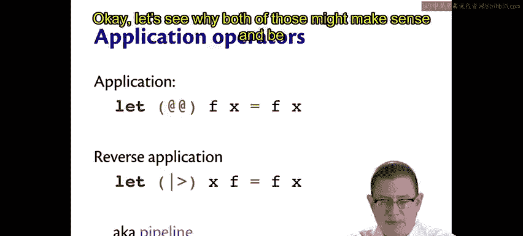
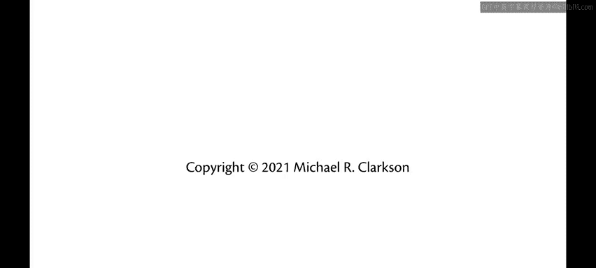

# 康奈尔大学《OCaml编程｜CS3110：OCaml Programming： Correct + Efficient + Beautiful》中英字幕 - P22：-022-Application Operators Chap2 Video 17.zh_en - GPT中英字幕课程资源 - BV1Tx4y1s7sP

Here are two binary operators built into OML's Standard Library that are related to function application。

The first is application， the second is reverse application。

The application operator is written with two at signs。And it's very simple。

 It just takes in a function F and an argument X， and it applies F to X。

 This is so simple it might seem like you don't even need it。

 We'll see an example in just a second as to how it can be useful。

The reverse application operator also called the Pi operator。

Does the opposite It takes in an argument X， and then an argument F。

 So notice they're in the reverse order from the first。And it applies F to X。

Reverse application is written with vertical bar greater than。

 which is meant to look like a right facing triangle。

 the notion being that you're like running something through a pipeline from left to right。

Okay let's see why both of those might make sense and be useful。

We've written the increment function a few times the function that just increments its argument。

 it turns out that's built into the OCMel Standard Library， although there is called successor suck。

 so what is the successor of one two？What if you wanted to take the successor of two times 10？Well。

 the way OcaMl parses that as always， is going to be that the function application binds tighter than the binary operator for multiplication。

 so OcaMml really understands that as successor of two， which is 3 times 10。

But maybe what you really meant was you wanted to get the successor of。Two times 10。Of 20。

hi you wanted to be 21。 Well， to make that happen， you'd have to put parentheses around two times 10 there perfectly fine。

 you can do it that way。The application operator。If you write it in between the function and the rest of that expression there causes Oaml to parse this a little differently。

 it changes the precedence rules， such that Ocaml says。

 all right the piece of syntax on the left here is a function， and the piece of syntax on the right。

 that's an entire expression to be evaluated separately。

So if you evaluate with the application operator in the middle there。

 OK will actually take the two times 10 first and then take the successor of that。

So the application operator can help you avoid having to write parentheses。

 which can be useful if you have quite a long expression on the right hand side of that application and you felt like it was a little cleaner to read without。

As for the reverse application operator。Let's add in another function here。

 Let's square x equal x times x。Imagine that you wanted to take five， increment it。

 and then square it。So the way we would have to write that so far is take the square of the successor of five。

And that involves adding some parentheses there to force Ocamel to parse that the correct way。

 Of course， if we left those parentheses out， then Ocamel would actually interpret it as we're taking the square function and trying to apply it to a successor。

 which from a tight perspective makes no sense at all。Instead。

 we have to have these extra parentheses in here。And if you wanted to take an even larger version of this。

 like suppose you wanted to square it again after that。 Now。

 you keep having to add in even more parentheses。 And then if you want the successor of that。

 you have to add in potentially more parentheses。So that gets a little ugly。

The reverse application operator is a solution to that。With it。

 you can take the argument right at first。And then kind of run it through the function after that。

 so suppose you wanted to take five and take the successor of that and then take the square of that and then take the square of that and finally take the successor of that。

Gets you the same result without having to write all of those nested parentheses。

 and it produces something that reads left to right。

 which if you're used to working in a language that reads left to right anyway。

 is a natural way to read。Take five， run it through the successor function， run it through square。

 run it through square， run it through successor。That's why it's called the pipeline operator。

 It's like taking a value and running it through a pipeline。 This is very idiomatic。 Okay Camel。

 and once you get used to it can create very beautiful code。😊。

