# OCaml编程：3.1：列表基础 📝

在本节课中，我们将要学习OCaml中一个核心的数据结构——列表。我们将了解列表的语法、类型、特性以及其适用的场景。

上一节我们深入探讨了OCaml的函数，现在我们将回到数据部分。

## 列表的语法与类型

OCaml中的列表写在方括号内。

空列表写作 `[]`。空列表不包含任何元素，其类型是 `'a list`。你可以从右向左阅读这个类型，它是一个元素类型为 `'a` 的列表。之所以是 `'a`，是因为列表目前是空的，在元素类型上是**参数化**的。它不包含任何内容，因此不需要特定的元素类型。

一旦我们向列表中加入元素，例如整数 `1`，我们就得到了一个 `int list`。从右向左读，它是一个整数列表。

我们使用分号来分隔列表中的元素，例如 `[1; 2; 3]`。当然，列表中的元素必须是相同类型的。我们可以有浮点数列表 `float list`，布尔值列表 `bool list`，甚至可以有列表的列表。

以下是一个嵌套列表的例子：`[[1; 2]; [3; 4]; [5; 6]]`。这是一个 `int list list`，即一个“整数列表的列表”。

## 列表的构造操作符

列表还有另一种语法。如果你已经有一个列表，例如 `[2; 3]`，并且想在它的前面添加一个新元素，你可以使用双冒号操作符 `::`。

`1 :: [2; 3]` 会得到列表 `[1; 2; 3]`。它将元素 `1` 添加到了列表的前端。事实上，我们可以仅使用 `::` 和空列表来构造整个列表。

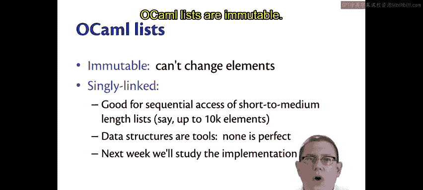

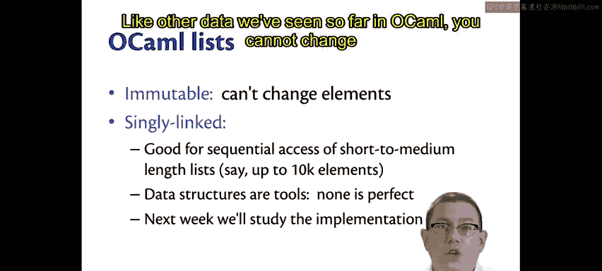

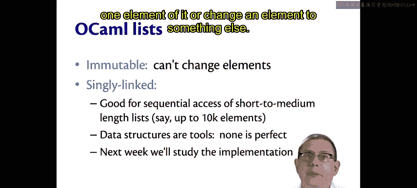

例如：`1 :: 2 :: 3 :: []` 就是列表 `[1; 2; 3]`。OCaml会将其简化为方括号形式显示。

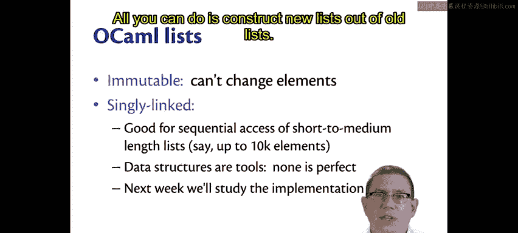

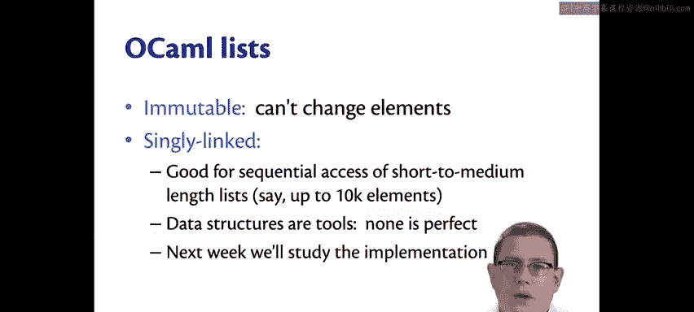

## 列表的特性

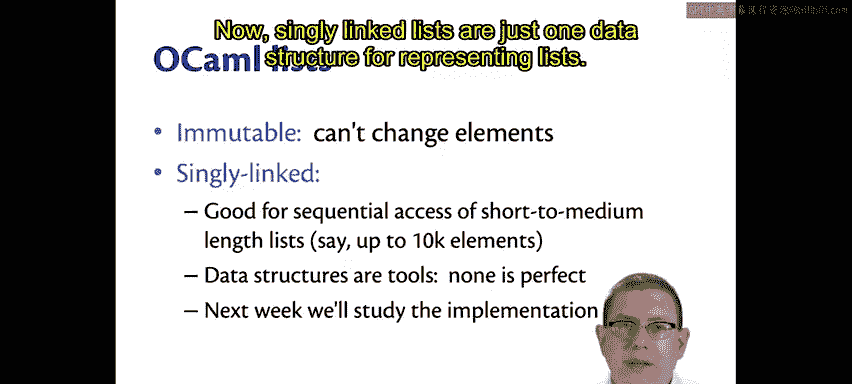

OCaml列表是**不可变**的，就像我们目前见过的其他OCaml数据一样。一旦创建了一个列表，你就不能删除其中的某个元素，或者将某个元素更改为其他值。你所能做的，就是基于旧列表构造新列表。我们刚才使用 `::` 操作符所做的正是这件事。

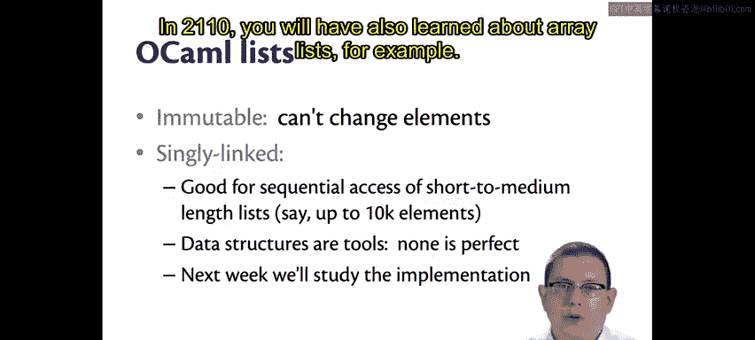

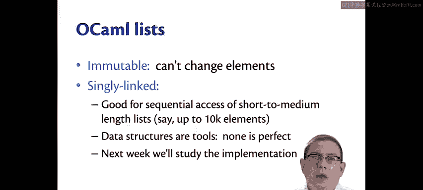

OCaml列表是**单向链表**。单向链表只是表示列表的一种数据结构。例如，你可能还学习过数组列表，那是另一种实现。OCaml内置的列表是单向链表，因为它们在这种语言中运作得非常好。

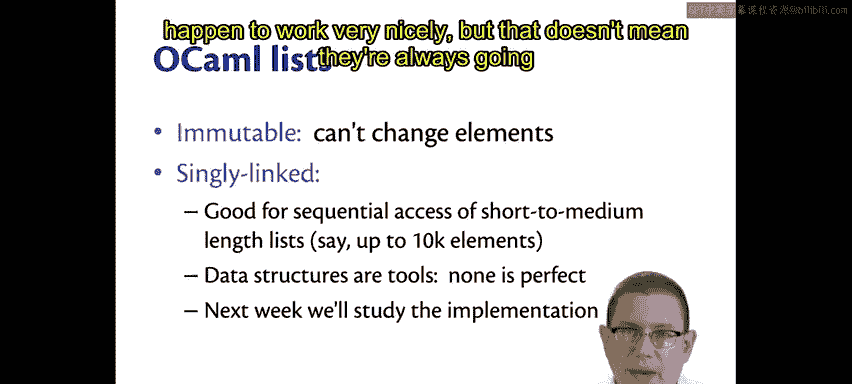

但这并不意味着它们总是完全符合你手头工作的需求。数据结构就像语言或工具一样，只是工具。没有完美的数据结构。

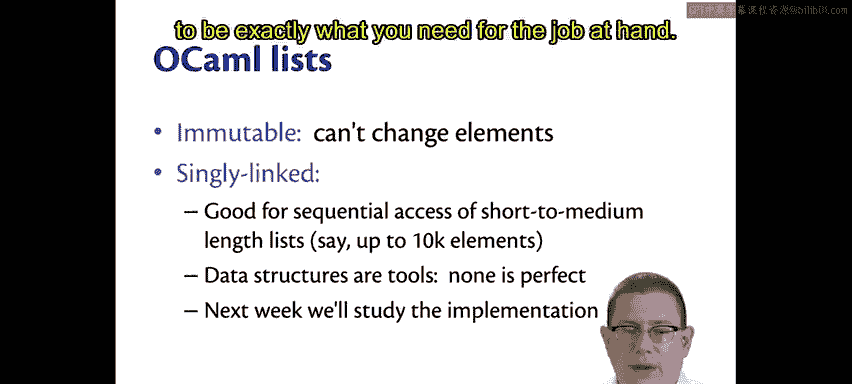

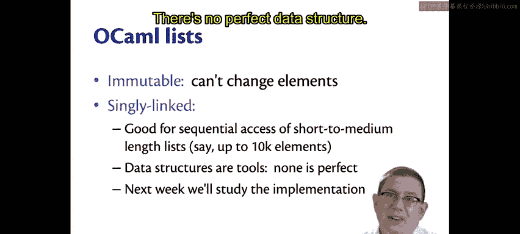

## 列表的适用场景

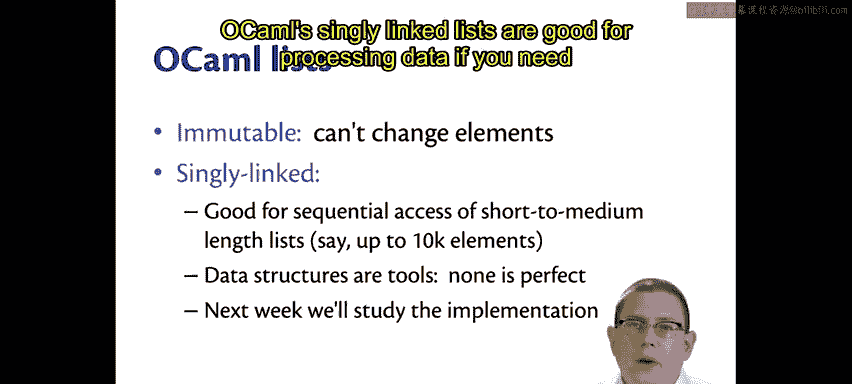

OCaml的单向链表适用于以下场景：

以下是OCaml列表擅长处理的典型情况：
*   **数据处理**：当你需要对数据进行顺序访问时。
*   **短到中等长度的列表**：很难给出一个精确的数字，但大约在最多10000个元素以内，这些列表会工作得很好。

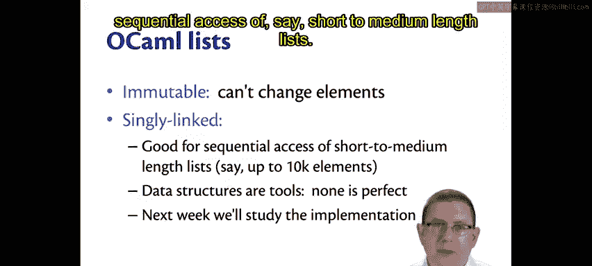

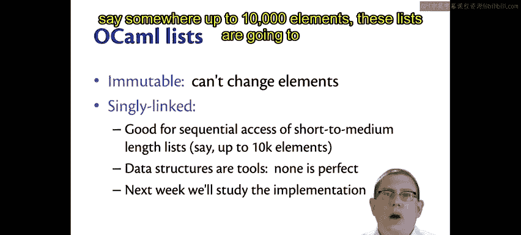

如果这不是你想要的，也没关系。将来如果需要，你可以寻找其他库的实现。但你会发现，当你习惯使用它们之后，这些列表对于你需要做的大部分事情都相当好用。

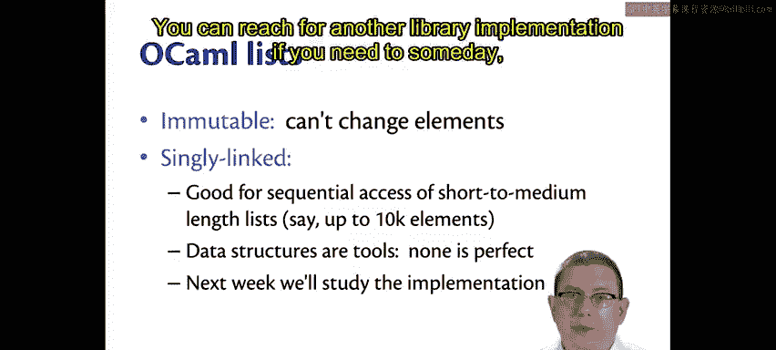

## 总结

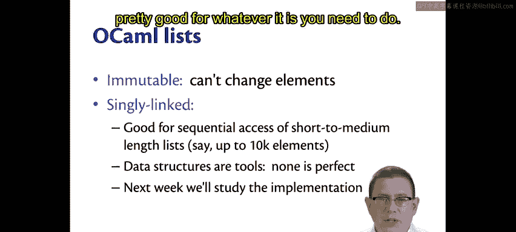

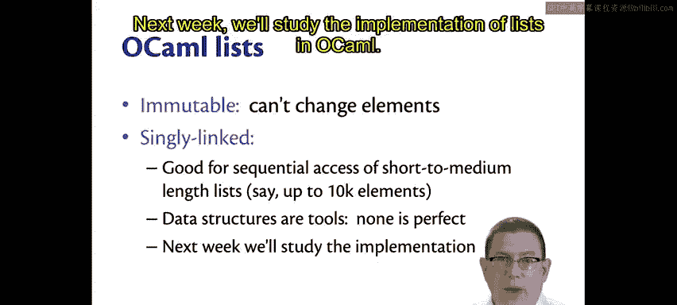

本节课中我们一起学习了OCaml列表的基础知识。我们了解了列表使用方括号 `[]` 和分号 `;` 的语法，以及使用 `::` 操作符在列表前端添加元素的方法。我们明确了列表是**不可变**的，并且其内置实现是**单向链表**。最后，我们讨论了这种数据结构适用于顺序访问和处理短到中等长度数据的场景。下周，我们将深入研究OCaml中列表的实现。