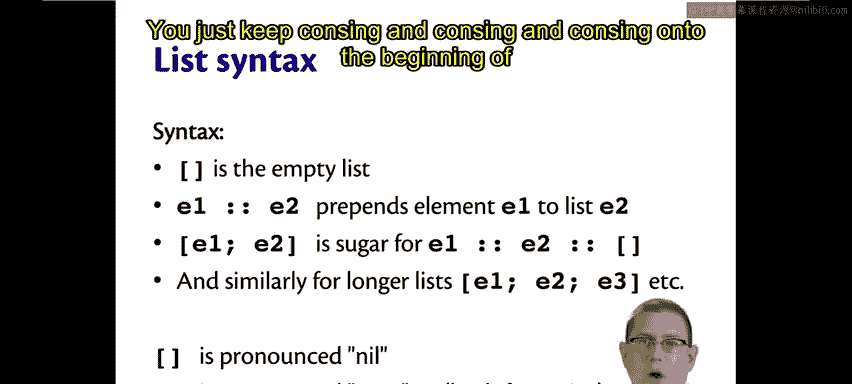
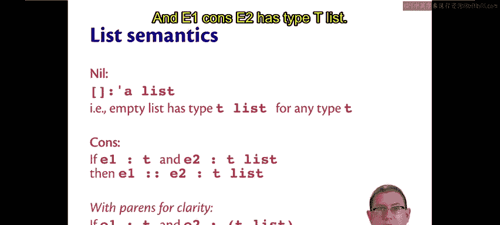
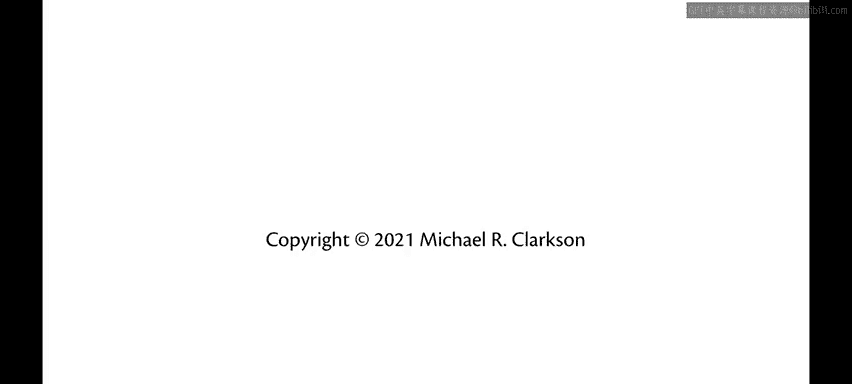

# 康奈尔大学《OCaml编程｜CS3110：OCaml Programming： Correct + Efficient + Beautiful》中英字幕 - P24：-024-List Syntax and Semantics Chap3 Video 2.zh_en - GPT中英字幕课程资源 - BV1Tx4y1s7sP

Syntactically， lists are formed really in one of two ways。

 either with the empty list rid with square brackets。 This is pronounced nil。

 It's a name that comes from Lisp。The grandmother or grandfather of all functional languages。

The other way of building a list is with double colon。E1， double colon E2。

 where E1 and E2 are expressions。 That prepends an element E1 onto a list E2。

The name for that operator is cons that also comes from Lisp。

You can think of it as constructing a new list， taking one element and constructing a new list by putting it on the beginning of another list。

 Now， lists are immutable。 This does not change the existing other list。 It just creates a new list。

The other syntax that we originally saw for lists with square brackets and semicolonons is itself really syntactic sugar just for using nil and cons。

 So anywhere you've written E1， semicolon E2 is a list。 That's really sugar for E1 cons E2 cons nil。

 and the same for longer list。 You just keep conzne and conzne and conzne onto the beginning of the list。

😊。

The evaluation rules for lists are quite simple。The empty list is already a value。To evaluate cons。

 well， you just evaluate the expressions on either side of the cons operator。

 So evaluate E1 to evaluate V1。 evaluate E2 to evaluate V2。 Now， of course。

 V2 is going to have to be a list because we're adding an element onto the beginning of it。

And return V1 cons V2。 So a list of values is itself a value。As a consequence of those rules。

 we now know how to evaluate the syntactic sugar that just uses square brackets and semicola。

If you want to evaluate the list E1 semi equal and E2。

 it just means evaluating E1 and E2 both the values and returning the list of those values。

List types involve a new keyword， which is list。 So for any type T。

 the type T list describes those lists whose elements are all of type T。 That's right。

 All the elements of the list must have the same type。 This is not really a restriction。

 We will see later on。 how to have lists that have a mix and match of kind of types。So 1，2。

3 is an int list。 True is a bo list。 We can have lists that are nested inside of other lists。

 and so forth。As for type checking。The empty list has type alpha list。

Another way of thinking of that is no matter what you want to stick into a list that is empty。

 that is， no matter what you want to cons onto to the front of it。

 you're going to be able to do that because there's nothing in it yet。

 So you can think of that list as having any element type that you want。The cons operator。

If you think about what it's doing， you'll always be able to remember what its type must be。😡。

Because you're taking an element and causinging it onto the front of another list。

So that means if that other list， E2 has type T list。

Then E1 has to have type T because it's a new element to put into that list。

 So its type has to agree with the rest of the elements already in that list。

And since we're left with a list at the end of the day， just with a new element on the front of it。

 the type of the list is not going to change。 So E1 cons E2 is going to have the same type as E2。

 which is whatever T list was for E2。If you're finding it a little bit difficult to read the colons that are going on there。

 here they are with some parentheses to hopefully make it a little bit clearer。

 of course the colon there is kind of at the lowest level of precedence when we read these expressions so E2 has type T list it's not that E2 colon T has type list or something like that and E1 cons E2 has type T list。

