# 康奈尔大学《OCaml编程｜CS3110：OCaml Programming： Correct + Efficient + Beautiful》中英字幕 - P25：-025-Records and Tuples Chap3 Video 3.zh_en - GPT中英字幕课程资源 - BV1Tx4y1s7sP

Records are another basic data type built into OCML， they allow us to aggregate data together。

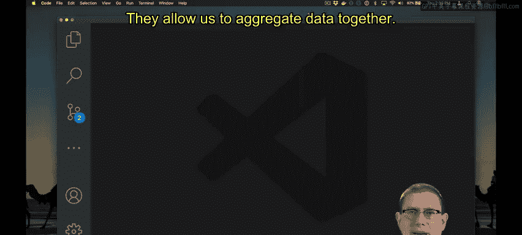

Let's start a new file for this code。Using VS code， I'll just call it records。m。

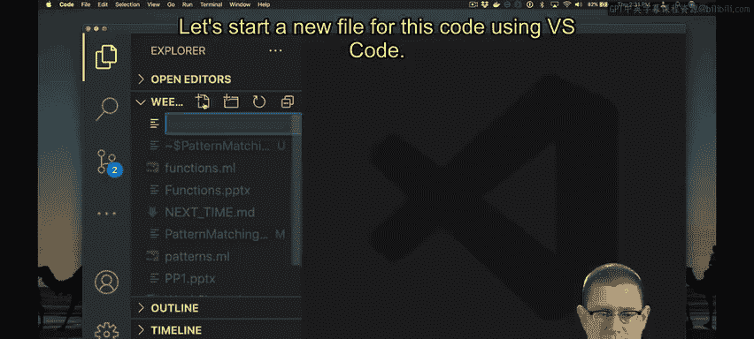

And inside this， I'll define a record type for students。So let's say that students have a name。

Which is a string。And a GPA， which is a float。Actually， you know， I don't like using that。

 You are not defined by your GPA， so let's let's not do that。 Let's say a graduation year instead。

In fact， I'll even document that so I can remember it。

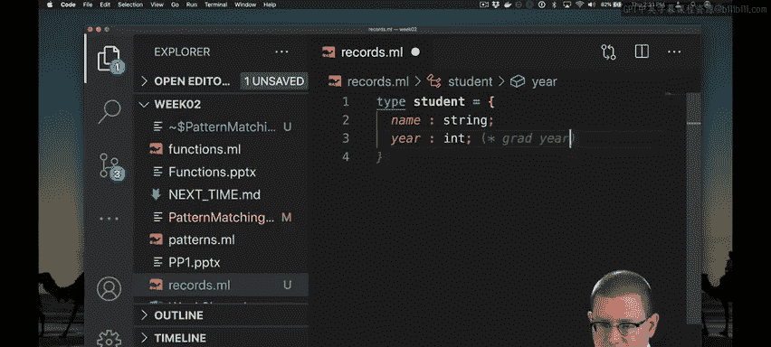

So this is a record type that I've now defined and I can create values of that record type for example。

 maybe we should create a famous Corneian Ruth Bader Ginsburg， so let Ruth Bader Ginsburg RBGB。

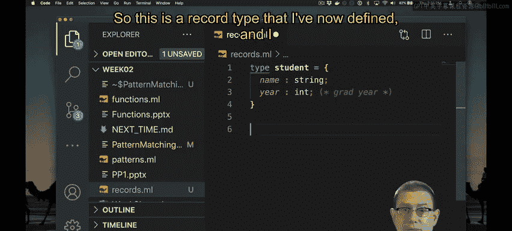

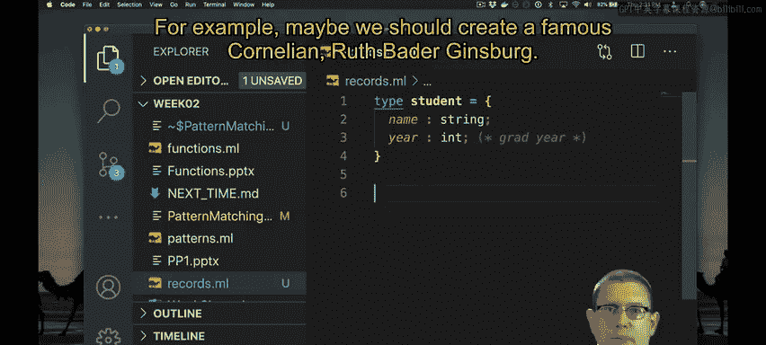

Her name is Ruth， and actually at the time she graduated from Cornell， it was just Ruth Bader。

 she hadn't gotten married and added the Ginsburg yet。

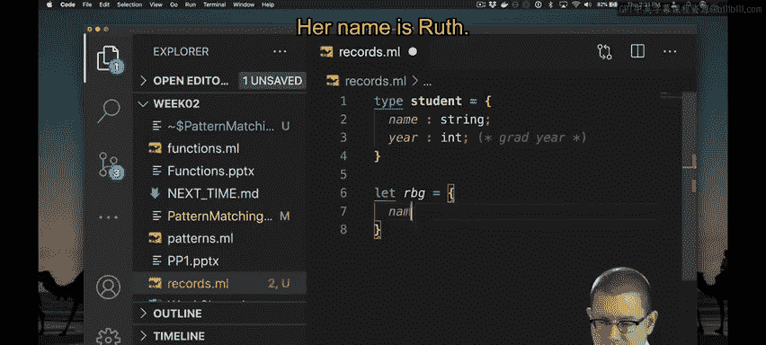

And she graduated in 1954。Okay so now we have a value of that record type in fact if you wanted to even double check that it had that type。

 we could add in student here as a type annotation， but of course。

 okay we'll configure it that out with type inference and if we hover over there you'll see it has indeed figured out that RBG is a student。

If you want to use this code in U， we could do that as well， let's start a new terminal here。

Make the terminal bigger so that we can see it， get that explorelorr window out of the way。

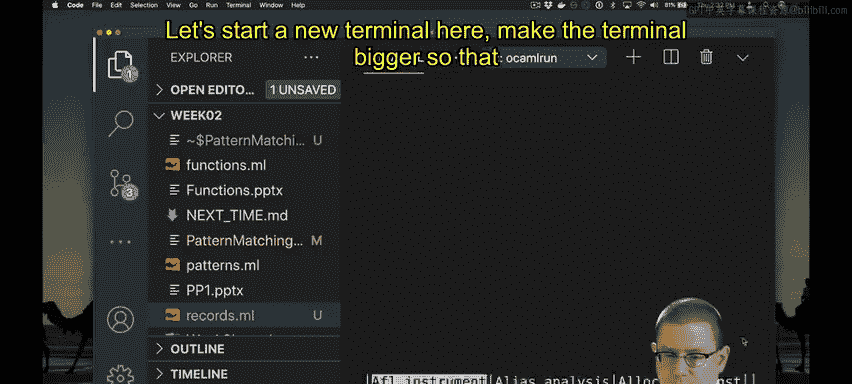

If you type the Use Directive， it will load the code into U。😡。

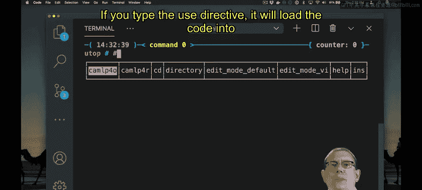

So I can say use and then the name of the file I called this file records。

m you can see okayl Utop is even offering to autocomplete that for me if I hit the tab key it will go ahead and add all the rest of that in for me that's a nice convenience and now it's used all the code from that loaded it into UT I don't have to type the code myself at that point and I can start playing around with it further if I like for example here is RBG's name I can say dot name to get that part of the record out that field as it's called of the record。

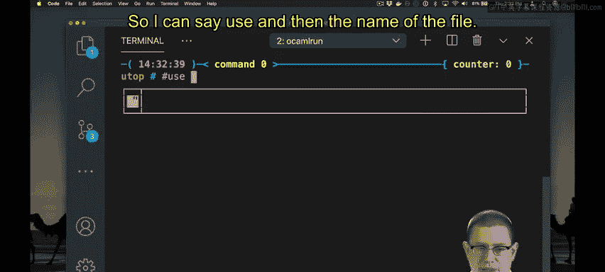

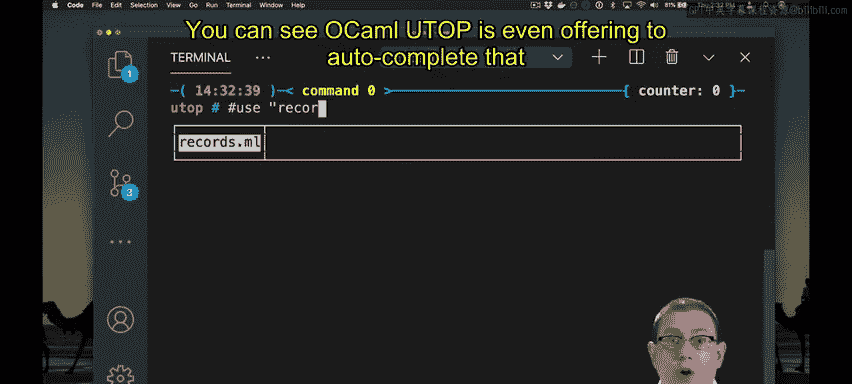

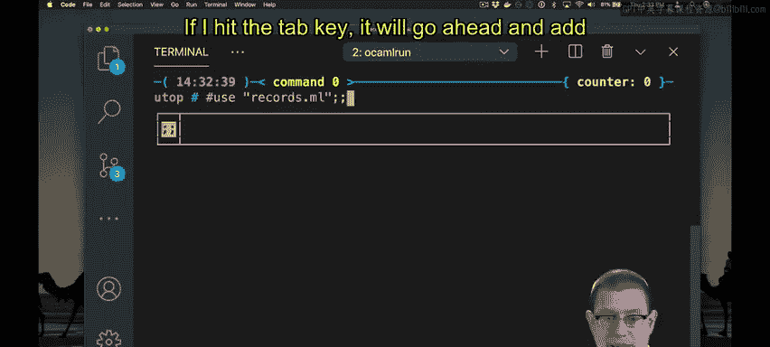

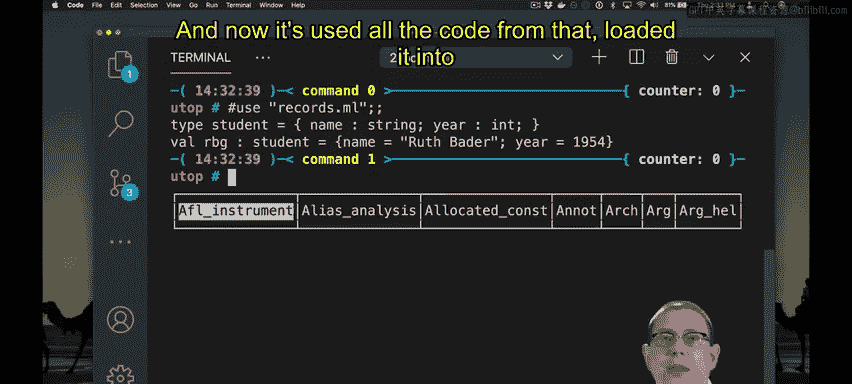

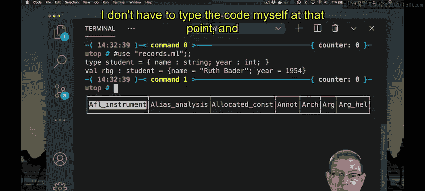

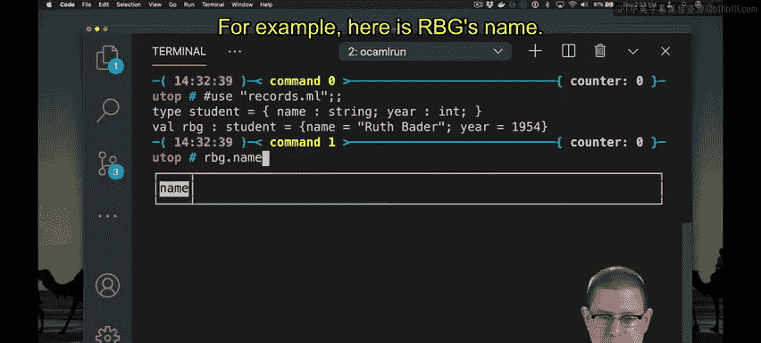

When I use a file of code inside of Utah， it's as if I had just directly typed those lines of code into Utah myself。

😡，Now it's not going to automatically refresh， don't get the idea that this is some sort of IDE perhaps so if I go back here and make a change。

 for example， I changed her graduation year to 53 or something， although that's incorrect。

If I go into the terminal here。RBG dot name。

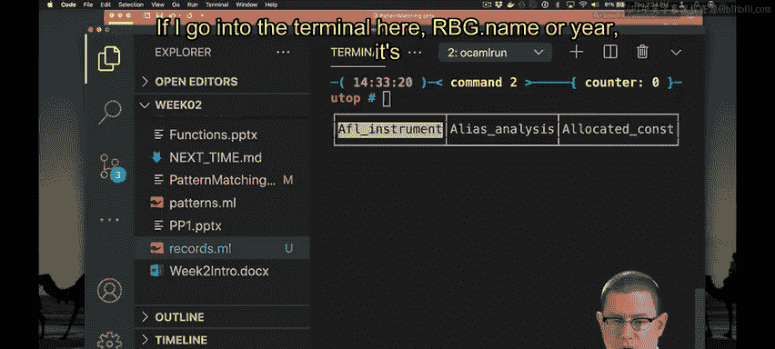

For year。It's still 1954。 So there's no kind of like sync going on between the two of these things。

 If I want to get those definitions out of the file again， I would have to reuse the file。 Now。

 you can hit the up arrow key in here to go back and use that file again。

But this is not something you want to get into the habit of doing anytime you reuse a file。

 it's really best to end your U session。😡。

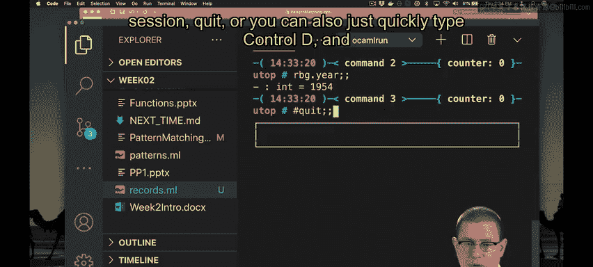

Quit or you can also just quickly type C D。And then start Utop。And use the file again。

This is a basic kind of hygiene in using Utah that prevents old definitions that you might have loaded before from confusing you or U about the new definitions you want to make。

Okay， so now you can see that Ruth Bader Ginsburg or Ruth Bader now has the graduation year in 1953。

Another basic kind of data type that's built into Oaml is called the tuple。

 so let's create another file here， Ts ML to play around with tus。

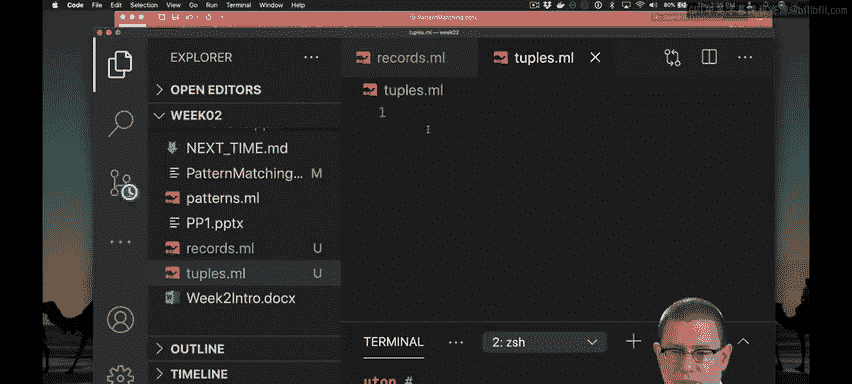

A tu is another way of aggregating data。

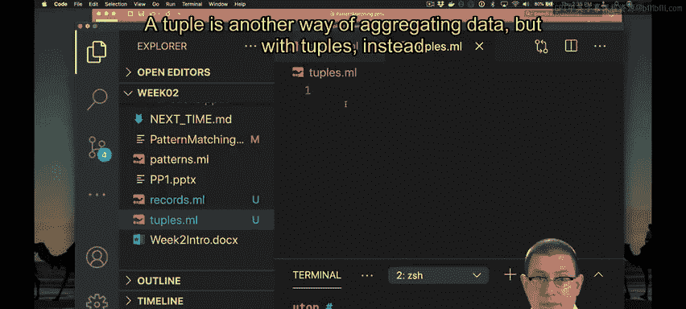

But with tus， instead of giving names to the pieces of data， like we did with records。

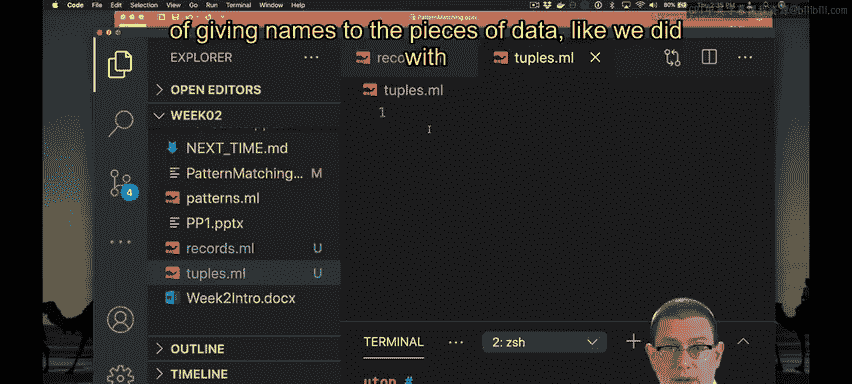

They are unnamed components， so here for example， is a tuple that contains 10 and 10 and AM。

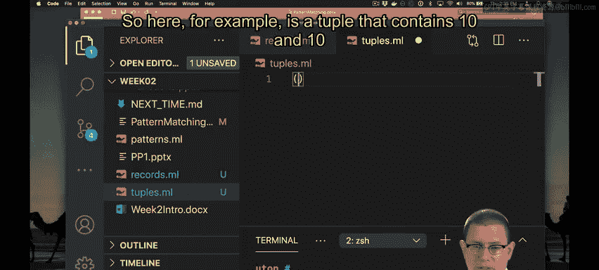

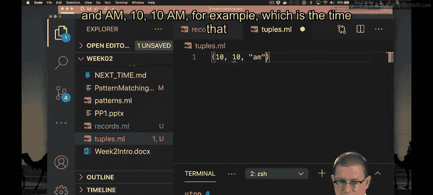

10，10 a， for example， which is the time that CS3110 used to start when we got to meet in person。

So this is a tuple with three components。We could even give a name to this kind of type for times。

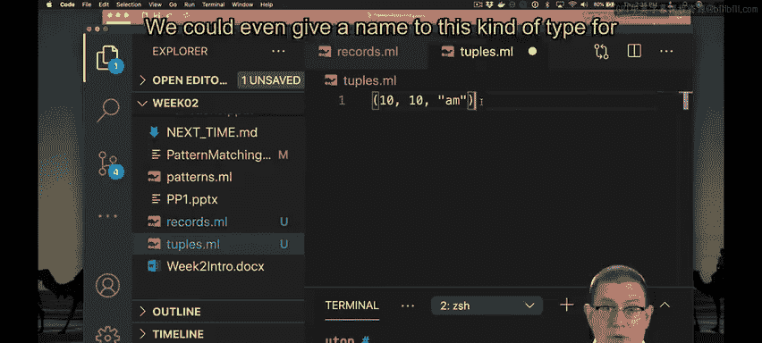

Let's create a tuple type。Type time equals int， star， int， star string。

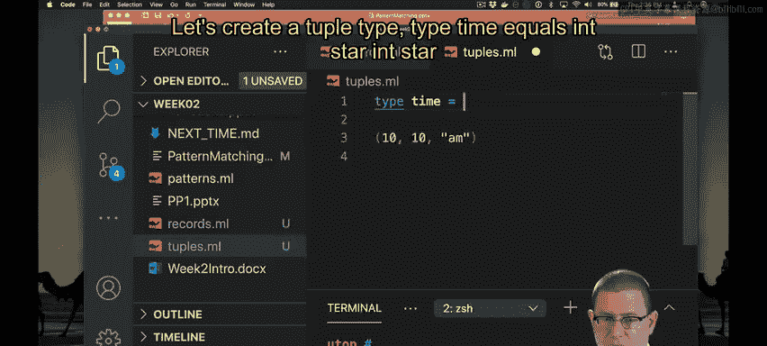

So times are going to have three components。 The first component is an int。

 the second component is an int， and the third component is a string。

And now we can say let T equal 10， 10 a， and you can see that T has that type star inch star string。

We can also manually annotate that with the type time。And now T has type time。

 These two are really synonyms for one another when we use the type keyword to define them this way。

 So it doesn't really matter whether we think of it as an in star in star string or as a time。

 They're both the same type。

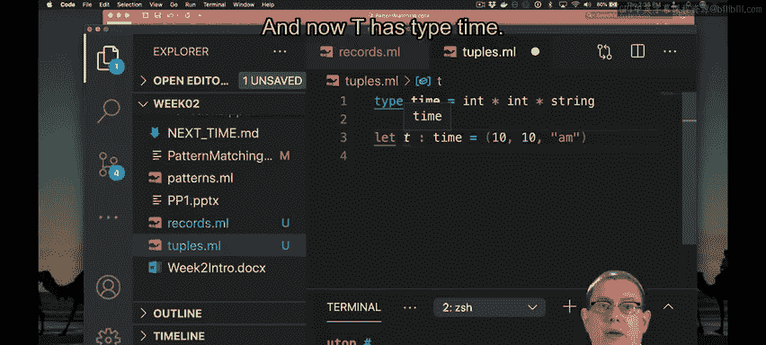

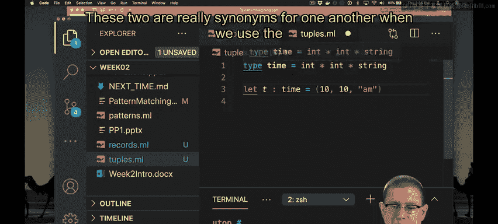

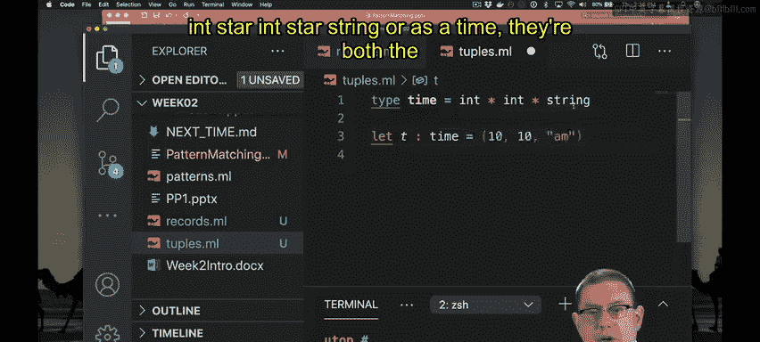

We could also define a type for points， say points in the Cartesian plane。

 so type point is a float star float， perhaps， and we' can to have a point P which is at the coordinates 53。

5。

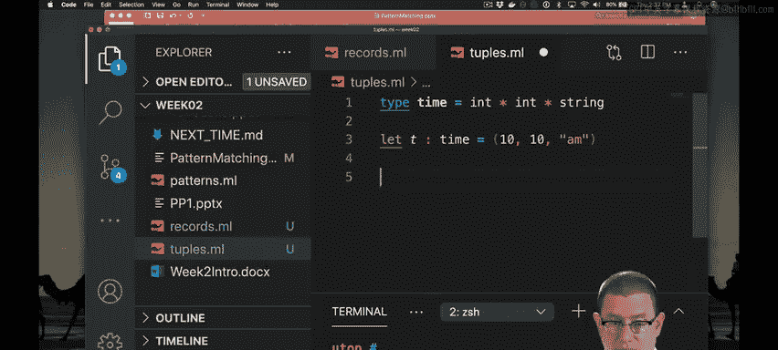

And you'll see here， P has tight float star float， which is equivalent to point perfectly fine to lean it out。

 But you could also say you want it to be a point。 The two are synonymous at this point。

Let's use that inside the terminal to get a chance to play with it。So we'll start Utop。I will use。

Tuples， do in L。Now， I've got all of these defined for me as if I had entered them myself。What is P？

It is of tight point。5，3。5。If you want to get the components out of a tuple。😡。

There's a function built into the standard library called FST， which stands for first。

 I guess they were like out of vowels the day they defined that or something。 and what does first do。

It takes in a pair。W is a tuple that has two components in it。

 and it gives me the first component of that pair back。 So what's the first component of P。 It's 5。

 What's the second component of P， There's a function built into the standard library for that called S& D second。

 What's the second component of that pair P， Well it's 3。5。Now these functions only work on pairs。

 not on tus that power longer that have more components。

 so I can't say what's the first component of my time T because that had three components to it don't worry we're going to see soon how to access other components of a tuple that doesn't happen to be a pair。

