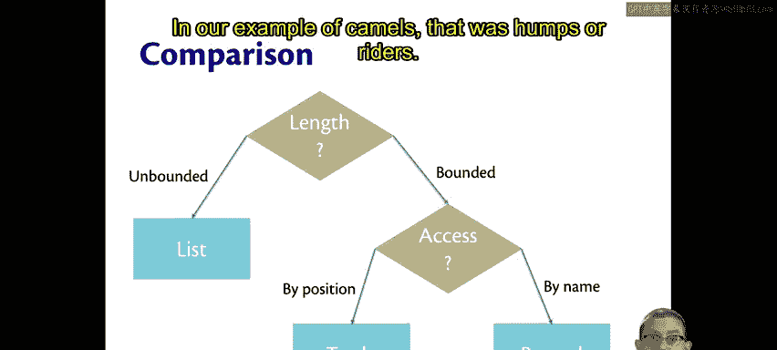
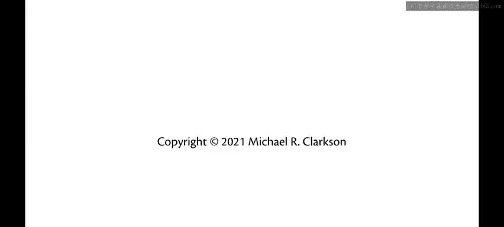

# 康奈尔大学《OCaml编程｜CS3110：OCaml Programming： Correct + Efficient + Beautiful》中英字幕 - P26：-026-Comparison of Data Types Chap3 Video 4.zh_en - GPT中英字幕课程资源 - BV1Tx4y1s7sP

When you're trying to decide which of these three basic kind of data types that are built into OCMl。

 a list， a tuple or a record that you want to use， here's the thought process。

What's the length of the data， if it's an unbounded length。

 then you might want a list because lists are unbounded。😡，But tus and records have bounded length。

 they have a certain number of components or fields。

So if you're representing something that has a bounded length to it， like our Caml example。

 there were only two numbers we needed to represent， you probably want other a two record。

Now as for how to decide between the tuple and the record。

How you're going to access the data is an important question。

 Do you want to access it by position or by name？By position means do you want like just the first component or the second component of a tuple？

For points that made sense， we usually think of a point as being ordered by position。

 there's an X coordinate and then a Y coordinate， maybe a Z coordinate。

Whereas a record you access by name， you get fields names。

 and you get to pull out a part of the record based on that field name。

 in our example of camels that was humps or riders。

