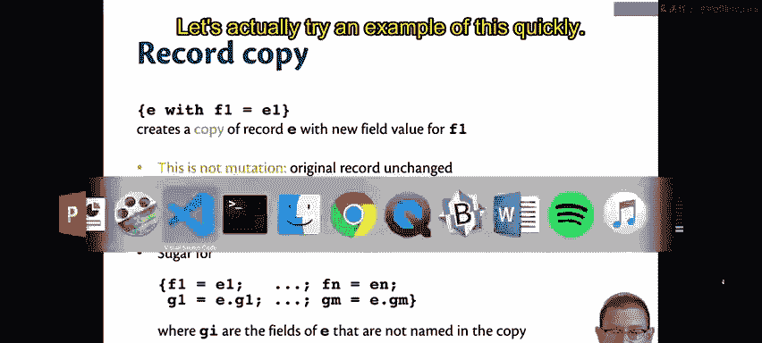
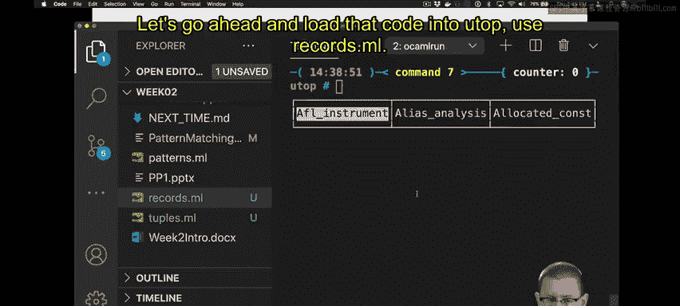
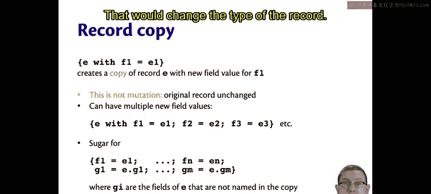
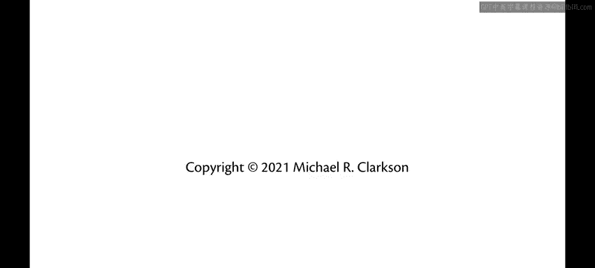

# OCaml编程：3.5：记录语法与语义 📝

在本节课中，我们将要学习OCaml中的两种新数据类型：记录（Records）和元组（Tuples）。我们将重点研究它们的语法和语义。

## 概述

上一节我们介绍了数据类型的基本概念。本节中，我们来看看两种复合数据类型：记录和元组。与它们一同引入的，还有一种新的定义方式——类型定义。我们之前见过使用 `let` 语法定义值，现在我们将使用 `type` 关键字来定义类型。

## 记录类型与元组类型

我们有两种新的类型：记录类型和元组类型。本节我们先聚焦于记录类型。

## 记录语法

记录写在花括号 `{}` 内。字段名之间用分号 `;` 分隔。在字段名和要存储在该字段中的表达式之间，我们使用等号 `=`。

所以，`{f1 = e1; f2 = e2}` 就是一个包含字段名 `f1` 和 `f2` 的记录。

记录中字段的书写顺序无关紧要。我们可以按任意顺序书写它们，OCaml不会根据字段顺序来区分不同的记录。

一个记录中可以包含任意数量的字段，从一个到大约四百万个。当然，你永远不会有一个那么大的记录。实际上，你可能会有三、四、五个，甚至八个字段。

## 字段访问

我们使用点号 `.` 来访问记录中的字段。因此，`e.f` 访问的是记录表达式 `e` 中名为 `f` 的字段。

重要的是要记住，这里的 `f` 是一个字段名，在语法上必须是一个标识符。它不能是一个需要计算得出的表达式。如果你想要后者，那么你实际上想的是字典（dictionary），我们将在后面学习字典。

## 记录求值

如何对记录进行求值？虽然用很多符号、文字和数学来描述，但概念其实相当简单。

只需将所有表达式求值为值。如果你有一组表达式 `e1` 到 `en`，假设每个 `ei` 都求值为 `vi`，那么包含所有这些 `e` 的记录表达式就会求值为一个内部只包含这些值的记录值。

至于字段访问，如果 `e` 求值为一个记录值，并且该记录值有一个名为 `f` 的字段绑定到值 `v`，那么 `e.f` 就求值为 `v`。我们所做的就是从记录中取出该字段的值。

## 类型检查

在类型检查方面，这里有一个小特点：记录类型必须在被使用之前定义。这并不奇怪，就像在Java中，你不能在定义类之前使用类。同样，在OCaml中，你不能在定义特定的记录类型之前使用它。这是为了让OCaml知道该记录类型将有哪些字段名。

理论上可以设计记录类型和类型推断，使得你不必先定义它们，但那样就无法获得同样好的类型推断效果。

以下是记录的类型检查规则：
*   如果你构造一个记录表达式，那么根据记录的定义，组成它的所有子表达式都必须具有正确的类型。如果一个字段名为 `gpa`，类型是 `float`，你就不能把 `int` 放进去。
*   如果你使用点符号访问记录的一部分，那么你将获得相应类型的字段。

## 记录复制

另一个我们尚未见过的记录语法是记录复制。

如果你写 `{e with f1 = e1}`，这将创建一个记录 `e` 的副本，并为字段 `f1` 赋予新值 `e1`。



让我们快速尝试一个例子。



回到之前的代码，我们有记录和 `rbg`。让我们把那段代码加载到交互式环境（utop）中。

```ocaml
# use "records.ml";;
```

我们可以创建一个 `rbg` 的副本。比如写 `{rbg with name = "Ruth Bader Ginsburg"}`。现在我们得到了一个新记录，其中的名字已被更改。

这并没有回去改变原始记录，它仍然是不可变的，原始记录的名字仍然是 `"Ruth Bader"`。所以记录复制不是突变操作，它保持原始记录不变。

你还可以通过用分号链接多个 `字段名 = 表达式`，在同一时间替换记录中的多个值。

实际上，记录复制只是语法糖的另一个例子。它本质上是将整个记录用所有字段名重写的语法糖，在 `with` 子句中使用所有这些字段名，然后对于你没有在 `with` 子句中提到的字段名，则使用原始记录中的值。

但是，如果记录有很多字段，而你只想更新其中一个字段，使用记录复制语法会方便得多。

注意，你不能使用这个语法来添加新字段。那会改变记录的类型，这是不允许的。

## 总结





本节课中，我们一起学习了OCaml中记录类型的语法和语义。我们了解了如何定义和构造记录，如何使用点符号访问字段，以及记录求值和类型检查的基本规则。我们还介绍了记录复制语法，它是一种方便地创建部分字段被修改的新记录副本的方法，同时强调了记录的不可变性。理解记录是构建更复杂数据结构的重要一步。