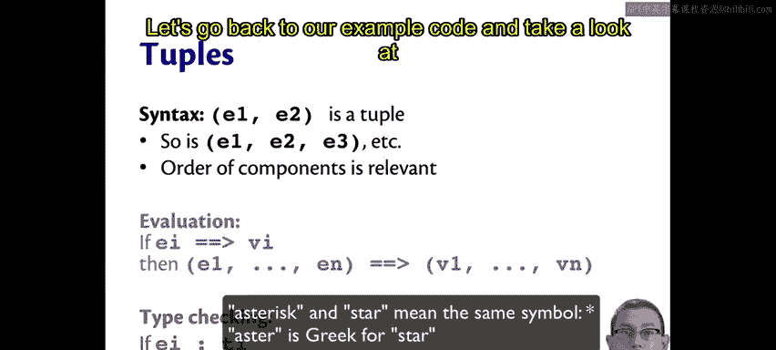
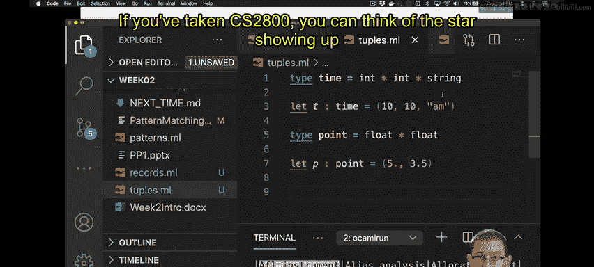
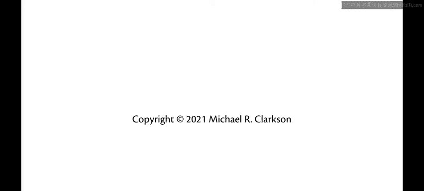

# 康奈尔大学《OCaml编程｜CS3110：OCaml Programming： Correct + Efficient + Beautiful》中英字幕 - P28：-028-Tuple Syntax and Semantics Chap3 Video 6.zh_en - GPT中英字幕课程资源 - BV1Tx4y1s7sP

Tupple syntax and semantics is even easier than records。

E1 comma E2 inside of round parentheses is a tuple。So as E1， E2， E3。

 you could have as many comma sub expressionpressions as you want here。

We call a tuple with two components， a pair， a tuple with three components， a triple。

 and you could go up to quadruple and quintupple and so forth。

 but in practice we don't usually use more than two or three components in a tuple。Here。

 the order of components is very much relevant and that's because tuples are accessed by position。

 not by name。😡，So that position is critical。Evaluation。

 just evaluate each of the subexions to a value and you get a pair value as a result or a triple value or a tuple value。

And for type checking， each of the components of the tuple needs to have a type itself and the type of the entire tuple then is written with asterisk。

 let's go back to our example code and take a look at that。

When I wrote the type for time tules here， I had int star int star string。

You can think of that star as separating each component of the tuple there。Their types。

Now this is not multiplication， right so we're using star in a couple different ways inside of the syntax of the language。

 but you can keep it straight because star here is showing up as part of a type。

 not as part of a value in a value that star would mean multiplication。In some sense。

 this really is multiplication， if you've taken CS2800。

 you can think of the star showing up in here of a tuple as representing a kind of Cartesian product。

