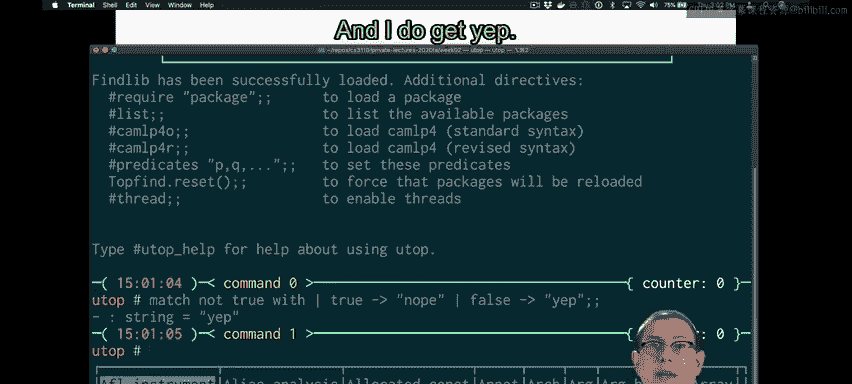
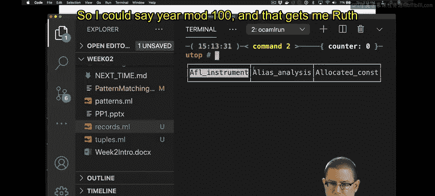

# OCaml编程：3.7：模式匹配 🧩

在本节课中，我们将学习OCaml中一个非常强大的特性：模式匹配。模式匹配允许我们根据数据的结构来分解和检查数据。我们将从基础用法开始，逐步深入到更复杂的应用。


## 概述

模式匹配是OCaml的核心特性之一，它让我们能够以一种声明式的方式检查和解构数据。无论是简单的布尔值、整数，还是复杂的列表、元组和记录，模式匹配都能优雅地处理。



## 基础模式匹配

上一节我们介绍了OCaml的基本数据类型，本节中我们来看看如何使用模式匹配来分解这些数据。

一个最简单的模式匹配示例如下：

```ocaml
let x = match not true with
  | true -> "nope"
  | false -> "yep"
```

这段代码匹配 `not true`（即 `false`）的值。由于表达式结果为 `false`，所以整个匹配表达式的结果是 `"yep"`。

模式匹配的语法结构如下：
- 关键字 `match` 后跟要匹配的表达式。
- 关键字 `with` 后跟一个或多个分支。
- 每个分支由竖线 `|`、一个模式、箭头 `->` 和一个结果表达式组成。

## 匹配变量与通配符

除了匹配具体的值，我们还可以使用变量来捕获匹配到的值。

```ocaml
let y = match 42 with
  | a -> a
```

在这个例子中，变量 `a` 会捕获整数值 `42`，并在右侧的表达式（这里就是 `a` 本身）中使用。

有时我们并不关心某些值，这时可以使用通配符 `_`。

```ocaml
let z = match "foo" with
  | "bar" -> 0
  | _ -> 1
```

因为字符串 `"foo"` 不等于 `"bar"`，所以匹配到通配符分支，结果为 `1`。通配符分支通常放在最后，作为默认情况。

## 解构复合数据

模式匹配真正强大的地方在于解构列表、元组和记录等复合数据类型。

### 解构列表

以下是检查列表是否为空的示例：

```ocaml
let a = match [] with
  | [] -> "empty"
  | _ -> "not empty"
```

我们还可以解构非空列表，获取其头部和尾部。

```ocaml
let b = match ["Taylor"; "Swift"] with
  | [] -> "folklore"
  | h :: t -> h
```

在这个匹配中：
- 列表 `["Taylor"; "Swift"]` 不是空列表。
- 它匹配模式 `h :: t`，其中 `h` 被绑定为 `"Taylor"`，`t` 被绑定为列表 `["Swift"]`。
- 因此，整个表达式的结果是 `"Taylor"`。

### 解构元组

假设我们想获取三元组的第一个元素，而标准库的 `fst` 函数只适用于二元组。

```ocaml
let fst3 triple = match triple with
  | (a, b, c) -> a
```

现在，调用 `fst3 (1, 2, 3)` 将返回 `1`。

### 解构记录

对于记录类型，我们也可以通过模式匹配按字段名解构。

```ocaml
type student = { name : string; year : int }

let name_with_year s = match s with
  | { name; year } -> name ^ " '" ^ (string_of_int (year mod 100))
```

这个函数接收一个学生记录，并返回类似 `"Ruth Bader '54"` 的字符串。在匹配分支中，字段 `name` 和 `year` 被自动绑定到记录 `s` 的对应值上。

## 总结




本节课中我们一起学习了OCaml的模式匹配。我们了解到：
1.  模式匹配使用 `match ... with` 语法。
2.  可以匹配常量（如 `true`, `42`, `"bar"`）。
3.  可以使用变量（如 `a`）来捕获值。
4.  可以使用通配符 `_` 匹配任意值，通常作为默认分支。
5.  模式匹配能优雅地解构列表（使用 `[]` 和 `::`）、元组和记录。
模式匹配是编写简洁、安全OCaml代码的基石，它强制你考虑所有可能的数据情况，从而减少错误。