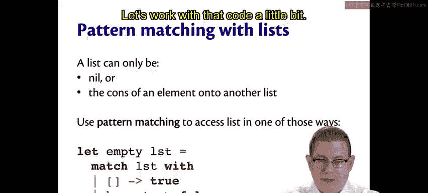
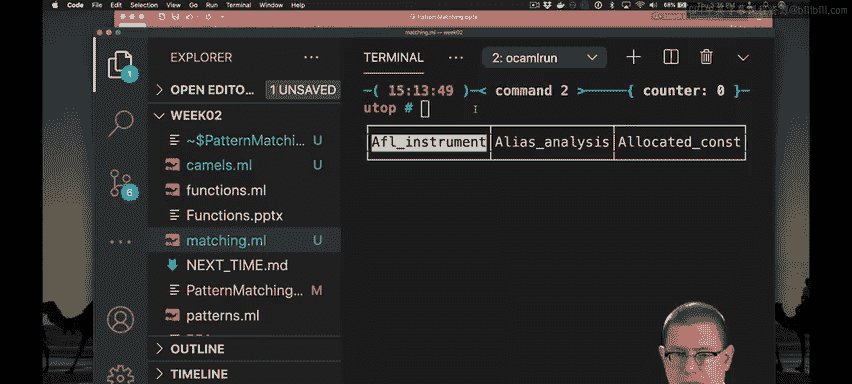
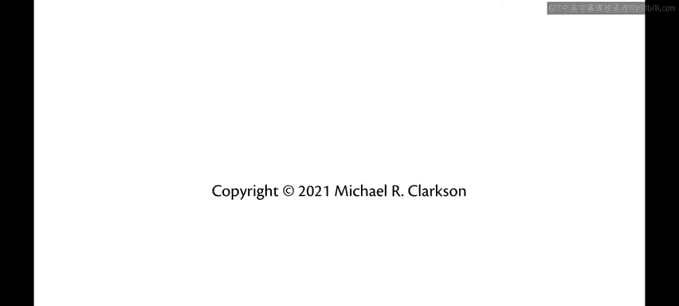

# 康奈尔大学《OCaml编程｜CS3110：OCaml Programming： Correct + Efficient + Beautiful》中英字幕 - P30：-030-Pattern Matching with Lists Chap3 Video 8.zh_en - GPT中英字幕课程资源 - BV1Tx4y1s7sP

We've seen that pattern matching lets us do two things simultaneously。

 match against the shape of some data and extract some pieces of that data。

Let's take a more careful look now at how to pattern match with lists。There's two things。

 a list can be。Either nil。Or the cons of an element onto another list。

 Those are actually the only two possibilities， the only two ways of forming lists。

So when we pattern match against a list。We are using pattern matching in one of those two ways。

Maybe you want to determine whether a list is empty， for example。You could match against that list。

And say， is it the empty list， if so， return true？But if it's an element cons onto to another list。

 say head cons tail。You could return false。Let's work with that code a little bit。

Here is the empty function。You can hover it over it and see its type is alpha list arrowbool。

 You give it a list of any kind of element， and it will give you back a boolean。

Match against that list if it's empty return true。Why did I write LST here is the name of it。

 you might be tempted， for example， to write list。I didn't do that because I don't want to confuse myself。

 List is also a keyword for types， I'd be allowed to use it here， but I prefer not to。

I also tend to not use just the letter L， which is a nice。

 short abbreviation for the word list and is tempting to use。 But in many fonts。

 just the letter L tends to look like either an I or a1。

 So I tend to stay away from that and write LS T for lists。

In the second pattern matching branch here。I bound two pattern variables named head and tail。

I actually never ended up using those on the right hand side here。

 So another way of writing this code would have been to instead of saying head and tail。

 say underscore cons underscore。 There needs to be a piece of data there。 I don't care what it is。

 I just want to throw it away and not bind it to a name。 That's what underscore does。

So this is another good implementation of this function。Of course。

 it's still a little more work than I needed to do。

 I could have just written underscore here without specifying the cons。

 because no matter what the list is， if it's not the empty list， I want to return false。

So there's a few different ways of writing empty there。Let's try another function。

 Supp I wanted dis sum the elements of a list。Of an int list。Well， I want to match that list with。

If the list is empty。What is it sum？Let's say that the sum of an empty list is 0。

But suppose there's an element at the head of that list， the first element in it。

 and then there's a tail of that list， the rest of the elements in the list。What can I do？Well。

 I definitely want to include H in the sum， so that's H plus。

And now if only I had a way of getting the sum of all of the rest of the elements in that list。

 because if so， I could just， you know whatever that is， I could add it in at this point。Oh wait。

 I do。I could write some T if I made some a recursive function。

So this is a way now of recursing down the rest of the list and adding in the sum of the tail。

Along with the heavy element of it。Okay， so what's the type of this， it's inlist arrow int。

This is taking a list of integers and giving me back the sum of all of them。What is H in here。

 It's going to be an int because it's the head element of the list。Is he。

 it's an in list because it's the rest of the elements of that list， which might be empty， of course。

 And when it is finally empty， we get down to the base case here of the empty list。

Let's try out that function。

What's the sum of the empty list， it's zero。What's the sum of one，2， three？It's 6， as it should be。

There's an interesting directive built into Utah called Trace。

If you say trace in the name of a function。It will show you the calls and returns from that function。

So if I say sum 1，2，3。You actually get a nice little depiction here of exactly what's going on with the recursive calls First sum gets called with the input。

 that's why the arrow is going to the left into the function of 1，2。

3 that causes a recursive call on two，3， the tail of  one，2，3。

That itself causes a recursive call on the tail of 2，3， that's just three。And then finally。

 a reccursive call on the empty list。That call produces a return， just 0。Then we add in three。

 and then we add in another two and add in another one until we get back up to six as the final output value。

So if you want to see what's going on with your cursive calls， this is a nice way to do that。

When you're done， if you don't want to see it being traced anymore。

 you can say untrace and that will get rid of that output。

Let's try writing another function for the length of a list。Let Re length the list。

 I know it's going to need to be a recursive function。Match LST with。

What is the length of the empty list？Well， it's zero。

What is the length of a list that contains a head element followed by some other elements？Well。

 it's going to be one。Plus， we've got one in there because there is a head element。

 there's at least one element there。Plus， whatever the length of that sublist is。

Let's give that one a try。The length of the empty list is in fact zero， the length of the list  one。

2，3。Is three as it should be。And as a third example。Let's write a function that appends two lists。

Let wreck aend。List one list2 be and now I should give you an example of what I mean by a pen because it could mean different things to different people。

 I'd like to write a comment up here to document that。 Meanwhile。

 I have a compilation error here in order to make it so that I can continue writing some code without getting an error。

 Let me just temporarily put in a kind of dummy value here。

 It's just going to return the empty list that's obviously not the implementation I want in the end。

 but it's always good to be compiling。Let me document an example usage here。

Pend of the list  one23 with456， what I'm looking for to get here is the list 123，456。Okay。

 so the idea here is to append the second list onto the end of the first list。

Now all of this is still immutable， I'm not changing any of these lists。

 I'm just returning a new list that happens to have all of the values from the first list followed by all the values from the second list。

So now that we know what we want to do， let's write the function。

I'm going to match against that first list。If it's empty。

Then there are no more elements from it to take， all I would need to do is return whatever happens to be in the second list at that point。

So I can return list two。But if there's a head followed by a tail element。

Then I at least want that head element。Followed by。Well。

 if only I had a way of creating a list that had all the elements of T followed by all the elements of List two。

Oh wait， I do。 I have append since I'm writing it recursively so I can now append。

T and list two together。Now， I wrote that in parentheses because I was worried that not everyone would be able to parse that right away。

 and maybe even Ocal wouldn't parse it correctly right away。 As it turns out。

 I can leave off those parentheses。 This is the sort of thing you can play with to figure out as you get used to Ocael。

And that's because the cons operator is parsed at a very low level of precedence。

 a pen is going to be applied to T and list2 before the cons operation actually happens。

Let's check out that code in Utah。I append the list 1，2，3 with the list 4，5，6。 I get the list 1，2，3。

4，5，6 as I want it。 By the way， many of these list functions are built into the standard library in Ocamel。

 including aend and append is even available as a built in operator written just as the single at sign。

 So instead of writing append 1，2，3，4，5，6， I could write 1，2，3 at or append4，5，6。

 and that gets me the same list。 and it's implemented exactly as I've shown you here。

