# 康奈尔大学《OCaml编程｜CS3110：OCaml Programming： Correct + Efficient + Beautiful》中英字幕 - P31：-031-The Function Keyword Chap3 Video 9.zh_en - GPT中英字幕课程资源 - BV1Tx4y1s7sP

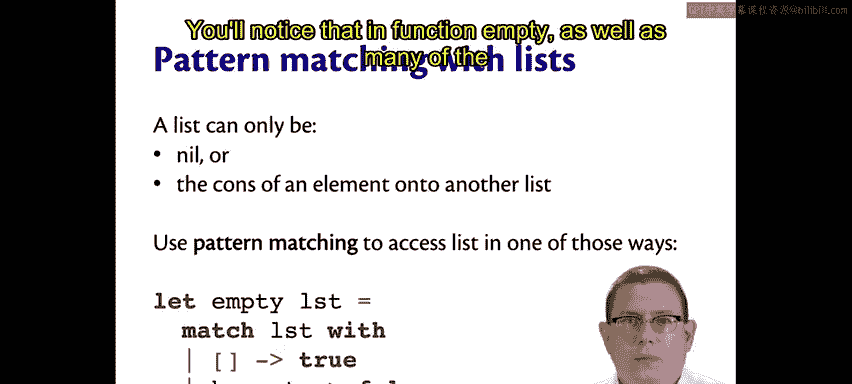

You'll notice that in function empty as well as many of the other functions we've written with lists。

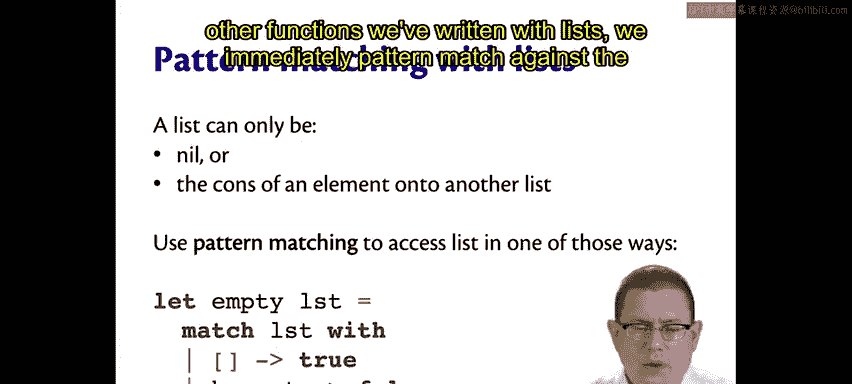

We immediately patterned match against the argument to that function。

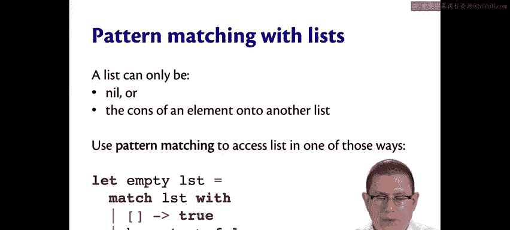

List is the argument to the empty function， and we immediately patterned matched against it here。

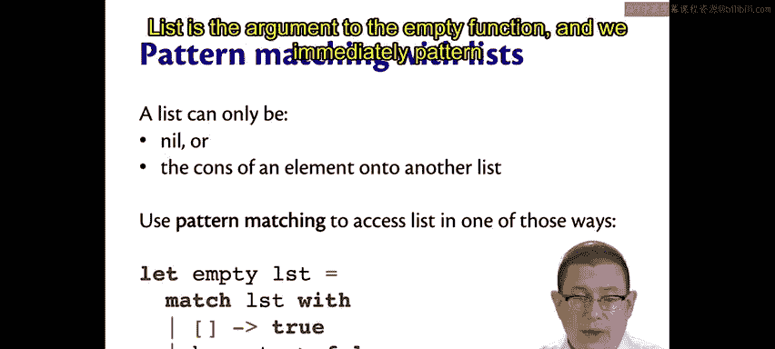

This kind of immediate pattern matching against an argument is so idiomatic and so common that Ocamel provides a syntactic form for it。

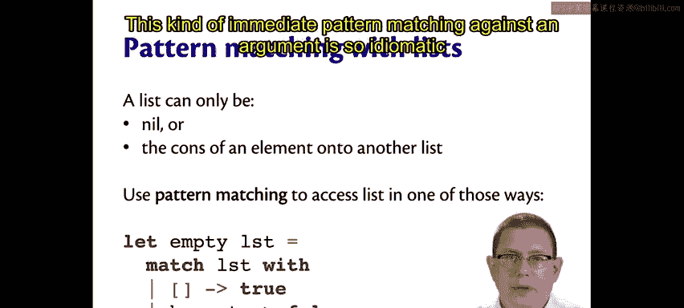

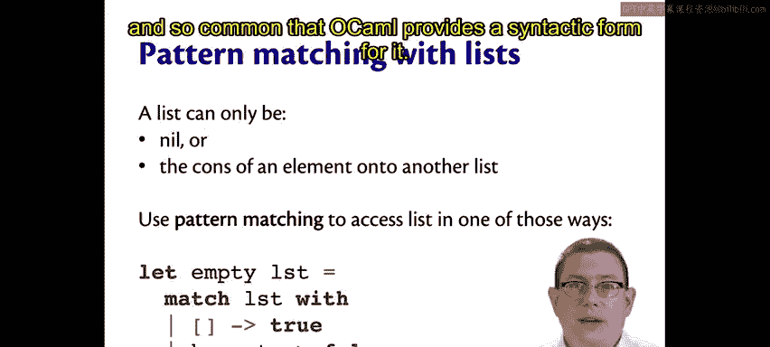

It's a kind of syntactic sugar once more， we wouldn't need it in the language but it makes things a little better。

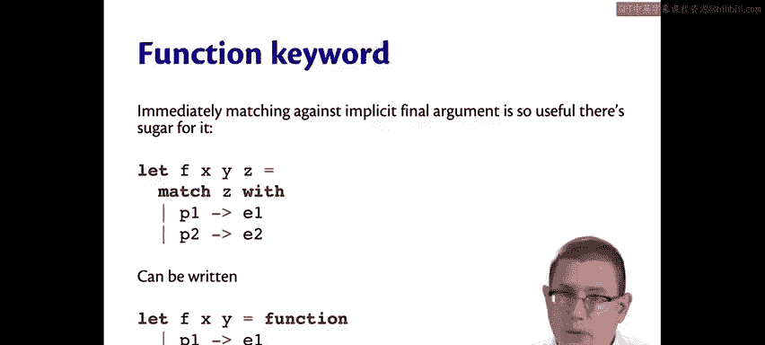

If you have a function which has some arguments here I've written X， Y， and Z。

 but it could be any number of arguments。

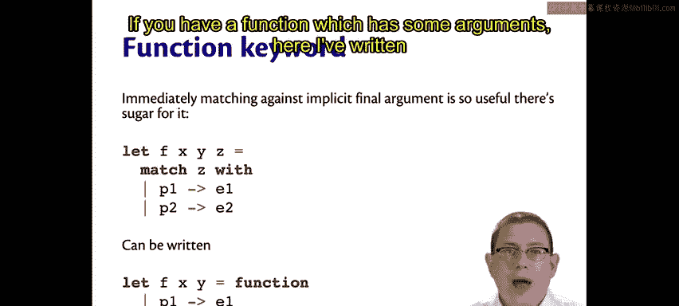

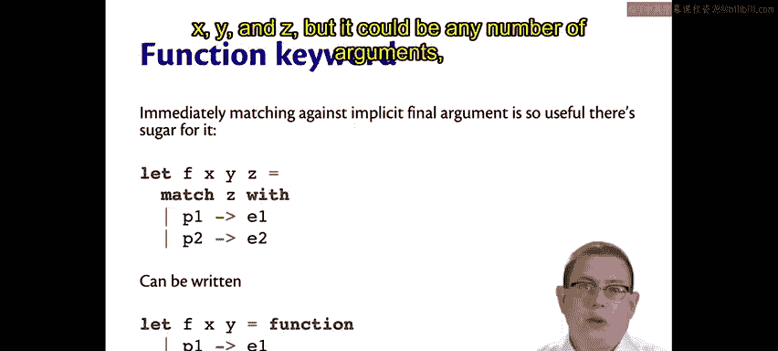

And you want to immediately pattern match against the last of those arguments。

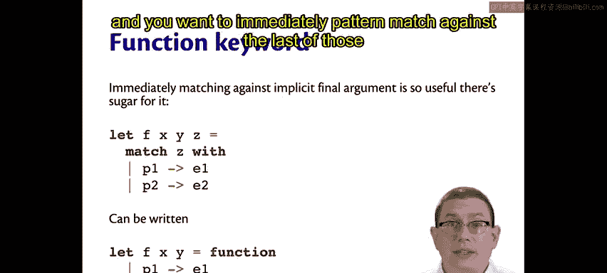

Which is how empty worked because I only had one argument anyway。

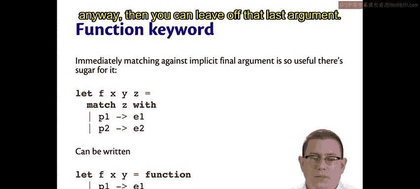

Then you can leave off that last argument。

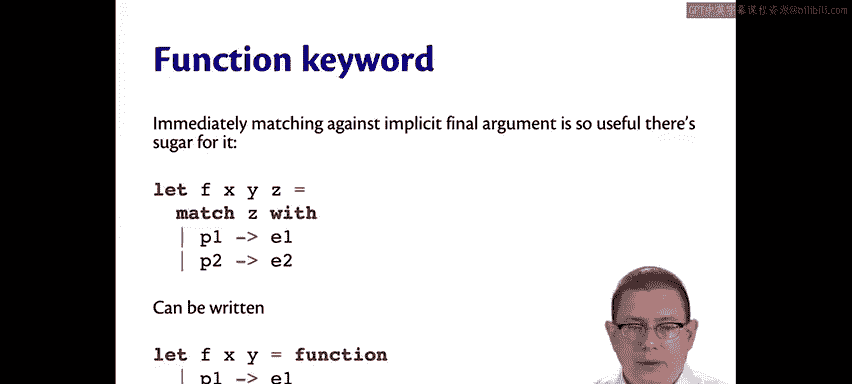

You can leave off the beginning of the match expression。

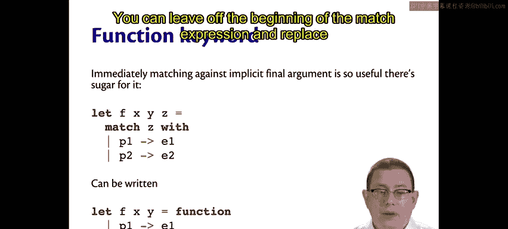

And replace all of that with a function keyword。

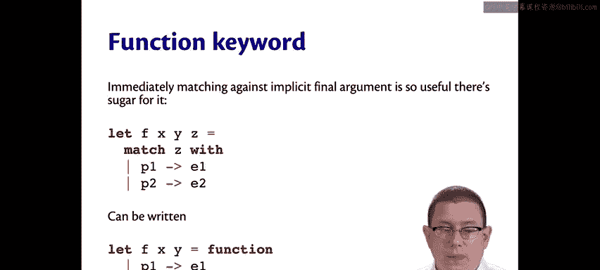

So notice the Z is gone。The match Z with is gone。

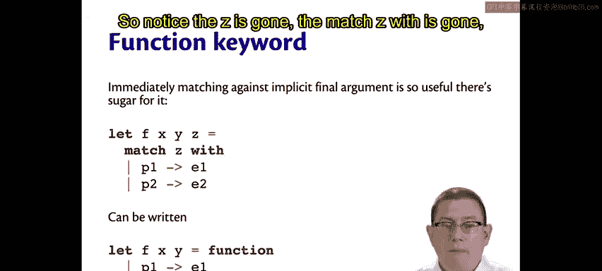

And we write the function keyword above that。

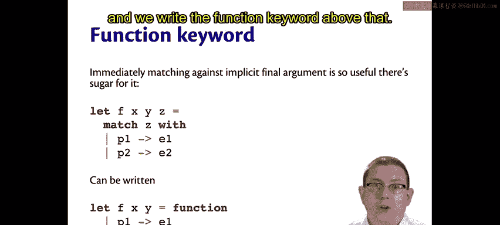

This leads to cleaner function definitions that don't involve having to repeat quite as much boilerplate code。

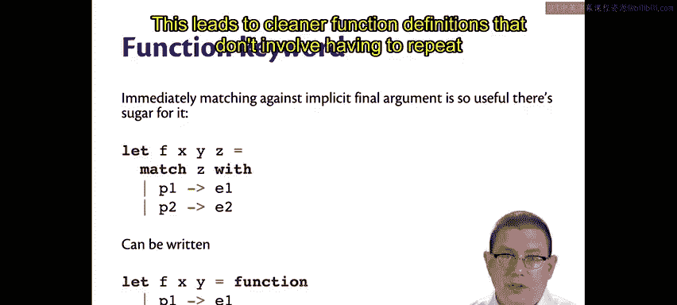

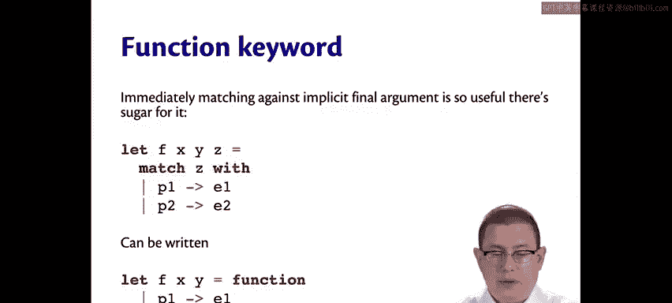

I could go back and clean up the functions we've written so far this way。So for empty。

 I could replace that with equals function。You got rid of the whole line of code there。For some。

 I could do the same thing equals function。For length。

 I can do the same thing because I pattern matching against the last argument equals function。

For a pen， I can't do it。Because the function key word means to immediately pattern match against the last argument。

 And that's not how a pen is implemented here。 It pattern matches against its first argument。

 So it doesn't help me out here。 Oh， well， there doesn't really need to be another syntax for matching against arbitrary other arguments。

 It's just useful enough to be able to do it against the last argument。

