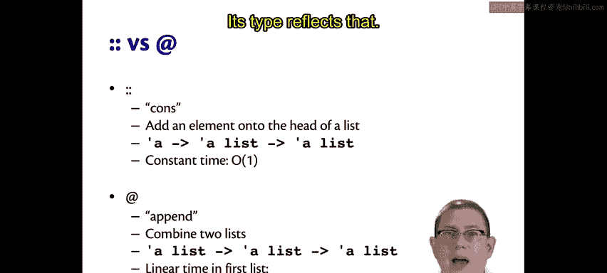
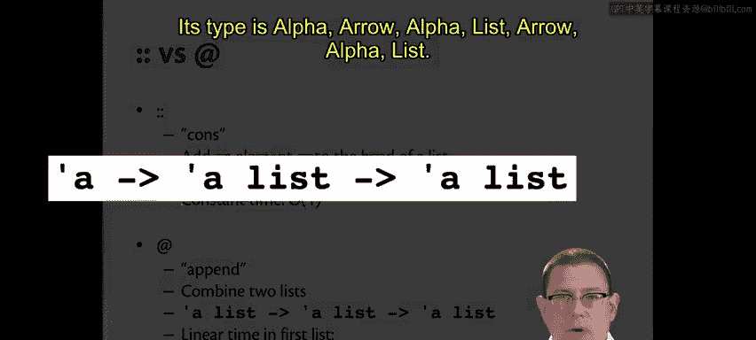
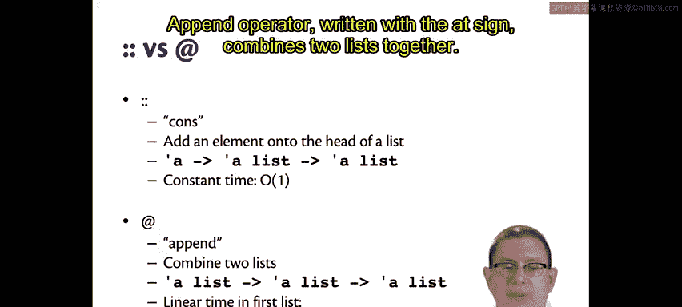
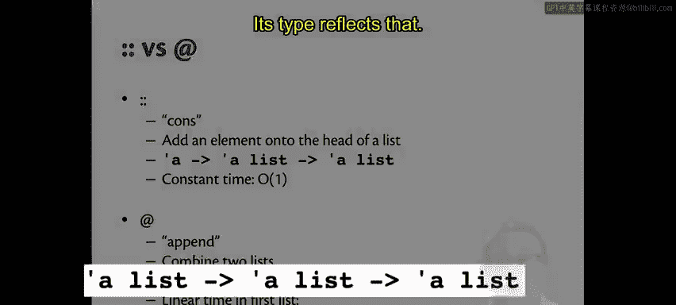
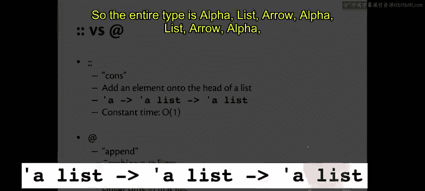
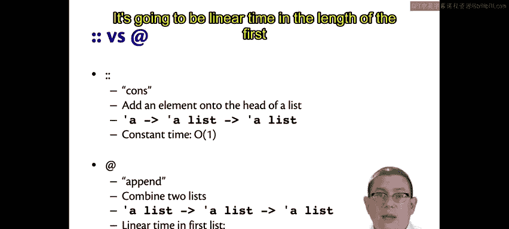
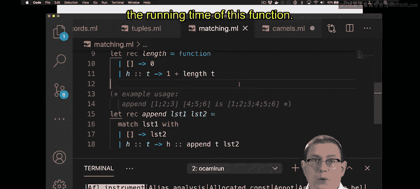
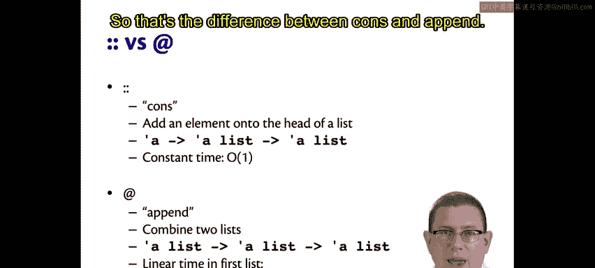

# 康奈尔大学《OCaml编程｜CS3110：OCaml Programming： Correct + Efficient + Beautiful》中英字幕 - P32：-032-Cons vs Append Chap3 Video 10.zh_en - GPT中英字幕课程资源 - BV1Tx4y1s7sP

We've now seen two list operators， let's briefly pause our discussion of pattern matching to take a closer look at them。

The cons operator， ridden with the double colon。Adds an element onto the head of a list。

You could think of that as prepending an element。Its type reflects that。

Its type is alpha， arrow Alpha list， arrow Al list。

You give it an element of type alpha， a list which contains elements of type alpha。

 and it gives you back another list that contains elements of type alpha。

We'll see the implementation next week。 But for now， let me tell you， it's constant time。

 It's very fast。 If you remember how singly linked lists are implemented。

 this should come as no surprise。 All you have to do is allocate a node and install a pointer， right。

The append operator， when ridden with the at sign， combines two lists together。

Its type reflects that。

Both of its arguments have type Alpha list。So the entire type is alpha list， arrow Al list。

arrow Al list。

You can see if you compare those two types that the argument。

The first argument to both of them is different。And for the cons operator， it's alpha。

For the append operator， its alpha list。Now， the append operator we just saw the implementation of。

 so you can think about it。It's going to be linear time in the length of the first list。

Here's that implementation， again。We pattern match against that list。

 walking all the way down it until we have looked at every single element and cons that element onto the front of a new list。

 So however， many elements are in list  one。 that's going to be the running time of this function。

So that's the difference between cons and append。

