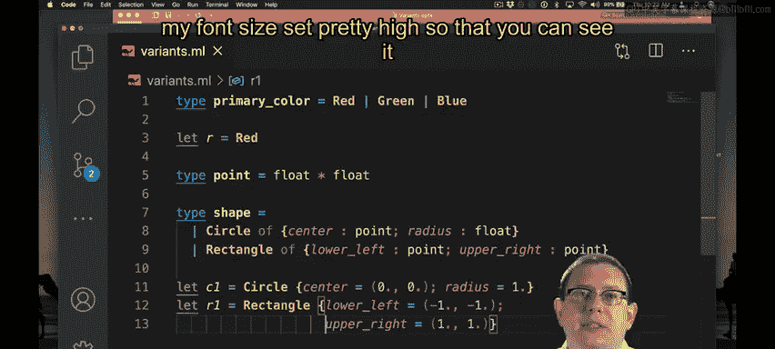
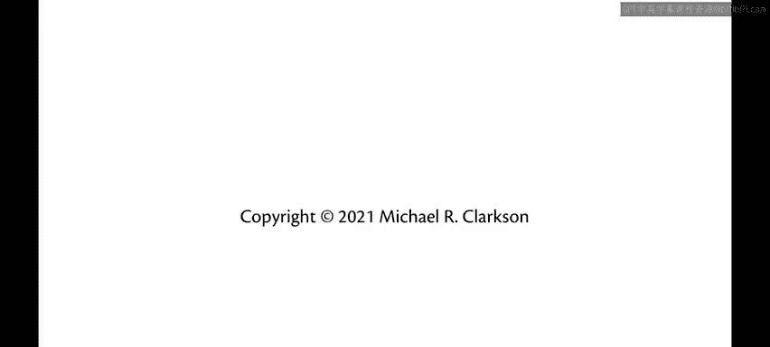

# OCaml编程：3.13：变体类型 🧩

在本节课中，我们将学习OCaml中的变体类型。这是一种强大的方式，用于创建自定义的数据类型，它允许我们定义一组可能的值，每个值可以携带额外的数据。

上一周我们学习了记录和元组，这是OCaml中创建自定义数据类型的两种内置方式。本节中，我们来看看变体类型，这是一种构建数据类型的令人兴奋的新方法。

## 简单的变体：枚举

变体类型初看起来可能很熟悉。在其他语言中，你可能见过允许枚举一个类型中不同常量的类型，有时被称为枚举。OCaml的变体也有类似的功能。

我们可以使用 `type` 关键字定义一个新类型，并列出其可能的值。

```ocaml
type primary_color = Red | Green | Blue
```

现在我们可以拥有该类型的值。

```ocaml
let r : primary_color = Red
```

请注意，即使不添加类型注解，OCaml也能推断出 `r` 是 `primary_color` 类型。这是最简单的变体类型。

## 携带数据的变体

但还有更有趣的变体。让我们尝试为形状创建一个变体类型。我们将在笛卡尔平面中表示形状。

首先，回忆一下我们用于点的类型。

```ocaml
type point = float * float
```

这是一个浮点数元组，代表笛卡尔平面中具有X和Y坐标的点。

现在，让我们为形状创建一个类型。世界上有很多形状，我们创建圆形和矩形。

```ocaml
type shape =
  | Circle of { center : point; radius : float }
  | Rectangle of { lower_left : point; upper_right : point }
```

圆形和矩形除了形状本身，还需要在平面中定位。因此，我们需要在变体构造器名称之外携带额外的信息。

我们可以通过在构造器名称后使用 `of` 关键字来实现。这表示它不仅仅是一个“圆形”，还包含了与“它是圆形”这一事实相关的其他数据。

对于圆形，我们需要一个中心点和一个半径。我们使用记录类型来组织这些数据，包含名为 `center`（类型为 `point`）和 `radius`（类型为 `float`）的字段。

现在我们可以创建这样的圆形。

```ocaml
let c1 = Circle { center = (0.0, 0.0); radius = 1.0 }
```

`c1` 现在是 `shape` 类型。

对于矩形，我们决定用两个点来表示：其左下角坐标和右上角坐标。同样，我们使用记录类型来清晰地标记这些字段，使代码更易于理解。

以下是创建矩形的方法。

```ocaml
let r1 = Rectangle { lower_left = (-1.0, -1.0); upper_right = (1.0, 1.0) }
```

使用带有命名字段的记录，而不是简单的元组（如 `point * point`），可以使代码更具自描述性，避免混淆哪个点是左下角，哪个是右上角。

## 总结





本节课中我们一起学习了OCaml的变体类型。我们首先介绍了最简单的枚举形式，然后学习了如何定义可以携带额外数据的变体构造器，并使用记录类型来组织这些数据。变体类型是构建复杂、灵活数据结构的强大工具。