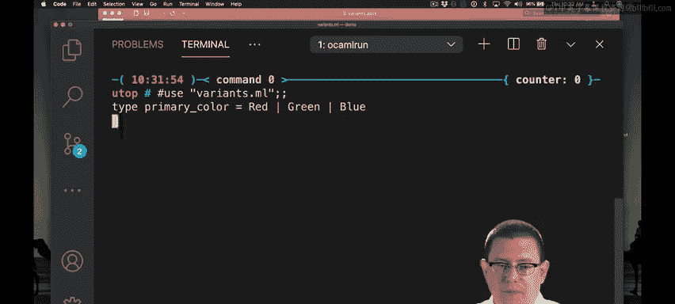

# 康奈尔大学《OCaml编程｜CS3110：OCaml Programming： Correct + Efficient + Beautiful》中英字幕 - P36：-036-Pattern Matching with Variants Part 1 Chap3 Video 14.zh_en - GPT中英字幕课程资源 - BV1Tx4y1s7sP

Suppose you wanted to do something with these shapes。I suppose you wanted to， for example。

 figure out what the center point of a shape was。We could write some code to do that。

Let's try to function。Let center。Of a shape S B。Now in order to figure out what the center of a shape is with this representation of circles and rectangles。

We're going to need to do something based on whether the shape that's passed in is a circle or is a rectangle。

You might remember back to lists from last week where we saw something similar。

We needed to do something depending on whether a list was empty or non empty。

 that is whether it was created with nil or with cons。Same idea here。Well match。S。

 with whether it is a circle or a rectangle。If it's a circle， we'll do one thing。

 if it's a rectangle， we'll do something else。Okay， so I've written circle here。

When I write circle here。And also， when I wrote it up here in the definition of shape。

 there's a term for it， it's called a constructor。This is a little different than the use of constructor in object oriented languages。

 but the essential idea in both places is you are constructing a value of some type and so circle helps you construct a value of type shape here。

We're going to match against that circle constructor here。

And get out what the center point is as well as what the radius is。

And now if I want to return the center point of that shape， it's really easy for circles， right。

 I just need to return that center point， boom， I'm done。Nice。Now for rectangles。

 I'm already getting a warning here， this pattern machine is not exhaustive。

 you haven't told me how to find the center point of a rectangle。Let's do that。So rectangle。

What does a rectangle carry along with it， it has a lower left point and an upper right。

So now I need to figure out how to take the center of those two points well the center is going to be the midpoint of the two x coordinates and the midpoint of the two Y coordinates。

 such as their averages really。mightight help if we just wrote a function to take averages first so in order to do that I'm going to leave off already my sender function here。

 but it's never good to leave code not compiling so I'm going to go ahead and do something here just to get the code to compile one possibility could be I just return some dummy value like I could return0 zero if I wanted。

Another possibility is I could raise an exception， we're going to look more at exceptions pretty soon。

You probably have seen already in a0 that you can write fail with to raise an exception。

 so I could write fail with to do， for example， here。

 that would raise an exception when we got to this piece in the code。

One final possibility could just be to say assert false。

 because assert false will always work in place of any other expression and just raise an exception that says that that assertion has failed。

I tend to do this。 I tend to right fail with to do。

Now I want to write an average function real quickly。 we've written this before。

 the average of two values A and B is going to be what it's going to be there's some。Divideed by2。

All right， now I need to take the average of the X coordinate and the Y coordinate。

those coordinates are kind of buried inside those two points lower left and upper right I need to get them out so let me do that I will do that with pattern matching。

 I could also do it with FST and SND the first and second functions， but let's use pattern matching。

So let the X coordinate from the lower left point and the Y coordinate from the lower left point。嗯。

Lower left。 So I'm pattern matching here against lower left as part of the let expression syntax。

 Now I can put the parentheses in here。I can also leave them out when we're pattern matching against things that truly are pairs here。

 it is stylistically good according to the OKml Community guidelines to leave those parentheses in so I'll go ahead and leave them in。

You will notice what just happened there by the way， when I typed in VS code。

 tried to autocomplete it to in_ channel that is somewhat a frustrating thing that happens。

Let's get the x and Y coordinates of the upper right point as well， x upper right， Y upper right。

Pattern match against stuff。In。And if you don't want it to autocomplete that in channel there。

 one thing you can do is hit escapescape at that point to exit the autocomplete name。All right。

 now I just need to take the average of each of those pair of coordinates。

 so I want to return a point that is at the average between the lower left and upper right。

And the average of the Y coordinates， lower left。And upper right。

 and I'm getting a little underline there what's going on。Oh， I have an extra comma right there。

So now we have a center function。Let's work with that see if we got it right。I will open up。

Terminal here。I'll load that code into Utah。

And now I can take the center of my circle。It's centered of the origin。

 and I can take the center of my rectangle。Which also is centered at the origin。

