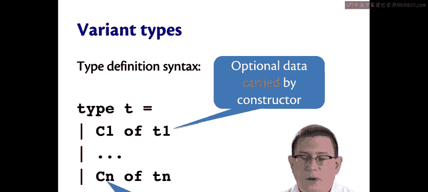
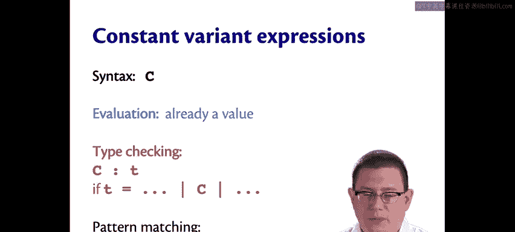
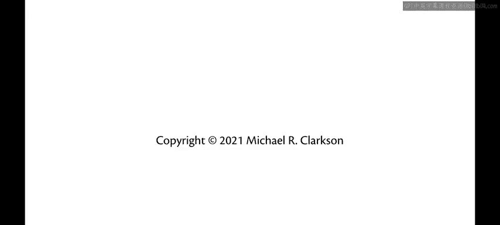

# 康奈尔大学《OCaml编程｜CS3110：OCaml Programming： Correct + Efficient + Beautiful》中英字幕 - P38：-038-Variant Syntax and Semantics Chap3 Video 16.zh_en - GPT中英字幕课程资源 - BV1Tx4y1s7sP

So the syntax for defining a variant type uses the type keyword， just as we saw before for records。

The type definition here though doesn't use curly braces。

 it uses something that looks a lot like pattern matching syntax。

 uses vertical bars to separate each of the constructors of the variant type。So those constructors。

 we could call them C1 through CN here， there could be as many of them as you want or as few as you want。

All of them do have to have capitalized names so always before we've said that identifiers and OamML need to start with lowercase letters here we're going to start to see uppercase letters OCMl does require constructor names to be capitalized。

The constructor can carry along data if it wishes， it's optional， it doesn't have to。

 we saw examples of constructors like the primary colors that didn't and examples of constructors like for Shaves that did。

We say that that optional data is carried by the constructor as the notion is it's carried along with it。

There's a synonym for the word constructor that sometimes people will use。

 it's sometimes called a tag， so it's like you've got all of this additional data that's carried along and then it's tagged to say what kind of data it is so the record carried along with a circle。

 for example， is tagged to say it is a circle by that circle constructor。

There are two kinds of expressions involving variants。

 depending on whetherre constant or non constantst。

 so the difference here is that we say a constructor is constant， if it carries no data。

 it's noncons if it carries some data。And hopefully that makes sense。

 it's non constant in the sense that the data that's carried along with it could change。

So the syntax for a non constant variant expression is the name of the constructor followed by an expression。

To evaluate a non constant variant expression， evaluate the expression E inside of it to evaluate。

And then the result of the entire expression is just the constructor name followed by that value。

For type checking。A non constant variant expression has type T if there's a definition of that variant type T that includes that constructor name C。

And that constructor is declared to carry along with it data of type T prime。And the expression E。

That is written next to capital C has that type T prime。

Now we said there would also be pattern matching syntax each time we introduce a new kind of data type in OcaMl。

 so here we have a new pattern form。A constructor name followed by a pattern is itself a pattern。

Constant variant expressions are really just a simplification of everything we just saw。

 The syntax for a constant variant expression is just the constructor name。For evaluation。

 it's already a value， this is similar to how every other kind of constant in Oambell is already a value。

 like 42 is already a value。And for type checking， a constructor name has type T if there is a definition of variant type T that includes that constructor name。

Finally， C is a pattern。

