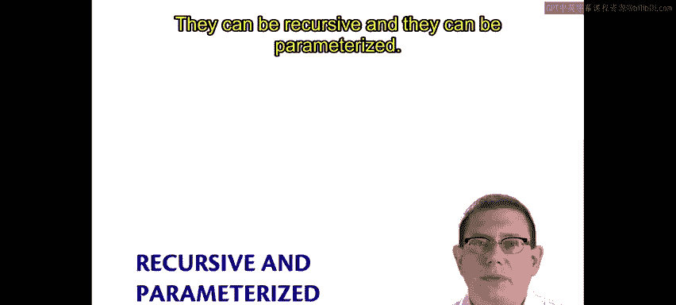
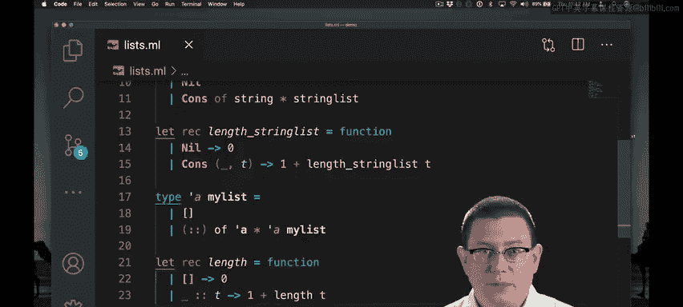
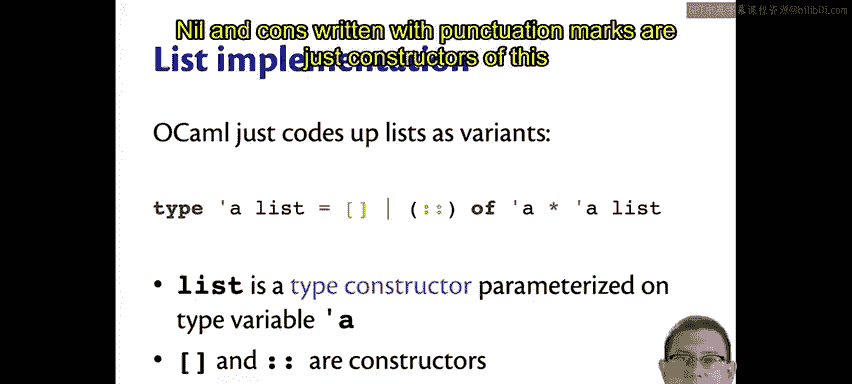

# 康奈尔大学《OCaml编程｜CS3110：OCaml Programming： Correct + Efficient + Beautiful》中英字幕 - P41：-041-Recursive Parameterized Variants Chap3 Video 19.zh_en - GPT中英字幕课程资源 - BV1Tx4y1s7sP

There is yet more power to variants that we haven't seen yet。

 They can be recursive and they can be parameterized。 Let's see examples of each of those。

 Let's code up our own type for representing lists， and for now there'll just be lists of integers。

So I've created a type int list， which has two constructors named Nil and Cons。Nil is constant。

 it doesn't carry any data along with it。Cons is non constant。It carries a pair。

The first component of that pair is an int。The second component of the pair is an int list。

So type int list here is recursive， it mentions its own name inside of its definition。

This is like how functions can be recursive， it's also like how classes in Java can name themselves inside of their own body were used to having types that are recursive this way。

So you can think of the int here in the cons constructor as being the head of the int list。

And the ink list here， the second component of that pair as being the tail of that list。

We could write functions on in lists。Like we've written on other lists built into OcaMl。For example。

 the length function。And now we're able to take the length of an inlist。Let's see an example of that。

How do we create an int list Well， the syntax for it isn't going to be quite as pleasant as the builtin syntax for lists in Ocal because we've had to write our constructors with words with capital NIL for nil instead of just the empty list with capital CO and S for cons instead of just the double colon。

But we can create an lists， here's the list containing one and2。Now we have an int list。

 its first element is one， its second element is  two， and then it ends with the empty list。

What is its length？It's two， as it should be。Now， what if the next day after writing our int list type。

 we discovered we also needed string lists？One possibility would be to copy all of this code and repeat it。

But now we do have a little bit of a problem。There's two length functions here。

 this one works on ant list， this one works on string list。

 but the latter one's going to shadow the first one。

 so we might end up needing to say two different names for this。But this sure is getting tedious。

 and then tomorrow， if we discover we also need bo lists and nested lists of lists。

 this isn't going to scale well at all。In fact， anytime we copy and paste and tweak code as I just did here。

Almost certainly we're doing the wrong thing。Good programmers don't copy and paste code nearly that much Instead。

 they abstract commonalities from code and try to write code that's parametric with respect to whatever the changeable parts might be。

We ought to parameterize this variant on the type of the elements that are stored in the list rather than hard coding it。

Of course， you know that from 20110。How can I do it in Ochemel with a parameterized variant？

I've just written a type alphapha myel list。The alpha here is a type variable。😡。

It goes to the left of the name of the type。This is a little different from how we normally think of application。

 right normally when we apply a function to a value。

The value we're applying to goes on the right hand side。For types。

 it's the opposite way around in Ocal。 So you can think of my list here as a kind of。

Function at the type level， it operates on types， it takes in a type and gives you back a type。

So my list takes in the type alpha here， that's the variable with which we're going to refer to that type in the body of this definition。

 and it gives me back a type， which is this variant type that's been defined here。

I get to use alpha in this definition， so cons for its pair。

 now has the head of the list as being of type alpha and the tail of the list as being of type alpha my list。

Now I used my list here just to disambiguate from the word list that's built into Ocal。

We can code up functions on alpha mylists now。And the nice thing is that we don't have to keep repeating these definitions for every kind of element we might want to put into the list。

We can take the length of a list containing just the integer 1， that's length length1。

 we can also take the length of a list containing true， it also has length one。

The length function now is parametric with respect to the type of the list elements。By the way。

 we actually could get some nicer syntax for our lists if we wanted。

 we could replace those constructors with operators or with punctuation。

And now I have a my list type that works more or less exactly like the built in list type in Ocal in that I can use square brackets for the empty list and double column for the cons constructor。

Indeed， that's exactly how the standard library codes up lists。

 so I promised last week we would look at the standard library implementation of lists。

 we actually basically just saw it。The standard library definition of lists is that type Alpha list is either nil writtenden with square brackets or cons。

 the operator of Alpha star Alpha list。So OcaMel built in Sly linked lists are just recursive parameterized variants。

List here is what we call a type constructor， you can think of that as a type level function。

 and it is parameterized on that type variable alpha。

Nil and cons written with punctuation marks are just constructors of this variant。

