# OCaml编程：3.20：Options 🧰

在本节课中，我们将要学习OCaml标准库中的另一个内置变体类型：Options。它为解决某些编程问题提供了一种优雅的方案。

## 概述

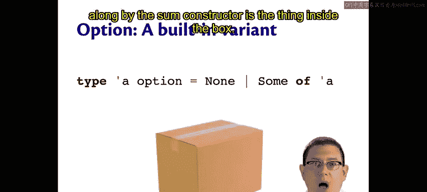

上一节我们介绍了变体类型的基本概念，本节中我们来看看一个非常实用的内置变体类型：`option`。它用于表示一个可能不存在的值，是处理“空值”问题的核心工具。

## Options的定义与概念

`option` 类型的定义非常简单。其类型 `'a option` 要么是 `None`，要么是 `Some of 'a`。

你可以将 `option` 想象成一个盒子。这个盒子要么是空的，要么里面装着东西。`None` 构造器代表空盒子，`Some` 构造器代表装有东西的盒子，而 `Some` 所携带的类型 `'a` 就是盒子里的内容。

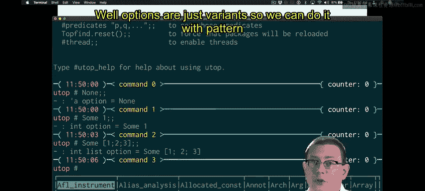

例如：
*   `None` 的类型是 `'a option`，类似于空列表的类型是 `'a list`。
*   `Some 1` 的类型是 `int option`，可以理解为“可选地，这是一个整数”。可选意味着这里可能有一个整数，也可能什么都没有（用 `None` 表示）。
*   你也可以放入更复杂的数据，例如 `Some [1; 2; 3]` 的类型是 `int list option`，即“可选地，这是一个整数列表”。

## 从Option中取值

Options是变体类型，因此我们可以使用模式匹配来从中取值。让我们编写一个函数来尝试从 `option` 中取出值。

```ocaml
let get_val o =
  match o with
  | Some x -> x
  | None -> ???
```

我们编写了函数 `get_val`，其类型应为 `'a option -> 'a`。它尝试从 `'a option` 中取出 `'a`。当盒子中有东西（`Some`）时，`get_val` 可以返回那个值。但是，当盒子是空的（`None`）时，我们该返回什么呢？我们不知道 `'a` 具体是什么类型，因此无法返回一个合理的默认值。

一个更好的方法是让调用此函数的程序员来指定当盒子为空时返回的默认值。

```ocaml
let get_val default o =
  match o with
  | Some x -> x
  | None -> default
```

现在，`get_val` 的类型是 `'a -> 'a option -> 'a`。它总是能返回一个 `'a` 类型的值。当然，这里也可以使用 `function` 关键字来简化代码。

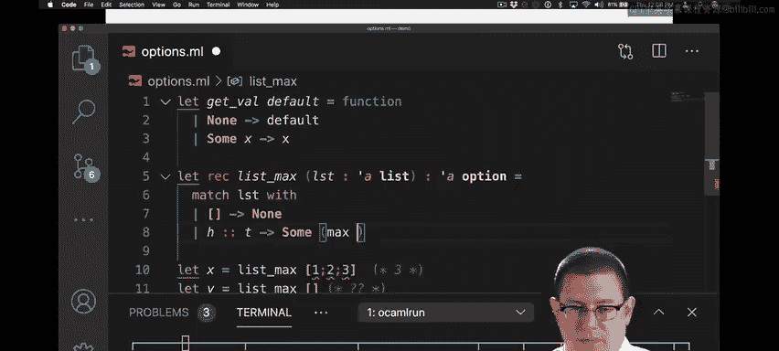

## Options的典型用途

仅仅有盒子和从中取值的操作并不十分有趣，也不是最地道的用法。Options真正有用的地方是作为那些可能没有有意义返回值的计算的返回值。

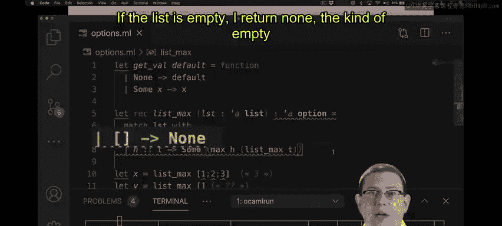

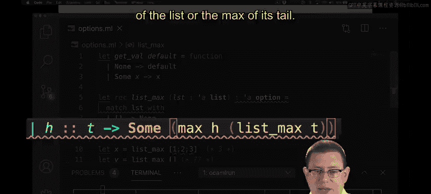

让我给你一个例子。假设你想求一个列表的最大值。`max_of_list [1; 2; 3]` 应该返回 `3`。但是，`max_of_list []`（空列表的最大值）应该返回什么呢？你可能会决定返回某个极值（如整数的最小值），或者抛出一个异常。但一个更有原则的处理方式是返回一个 `option`：对空列表返回 `None`，对列表 `[1; 2; 3]` 返回 `Some 3`。

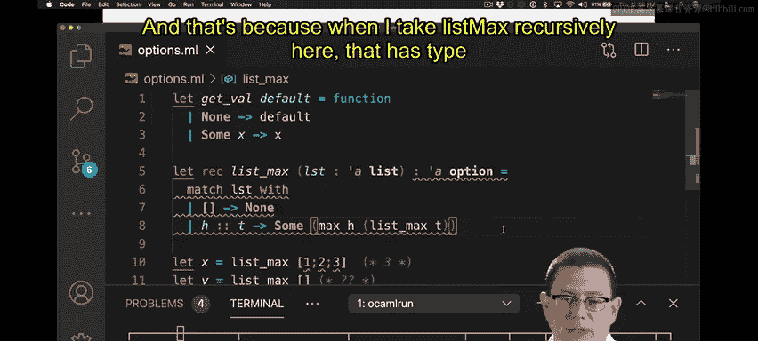

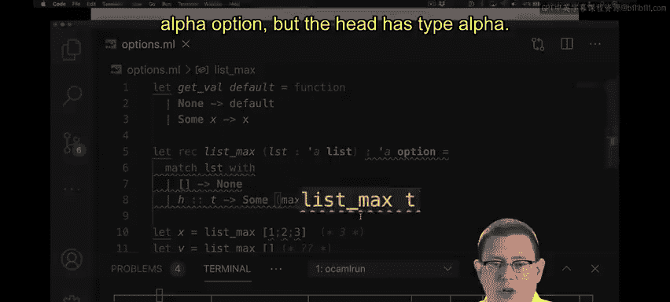

因此，我们真正要写的是一个函数 `list_max`，它接收一个列表，并返回一个 `'a option`。它可选地返回列表中的一个元素作为最大值。

以下是实现这个函数的代码：

```ocaml
let rec list_max = function
  | [] -> None
  | h :: t ->
    match list_max t with
    | None -> Some h
    | Some m -> Some (max h m)
```

如果列表为空，我返回 `None`（空盒子）。如果列表有头元素 `h` 和尾列表 `t`，那么我返回一个盒子（`Some` 构造器）。我放入盒子的是两个值中的较大者：要么是列表的头元素 `h`，要么是其尾列表 `t` 的最大值。

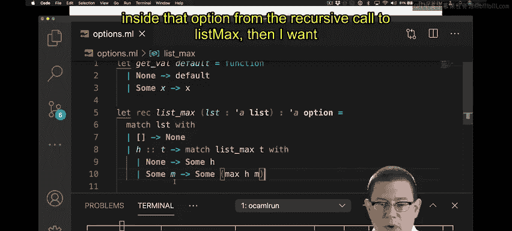

但是，这里有一个编译错误。因为递归调用 `list_max t` 返回的是 `'a option` 类型，而头元素 `h` 是 `'a` 类型。我试图比较一个 `'a` 和一个 `'a option`，多态比较操作符会报错，因为这两者的类型不同。

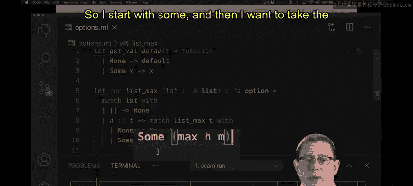

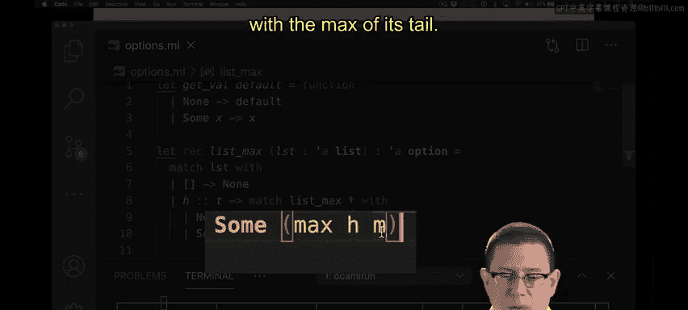

因此，我需要先从递归调用 `list_max` 返回的盒子中取出值。修改后的代码如下：

```ocaml
let rec list_max = function
  | [] -> None
  | h :: t ->
    begin match list_max t with
    | None -> Some h
    | Some m -> Some (max h m)
    end
```

现在，代码做了什么？我匹配对尾列表 `t` 递归调用 `list_max` 的结果，它返回一个 `'a option`。这个 `option` 可能有内容，也可能没有（因为尾列表可能为空）。如果尾列表为空，递归调用返回 `None`。在这种情况下，我直接返回 `Some h`，因为头元素是列表中唯一的元素，所以它必然是最大值。另一方面，如果递归调用确实返回了一个包含最大值元素的 `Some`，那么我想返回一个 `option`（以 `Some` 开头），里面放入当前头元素 `h` 和尾列表最大值 `m` 中较大的那个。

## 关于代码风格的重要说明

在风格上，需要指出的一点是，你应该在这样的嵌套模式匹配周围写上 `begin` 和 `end`。这样做有充分的理由：它帮助OCaml和人类确保正确解析代码。`begin` 和 `end` 实际上与括号作用相同，但在风格上，我们倾向于在嵌套模式匹配周围使用 `begin` 和 `end`，因为它们更醒目，能帮助我们更好地看清代码分组。

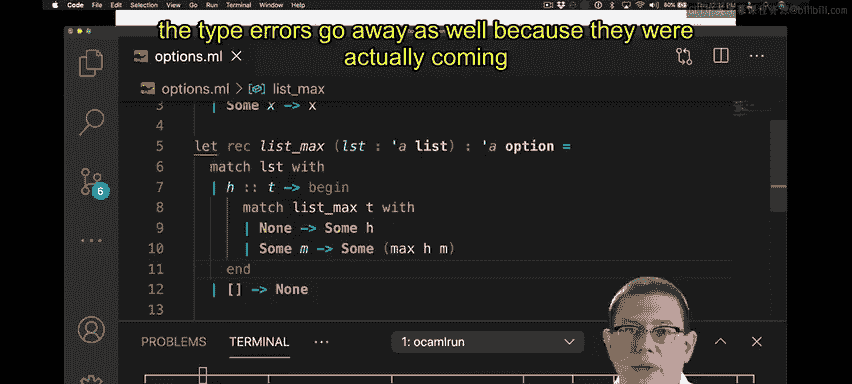

为什么需要它们？假设我们没有写 `begin` 和 `end`。当我保存文件并让Merlin（代码工具）重新格式化时，它可能会将外层模式匹配的第一个分支移动到内层 `match` 表达式中，因为OCaml会将其解析为离它最近的 `match` 表达式的一部分。这会导致解析错误，进而引发类型错误。正确使用 `begin` 和 `end` 可以确保OCaml正确解析代码，从而消除这些类型错误。

## Options与空指针异常

我之前提到，Options提供了一种解决Java难以处理的问题的方法。这个问题就是空指针异常。这不是我说的，是Tony Hoare说的。他在1980年因对编程语言定义和设计的基础性贡献而获得图灵奖，也是快速排序算法的发明者。他写道，他称空引用（null）为他“十亿美元的错误”。在设计面向对象语言的类型系统时，他没能抵制住加入空引用的诱惑。这在过去40年里导致了无数的错误、安全漏洞和系统崩溃，可能造成了数十亿美元的损失和损害。

Options是空值（null）的一个有原则的替代品。Java的类型系统本可以内置 `option` 类型，而不是让每个引用都可能是 `null` 或一个指针。这样，每个引用都可以是一个 `option`，程序员必须通过模式匹配来检查它是 `None` 还是 `Some`。强制程序员进行这种模式匹配，可以确保他们在每次解引用时都考虑到空指针错误的可能性。

所以，这个故事的寓意是：避免空指针异常，转而使用模式匹配来检查 `None`。

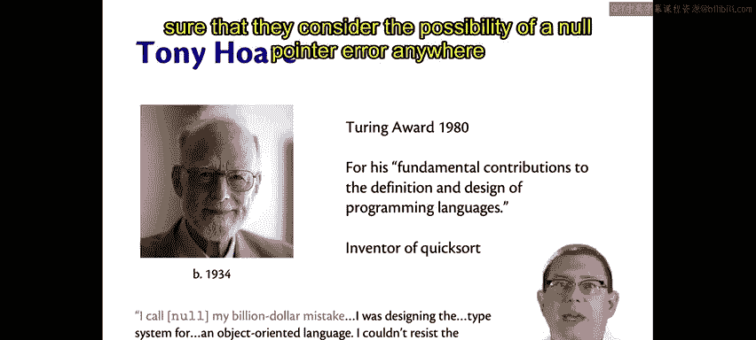

## 总结

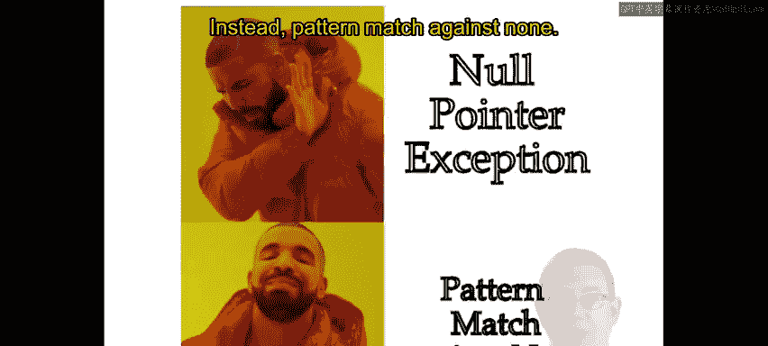


本节课中我们一起学习了OCaml中的 `option` 类型。我们了解了它如何像一个盒子一样，表示一个可能存在也可能不存在的值。我们学习了如何通过模式匹配从 `option` 中安全地取值，并看到了它在处理像“求列表最大值”这类可能无结果的计算时的典型应用。最后，我们探讨了 `option` 类型作为一种更安全、更有原则的机制，如何帮助我们避免像Java中空指针异常那样的常见错误。通过使用 `option`，编译器可以强制我们在代码中显式地处理“值缺失”的情况，从而编写出更健壮的程序。