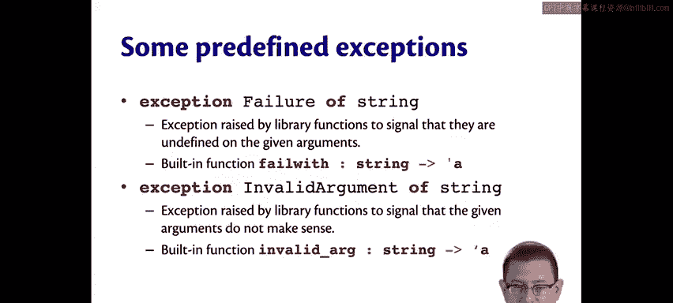

# OCaml编程：3.21：异常处理 🚨

在本节课中，我们将要学习OCaml中的异常处理机制。异常是处理程序中错误或意外情况的一种方式。理解了变体类型后，你会发现异常本质上就是一种特殊的变体。

## 异常的本质：一种特殊的变体

上一节我们介绍了变体类型，本节中我们来看看异常。OCaml中有一个内置的类型叫做 `exn`，这是异常的类型。所有的异常实际上都是这个类型的值。

你可以通过 `exception` 关键字定义自己的异常，后面跟上异常的名称。这相当于定义了一个 `exn` 类型的构造器。既然是构造器，它可以是常量，也可以携带数据。

```ocaml
exception BadThing
exception OhNo of string
```

这里的 `exn` 类型很特殊，它是一个内置的、可扩展的变体。通常我们定义变体时，必须在定义中列出所有的构造器。但 `exn` 允许我们稍后通过 `exception` 关键字来添加构造器。

## 抛出与处理异常

定义好异常后，如果想抛出它，可以使用 `raise` 关键字，就像Python一样。

```ocaml
raise (OhNo "oops")
```

执行上述代码，OCaml会报告一个异常被抛出：`Exception: OhNo "oops"`。这类似于除以零会抛出预定义的 `Division_by_zero` 异常。

我们创建的异常可以不携带任何数据。

```ocaml
exception ABadThing
raise ABadThing
```

OCaml程序员比某些Java程序员更倾向于创建自己的新异常，因为在OCaml中创建异常非常简单，不需要像Java那样创建一个新的类文件并定义构造器。


内置函数 `raise` 的类型是 `exn -> 'a`。它接受一个异常值并将其抛出。由于它会抛出异常，包含 `raise` 的表达式本身永远不会产生一个真正的值，它不会返回任何值，因此其返回类型被标记为 `'a`（任意类型），类型系统允许这样做。

```ocaml
let x : int = raise ABadThing (* 这是类型检查通过的 *)
```

## 标准库中的常用异常


标准库中预定义了许多异常，其中两个有用的异常是 `Failure` 和 `Invalid_argument`。它们都携带一个字符串，以便提供有用的错误信息。

以下是它们的简要说明：
*   `Failure`：由库函数引发，表示它们在给定参数上未定义。
*   `Invalid_argument`：由库函数引发，表示给定的参数没有意义。

实际上，它们的功能很相似，但标准库同时提供了两者。

为了方便，标准库还提供了两个内置函数来抛出这些异常：
*   `failwith`：抛出 `Failure` 异常。
*   `invalid_arg`：抛出 `Invalid_argument` 异常。

因此，你可以选择麻烦一点的方式：
```ocaml
raise (Failure "my error message")
```
或者更方便的方式：
```ocaml
failwith "my error message"
```
`failwith` 函数本质上就是用你提供的消息调用了 `raise`。




## 总结

本节课中我们一起学习了OCaml的异常处理。我们了解到异常是 `exn` 类型的值，这是一种可扩展的变体。我们学会了如何使用 `exception` 关键字定义自己的异常，以及如何使用 `raise` 关键字抛出异常。最后，我们还介绍了标准库中预定义的 `Failure` 和 `Invalid_argument` 异常，以及便捷函数 `failwith` 和 `invalid_arg` 的用法。