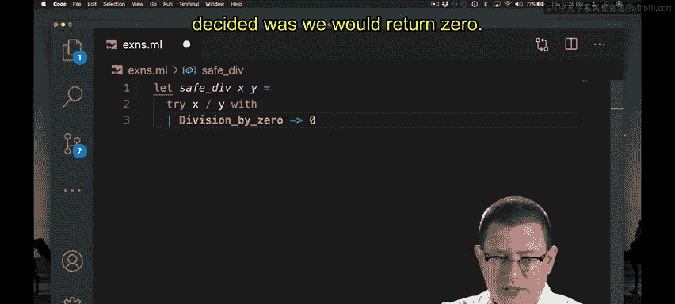
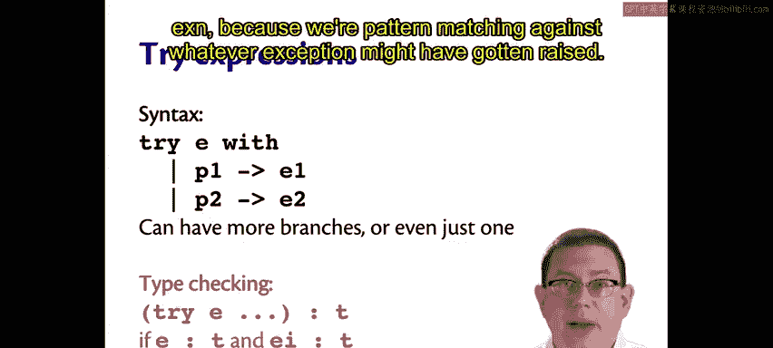

# OCaml编程：3.22：异常处理 🚨

在本节课中，我们将要学习如何在OCaml中处理被抛出的异常。异常处理的核心是模式匹配，因为异常本身就是一种变体类型。我们将通过一个安全的除法函数示例来理解其语法和语义。

## 处理被抛出的异常

处理一个被抛出的异常，本质上就是进行模式匹配。

因为异常是变体类型。例如，假设你试图处理一个除零错误。

通常，如果你除以零，你会得到一个异常。

假设你想要一个安全的除法函数，如果尝试除以零，则返回其他值，比如定义除零的结果为零。

我们可以这样定义：`let safe_div x y =`。我们将尝试计算 `x / y`。如果成功，`x / y` 的值将被返回。但如果计算 `x / y` 时抛出了异常，我们可以继续并对该异常进行模式匹配。这就像 `match ... with`，但现在用的是 `try ... with`，并且我们只在异常被抛出时进行模式匹配。

因此，如果抛出除零异常，那么我们决定返回零。



```ocaml
let safe_div x y =
  try x / y with
  | Division_by_zero -> 0
```

现在，当我们尝试计算 `safe_div 4 0` 时，我们得到零而不是一个异常。`try` 表达式的语法和语义与 `match` 表达式非常相似。

## `try` 表达式的语法与语义

语法是 `try E with`，然后是一些模式分支。你可以有多个分支，也可以只有一个。

要计算一个 `try` 表达式，首先计算表达式 `E`。

如果 `E` 确实成功，即 `E` 能够在不引发异常的情况下产生一个值 `V`，那么整个 `try` 表达式就计算为 `V`。此时我们甚至不会去看那些模式。

但如果 `E` 引发了一个异常，我们称之为 `X`。那么就像正常的模式匹配一样，将 `X` 与每个模式进行匹配。

如果有一个模式匹配成功，则计算右侧的表达式并返回其结果。

否则，如果我们检查完所有模式都没有匹配项，此时，异常 `X` 会被重新抛出。这与 `match` 表达式的正常语义略有不同，因为在 `match` 表达式的末尾，如果没有找到匹配项，会抛出 `Match_failure` 异常，而这里我们重新抛出原来的异常 `X`。

## 类型检查规则

整个 `try` 表达式具有类型 `T`。

表达式 `E` 必须具有类型 `T`，因为如果没有引发异常，`E` 的结果将被返回。

所有分支右侧的表达式 `E_i` 也必须具有相同的类型 `T`，因为其中一个可能在发生异常时成为返回的值。

当然，所有模式本身必须具有类型 `exn`，因为我们要对可能引发的任何异常进行模式匹配。

---



本节课中我们一起学习了OCaml中的异常处理机制。我们了解到，使用 `try ... with` 结构可以捕获并处理表达式执行过程中抛出的异常，其核心是通过模式匹配来识别不同的异常类型。我们掌握了其语法、计算语义以及类型检查规则，并通过一个“安全除法”函数的例子进行了实践。记住，如果没有任何模式匹配到被抛出的异常，该异常会被重新抛出。