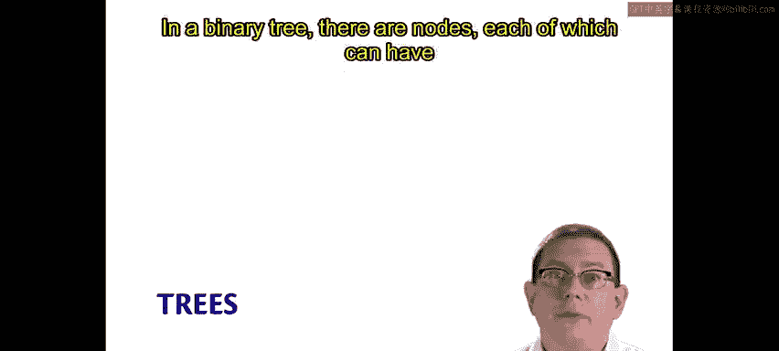
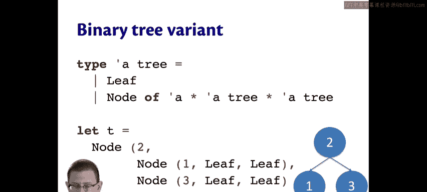
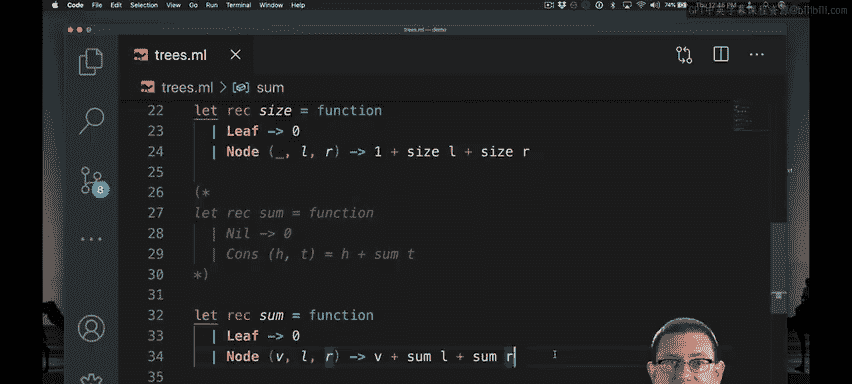

# OCaml编程：3.23：🌳 二叉树

在本节中，我们将学习OCaml中变体类型的另一个重要应用：二叉树。我们将通过对比单链表来理解二叉树的定义、创建和基本操作，例如计算树的大小和元素总和。

---

## 二叉树的定义

上一节我们介绍了变体类型，本节中我们来看看如何用变体类型定义二叉树。二叉树与单链表非常相似。单链表的节点中，每个元素只有一个后继节点。而在二叉树中，每个节点可以有两个后继节点，即两个子节点。

以下是 `alpha mylist`（单链表）和 `alpha tree`（二叉树）的代码定义，我们可以边看边比较：



```ocaml
type 'a mylist = Nil | Cons of 'a * 'a mylist

type 'a tree = Leaf | Node of 'a * 'a tree * 'a tree
```

`alpha mylist` 要么是 `Nil`（空列表），要么是 `Cons`（包含一个元素和另一个列表的节点）。`alpha tree` 要么是 `Leaf`（空树，不包含任何内容），要么是 `Node`（包含一个类型为 `alpha` 的值，以及另外两个 `alpha tree` 作为左右子节点）。除了将标识符重命名外，其定义与 `alpha mylist` 基本相同，只是在 `Node` 构造器中多了一个子节点，而链表节点只有一个子节点。

---

## 创建二叉树

要创建这种类型的值，可以像下面这样定义一个树 `t`：

```ocaml
let t = Node (2,
              Node (1, Leaf, Leaf),
              Node (3, Leaf, Leaf))
```


下图展示了我们创建的这棵树的结构：


这棵树的根节点是 `2`，其左子节点是 `1`，右子节点是 `3`。节点 `1` 和 `3` 各自又有两个叶子节点作为子节点。在绘制树形图时，我们通常不会画出叶子节点，因为它们不包含数据，也没有实际作用。

---

## 计算树的大小

如果你想计算树的大小，即树中节点的数量，代码会与计算列表长度的代码非常相似。

以下是计算树大小的函数：



```ocaml
let rec size = function
  | Leaf -> 0
  | Node (_, left, right) -> 1 + size left + size right
```

对于空的情况（`Leaf` 构造器或列表的 `Nil` 构造器），我们返回 `0`。对于非空的情况（列表的 `Cons` 或树的 `Node`），我们返回 `1` 加上对子节点递归调用的结果。列表只有一个子节点，而树有两个子节点。

---

## 计算树中元素的总和

如果你想计算列表或树中所有元素的总和，方法也类似。

以下是计算树中元素总和的函数：

```ocaml
let rec sum = function
  | Leaf -> 0
  | Node (value, left, right) -> value + sum left + sum right
```

对于列表，如果列表非空，则返回头元素加上尾部元素的总和。对于树，则返回节点处的值加上对两个子节点递归调用的结果之和。同样，代码结构非常相似。

---

## 总结

本节课中我们一起学习了如何在OCaml中使用变体类型定义和操作二叉树。我们了解到，二叉树的实现与单链表非常相似，主要区别在于节点可以拥有两个子节点。通过计算树的大小和元素总和这两个例子，我们看到了递归在处理树结构时的强大和简洁。在OCaml中实现二叉树并不困难，这正体现了函数式编程的精妙之处。



