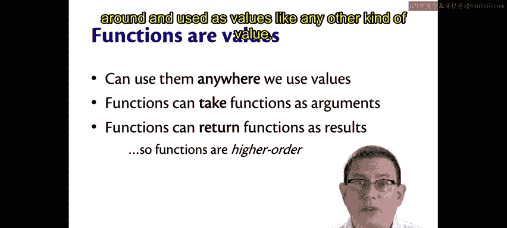
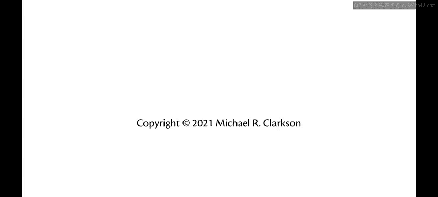

# 康奈尔大学《OCaml编程｜CS3110：OCaml Programming： Correct + Efficient + Beautiful》中英字幕 - P46：-046-Higher-Order Functions Chap4 Video 1.zh_en - GPT中英字幕课程资源 - BV1Tx4y1s7sP

We've now spent a fair amount of time talking about data and types in Ocaml。

 Let's return to the notion of functions actually let's even think about functions as data。

We said a while back， functions are values， we can use them anywhere that we use values。

So functions can take functions as arguments， and functions can return functions as results。

This means that functions are higher order in OcaMl。By higher order here。

 we mean exactly that they can be passed around and used as values like any other kind of value。

 Let's start by writing a couple functions。

Double， which doubles its argument。And how about square？What if we wanted to quadruple a number？Well。

 quad of x could be four times x。There's another way we could code that up though。

 which is we could use double twice。Quad prime。Could be the result of doubling。double不。6。

We learned about the pipeline operator before， we could use that to write Quad as well。

Qud double prime could be X pipelined through double and then pipelined through double。

So that's a bunch of different ways of writing Quad。

Now suppose you wanted to take the fourth power of a number。

I don't really know what that would be in terms of squaring， but let's call it fourth。Let's see。

 fourth of x could be x times x times x times x。This is kind of similar to Quad。

We could also write it。Rewrite it。 That is in the same ways we rewrote quad。

 So we could have let fourth prime of x be the result of。Taking quad。Or squarequa， rather。

And applying square twice to the argument。Or we could do it with a pipeline operator。

So that gives us a bunch of different ways of writing the same function。Now。

 those were not maybe that interesting of functions。

 but let's look at the similarity between what we did for each of them。In order to build quad。

We applied double twice。In order to build fourth， we applied square twice。

So there's this notion here of applying a function twice。Well。

 anytime you notice that kind of repeated action in a code。

 a good question to ask yourself is could I factor that out。

 could I abstract that functionality and make it its own piece of code so that I don't have to keep repeating it？

So let's write a function that actually applies another function twice。

Twice we'll take in a function F and an argument X。And it will apply F。To that argument twice。

Let's look at the type of that function。Twice takes in a function， a function from alpha to alpha。

 so it doesn't really matter what the input output type of that function is， it could be anything。

It then takes in a value of the input type and gives us back a value of that type。

 which is also the same as the output the function。

So I could use twice to recode some of the functions that I wrote before。For example。

 I could write Quad。 Let's see whether we have to triple prime here。 Quad of x could be。

Twice double X。So I'm going to take the double function and apply it twice to X。

 This is higher order。We're actually using twice as a function that takes in another function as an argument。

I could do the same thing with fourth。So let's see， let fourth triple prime be twice。Square。X。

And of course， I could have done all of that with twice using the pipeline operator as well。

I could have written it as Fx equal x。Pipeline through F twice that would work just as well。

 I won't go back and rewrite the other functions with that but you get the idea。

Another thing I could do。For quad and forth。Is actually leave off the argument。

I could rewrite quad we're up to four primes here。As twice double x。 Now I leave off the argument。

 what I mean is。Suppose I just said quad。Ys。Were。This。In which。Qud is not taking in an argument here。

 but it is equal to twice double， so what's twice double， well。

 twice we can see the type of it up at the top here takes in a function， takes in an argument。

 gives us back an output。But if we apply twice only to its function F， in this case。

 we did twice double， what that gives us back is a function。A function of type alpha arrow alpha。

 or in this case， since double was defined based on integers， a function of type int arrow int。

So again， this is higher orderness。Our twice here is being a higher order function because it is giving us back a function as output when we applied it to just that first input。

We've seen this before with partial application。Of course， I could do the same thing with fourth。

So that's a bunch of different ways of writing these two little functions and the reason we took a look at all of these was to get some insight into what it means to be higher order。

It means we can use functions in the same way as other kinds of values in the language by passing them into other functions and even returning functions as a result。

