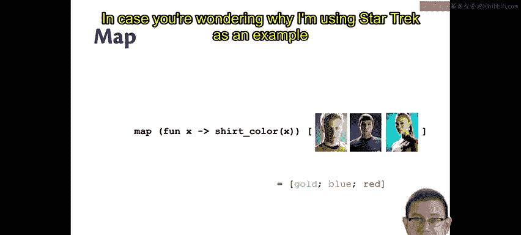
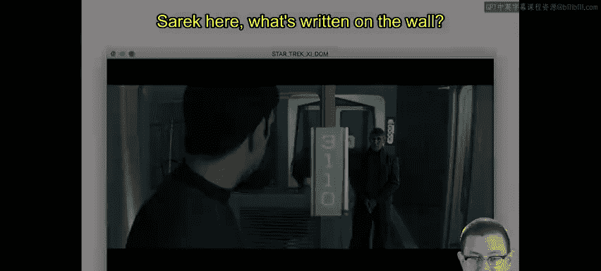
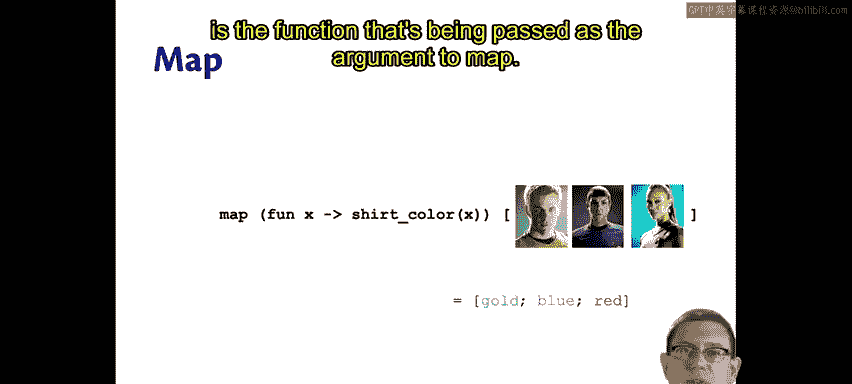
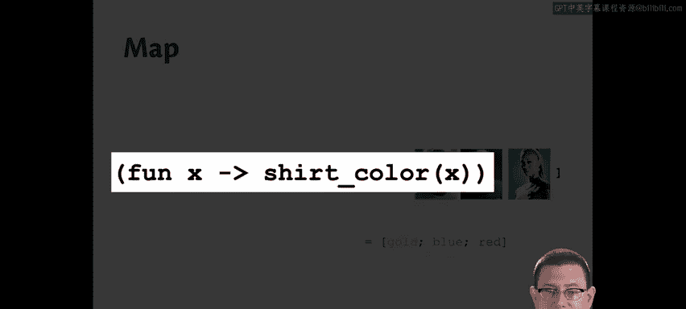
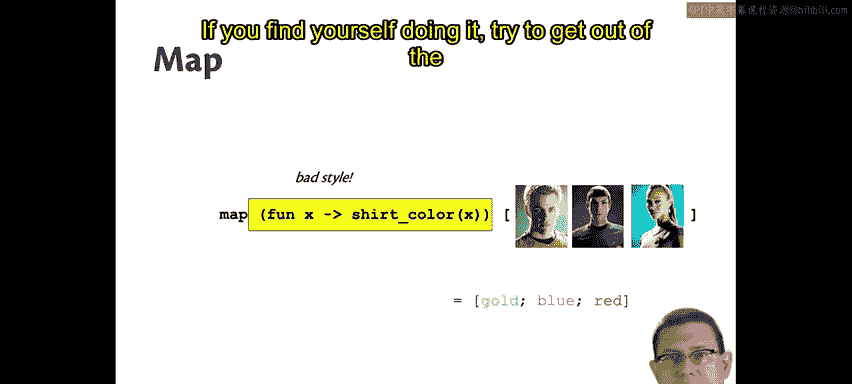
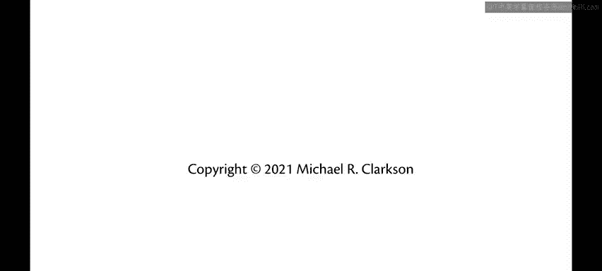

# 康奈尔大学《OCaml编程｜CS3110：OCaml Programming： Correct + Efficient + Beautiful》中英字幕 - P47：-047-Map Chap4 Video 2.zh_en - GPT中英字幕课程资源 - BV1Tx4y1s7sP

Perhaps the most famous higher order functions are map and Red。

Google made these extremely popular for large scale data parallel computations in a framework called Maap Reduce。

 There's an open source implementation of this by Apache called Hadoop。

In the paper that introduced map Redduce， Google wrote。

The abstraction is inspired by the map and reduced primitives present in Lisp and many other functional languages。

Let's get started with map and before looking at any Ecode， let's just look at an example。

Suppose you wanted to map some characters from a popular TV show I've chosen Star Trek here to their shirt color。

 Suppose you have three people， Kirk， Spock and Uhuura。

 I don't know if you recognize classic trek characters。

 maybe if I replace them with the rebooted tre， they're a little more recognizable either way。

 we've got a gold shirt， a blue shirt and a red shirt。

So the idea of the map function is that you take map。And if you pass it a function and a list。

 it's going to apply that function to every element of the list and give you back the resulting list。

So if you pass in a function that gives you a shirt color for a given character。

Then it's going to give you back the list that says gold， blue， red for their shirt colors。

In case you're wondering why I'm using Star Trek as an example here。

Here's a screenshot of one of the reveed Star Trek movies， and if you look very closely。

 you will notice between Spock and Saraak here what's written on the wall。

31，10。And then later in the scene， they flip around to the other side of that wall。

 and what do you see there， 6110， which is the graduate programming languagegus class in this department。

Standing on the other side there， you still see Spock standing on the transporter pad and Sarah looking at him。

So I guess what they're trying to say is that studying programming languages will really transport you。

Going back to our example code here， there is something that could be improved about it。

 even though it is kind of pseudocode， which is the function that's being passed as the argument to map。

We're passing in an anonymous function that takes in an argument X and applies shirt color to X。

There's some additional parentheses there that we never needed to write， but even worse than that。

 there's a much simpler way of writing this function。If only we had something that when you pass it。

 X gives you back the shirt color of x。We do， we could just write shirt color here instead。Okay。

 so this is a common error I see a lot as people start to study functional programming is taking what could just be a function name that they pass as an argument to a higher order function。

 and instead using this bad style to kind of wrap that function name with an anonymous function around it。

No need to do that if you find yourself doing it， try to get out of the habit。

