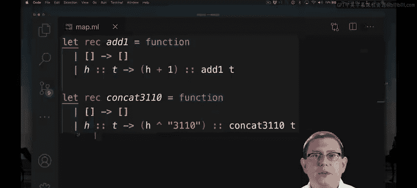
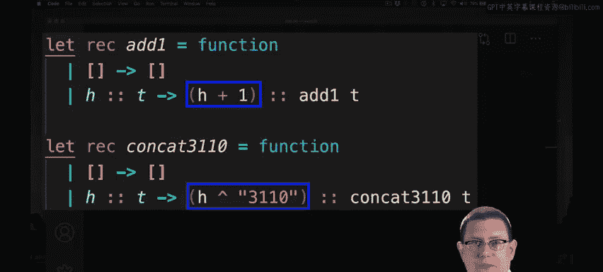
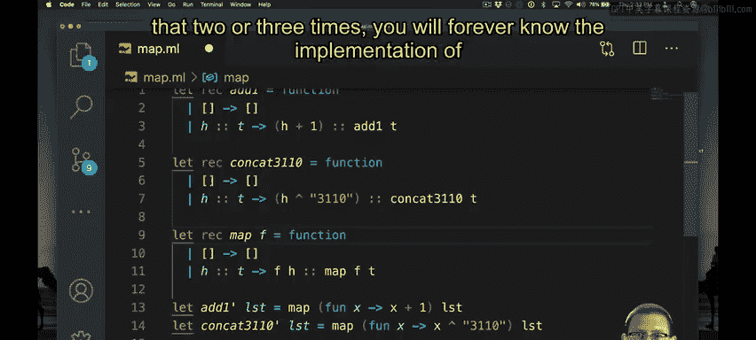
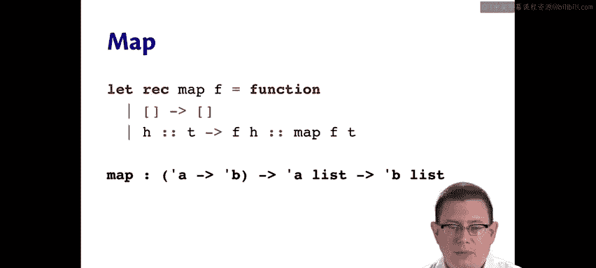
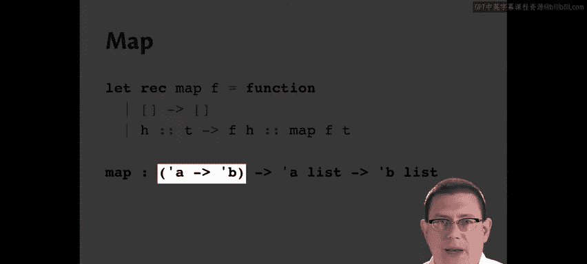
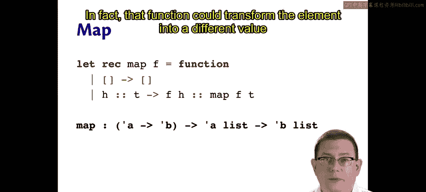
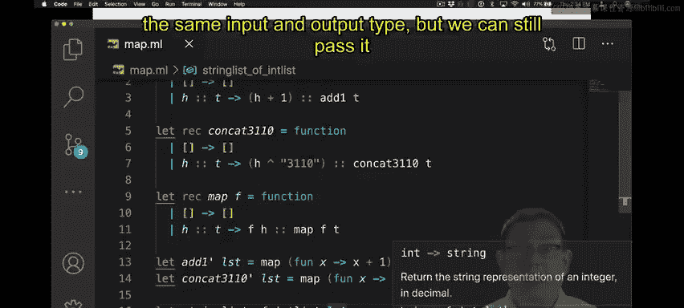
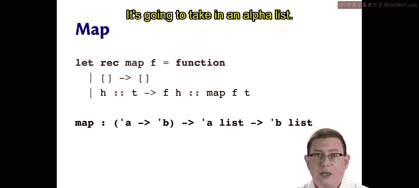
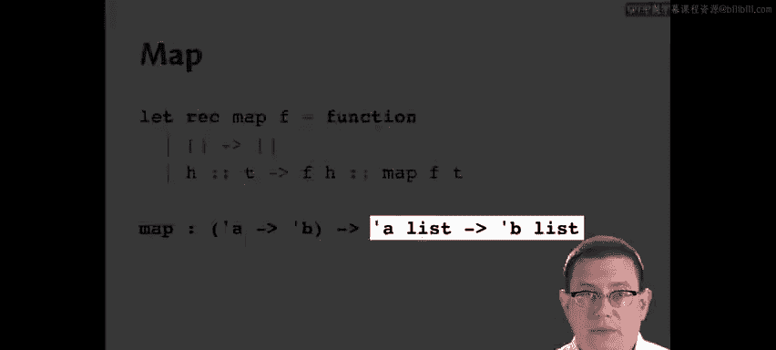
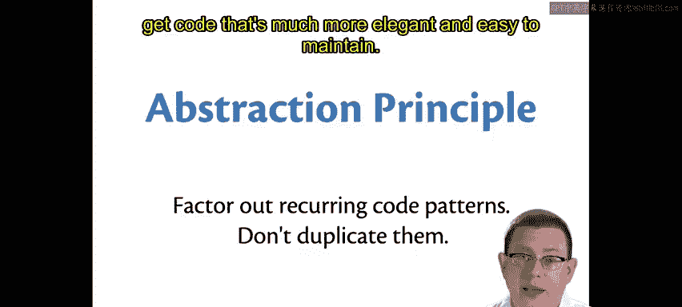

# 康奈尔大学《OCaml编程｜CS3110：OCaml Programming： Correct + Efficient + Beautiful》中英字幕 - P48：-048-Implementing Map Chap4 Video 3.zh_en - GPT中英字幕课程资源 - BV1Tx4y1s7sP

We saw that the key idea of map is that it transforms elements of a list。

Let's look at some other functions that transform elements of a list to get some insight as to how map could be written。

Suppose you wanted to add one to every element of an integer list。

This is a function that I hoped by now you could just write so quickly that you don't even need to think about it。

As another example of transforming list elements， suppose you wanted to concatenate the string 3110 with every element of a list。

Take a look at the similarities and differences between these two functions。

 both of which transform lists。

Well， as I look at the first line of each of them， it's the same thing other than the function day。

As I look at the second line of each of them。It just takes the empty list and returns the empty list。

And as I look at the third line of each of them， I see there's a pattern magic against a head and a tail。

On the right hand side， there's a cons of a recursive call on the list's tail。

And on the left hand side of that cons。What I see is there is an operation being performed。

To transform that head element。In the case of add1。

 the operation is adding one in the case of concatet 3110。

 the operation is concatednating the string 3110。

So let's factor out all of that repeated code， much like how earlier we factored out the repeated code for the function twice。

😡，Okay， so I've factored out most of that code， the only thing that's left is what do I do on the left hand side of the cons here。

 I need to do something with the element H， I need to transform it in some way。

But the way in which it was transformed was different between these two functions。

So how about I take in a function as an argument that tells me how to do the transformation？

So I could take in a function F and apply it to H here， and now F needs to be an input to transform。

And therefore， I also need to continue passing it as an input to transform at the recursive call site。

Transform now could be the basis for us writing add1 and Concatet 3110 in some ways that get rid of a lot of duplicated code。

Add one could instead be implemented as transform。Where we pass in a function that takes in an element of the list called it X and gives us back x plus1。

I will supply the list argument here rather than making us think about partial application。

For concat。31，10。I could implement that as taking transform and applying the function， let's see。

 I need to take in an argument X， and I need to concatenate 31，10 to that argument。Okay。

So we've managed to factor out all that duplicated code and implements both Ad1 and Concatet 3110 in terms of transform。

Guess what？Transform is actually。Named。Map。That's the map function right there， folks。

 We just implemented it。 and I bet if you study this。

 if you practice factoring out the common code into the body of a function called map。

Do that two or three times you will forever know the implementation of map and understand it。

 Let's take a look at the type of map。

Map takes in a function of type alphaarrow beta。

That's the function that's going to be used to transform each element of the list。

That function's input and output types are not the same。 In fact。

 that function could transform the element into a different value of a different type。 For example。

 if you wanted to convert every element of an in list to a string to the appropriate string representation。

We could have let string list of。Int list be the result of taking a list。

Applying map to the function that let's see takes in an element X and returns string of int X on that list。

And then I would have int list arrow string list。Oops， actually。

 you know I did the bad style thing here， I didn't really need to write an anonymous function here。

 string event is already a function that will take in an element and take in an integer and give this back a string so I can shorten that and make it better style just like that。

Okay， so that's an example of a function that does not have the same input and output type。

 but we can still pass it to map。

Map is then going to take that function， it's going to take in an alpha list。

 so this is the list of untransformed elements。

It will apply the function to transform each of them and therefore give us back a beta list because that function has transformed each of the alphas from the original list into a beta and given us back the list of results。

What we've done here with MAP is to apply something called the abstraction principle。😡。

The abstraction principle says factor out recurring code patterns don't duplicate them this commonality of needing to transform elements。

 not just of lists， but of data structures more generally。

 is something that shows up again and again in computations and so when you provide a way of mapping over a data structure as we just did for lists that separates that from the concern of transforming each element of the data structure。

 then you can get code that's much more elegant and easy to maintain。

