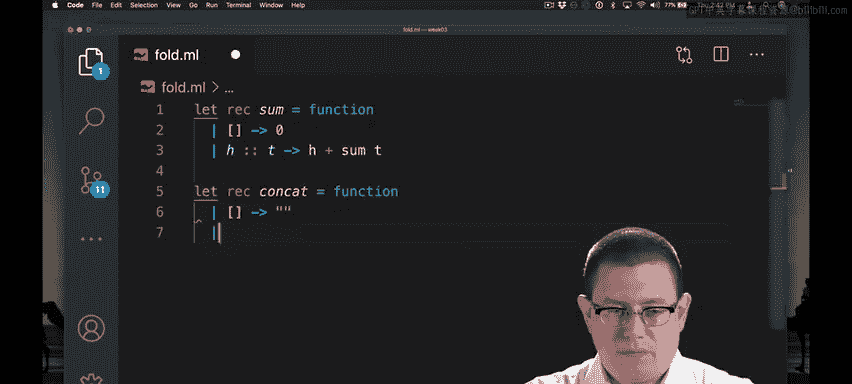
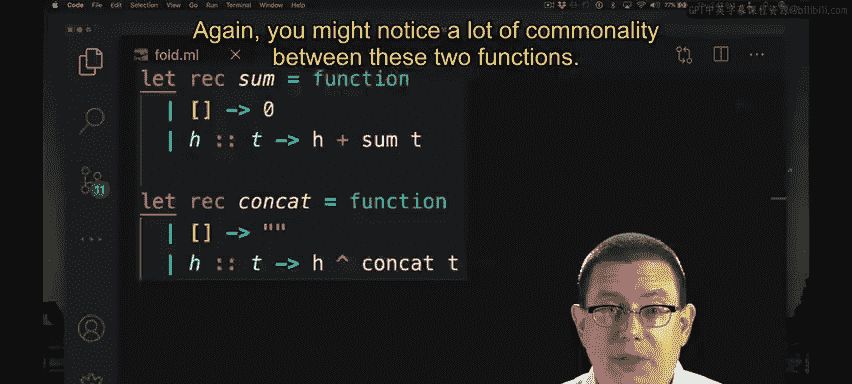
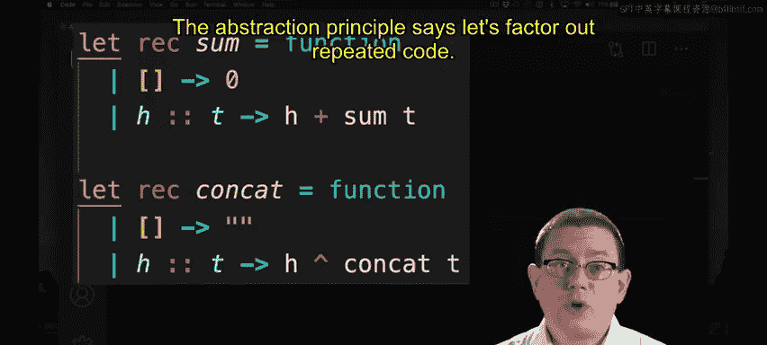
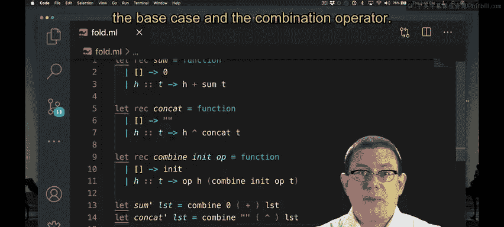
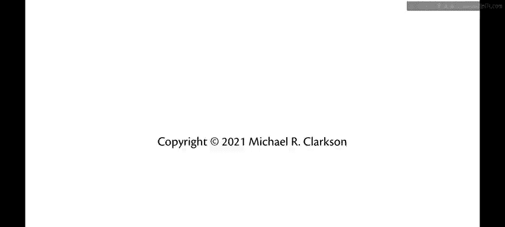

# 康奈尔大学《OCaml编程｜CS3110：OCaml Programming： Correct + Efficient + Beautiful》中英字幕 - P49：-049-Combine Chap4 Video 4.zh_en - GPT中英字幕课程资源 - BV1Tx4y1s7sP

When we wrote Matt earlier， we were transforming each element of a list。

That meant that the list didn't change in length。We just changed each element of it。In some sense。

 each element was treated independently in that list。

Suppose you didn't just want to look at list elements independently。

 but you wanted to combine them together。Here's a couple examples of that Sose you wanted to sum all the elements of a list together that's combining all of them。

Suppose you wanted to concatenate all the elements of a list together。

 that's another way of combining。Those are two simple functions that I bet you could write really quickly right now。

Let's do it。

Again， you might notice a lot of commonality between these two functions。

In the first line， the only thing that's different is their names， and the second line。

 the only thing that's different is what they return is the base case。

 and the third line the only thing that's different is what they apply as an operator in between the head and the result of the recursive call。

So the abstraction principle says， let's factor out repeated code。

Here let's factor out the idea of combining a bunch of list elements together。Into a function。

That pattern matches against that list， if it's the empty list。

 we need to return some sort of base case here or some sort of initial value。Okay。

 so let's have combine take in that initial value as an R。

And then in the case that we have a head and a tail for the list， what do we need to do Well。

 we need to combine the head together with the result of the recursive call on the tail。

So how are we going to do that combination？Once more。

 let's taken a function that tells us how to do it。So we'll take in some operation or off。

 I'll call it here。And that operation will be used to combine the head element H together with something else。

 and that something else is the result of the recursive call of combining on the tail。Of course。

 we've added two other arguments to combine at this point， so I need to add in ait andO as well。Okay。

 so now I have combined and I can rewrite some and concatet in terms of it。

Some prime of a list could be。Combine。Now， of course we want to apply it to that list。

 but we need two other arguments in the middle here。

 we need the initial value and the operator to use to combine the elements of the lists。

The initial value is going to be zero， that's what we returned in the base case for some originally。

The operator that we use to combine elements， well is just the plus operator。

Provide that there using that notation that allows us to treat infi operators as it functions。

It's very simple to write concat in this way as well。

We're going to combine starting with an initial value of the empty string and using the concat operator to do the combination。

So there you go， we've factored out the common code of combining elements of a list。

 and now all that remains for the implementation of those two functions is just to identify the particular pieces that were special to them。

 the base case and the combination offer。

The code that we just wrote for combined is the essential idea behind a OKel library function。

 actually a couple of functions known as F。And fold is a close cousin of reduce。

