# OCaml编程：1.4：函数式编程的意义（第二部分）🎯

在本节课中，我们将继续探讨学习函数式编程的原因，特别是其在工业界的应用、教育价值以及代码美学方面的意义。

上一节我们讨论了函数式编程在概念和效率上的优势，本节中我们来看看其他几个同样重要的原因。

## 工业应用与现实考量 🏢

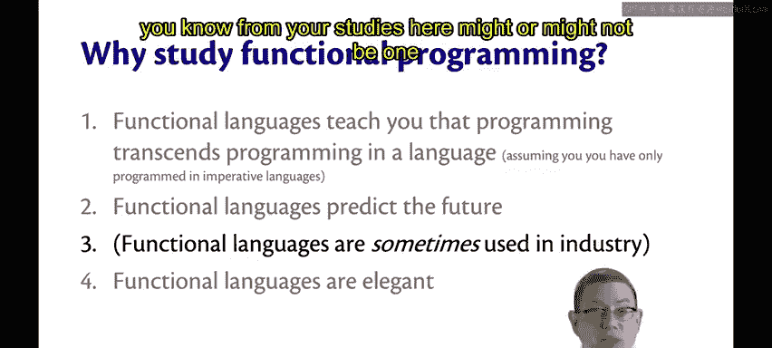

学习函数式编程的第三个原因，实际上更像是一个“非原因”。函数式语言确实在工业界有所应用，但这里需要澄清一个观点。

学习这门课程中的函数式语言，并不意味着你立刻就能以此为基础找到工作。事实并非如此。人们被雇佣的原因多种多样，你在学校学到的特定语言可能只是其中之一。

在现实世界中，确实存在使用函数式语言的地方。我将Java 8放在列表顶部可能有些取巧，因为Java 8增加了一些函数式特性。这或许是一种在现实世界中观察其影响的方式。事实上，随着时间的推移，函数式语言中的一些小特性正逐渐融入命令式语言，从而得到广泛应用。

例如，你在Java中学到的Lambda表达式（匿名函数）就是一个例证。

随着我们看向列表下方，我们会遇到越来越多真正的函数式语言，它们被世界各地的公司所使用。我们将要学习的OCaml语言就被许多公司使用过。你可以在OCaml.org网站上查看部分列表。

例如，Facebook创建了一种名为Reason的语言，它基于OCaml，实际上可以编译成OCaml。Reason用于前端Web开发，解决了JavaScript缺乏编译时类型检查的一些混乱问题。

再举一个例子，Jane Street是一家位于纽约的量化交易公司，它尽可能在所有业务上使用OCaml。其技术负责人Yaron Minsky博士，并非巧合，正是康奈尔大学的博士毕业生。

但归根结底，我们在3110课程中学习函数式编程的原因，康奈尔大学计算机科学系（美国前十）要求其主修学生学习函数式编程的原因，是为了你们的教育。因为它能让你成为一名受过良好教育的计算机科学家。其本身目的并非是为了帮你找到下一份实习。

## 教育的持久价值 🎓

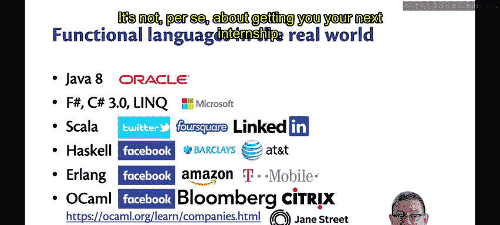

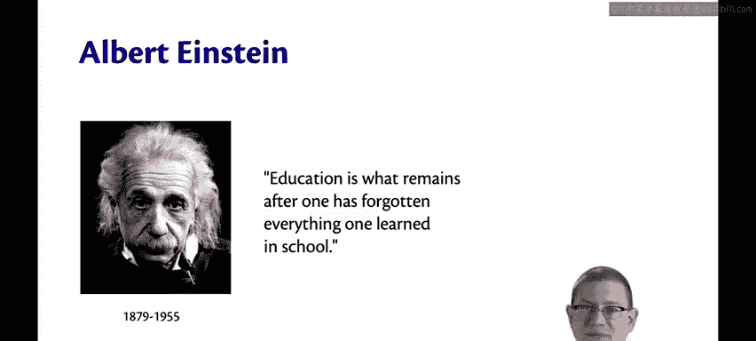

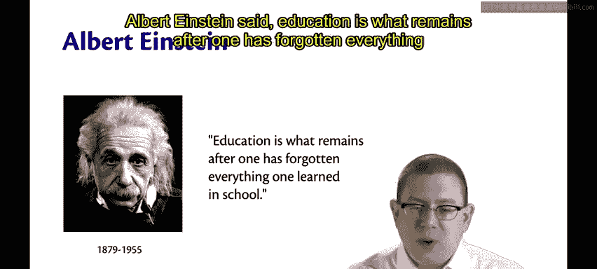

阿尔伯特·爱因斯坦曾说：“教育就是当一个人把在学校所学全部忘光之后剩下的东西。”

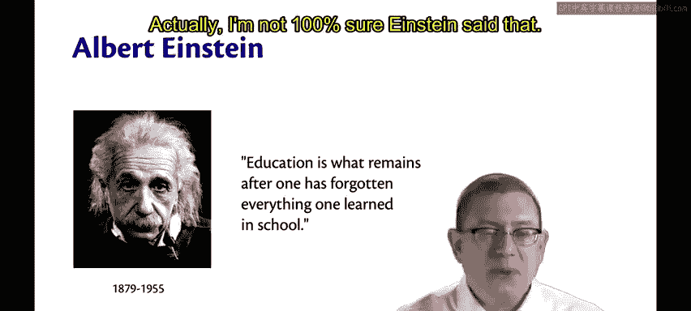

实际上，我不完全确定这是否是爱因斯坦说的，他有点像教育名言界的亚伯拉罕·林肯，但总之有人说过这句话。

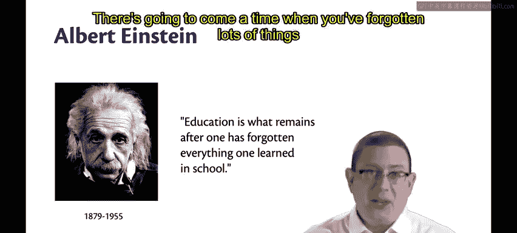

我认为这句话用在这里很合适。总有一天，你会忘记在学校学到的许多东西。

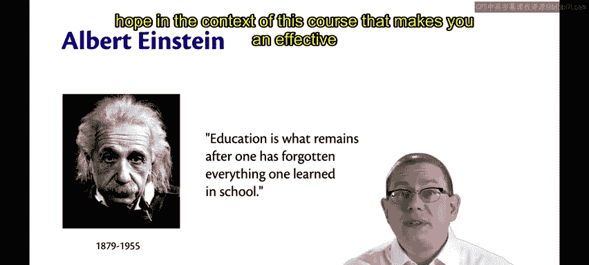

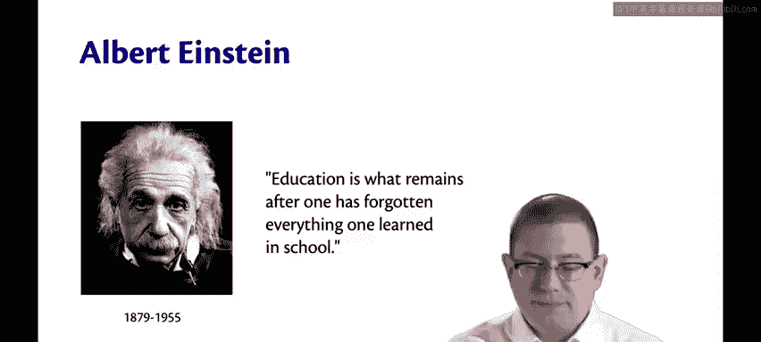

朋友们，我曾经上过微生物学，现在什么都不记得了。我也上过线性代数，现在别问我特征向量。你会忘记学过的一些东西，包括这门课的内容，我对此有清醒的认识。

但我希望剩下的东西对你仍然有用。我希望剩下的东西是我和这里的其他教员训练你思考计算机科学的方式。我希望在本课程的背景下，这能使你成为一名高效的程序员。

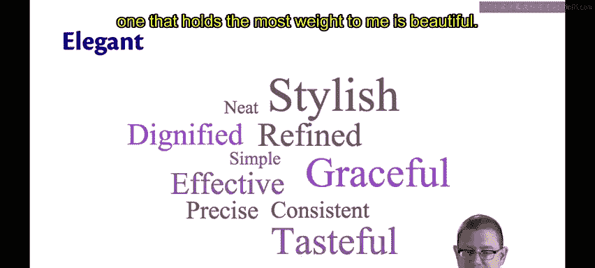

## 代码的优雅与美学 ✨

第四，函数式语言是优雅的。这是我目前提出的最主观的主张，我无法用数据来证实，所以也许我在这里不是一个好的科学家。

我所说的“优雅”，是指函数式语言是优美、庄重、时尚、雅致的，或者许多其他同义词。但对我来说，最有分量的是：

**美丽**。你是否曾认为代码可以是美丽的？我有过。我见过非常丑陋的代码，也见过让我坐下来感叹“哇，这真是一段漂亮的代码”的代码。编写它的人投入了大量精力使其变得优秀。

所以，恭喜你，你可能不知道，在注册3110课程的同时，你也注册了一门艺术鉴赏课。我希望在这个学期里，你能学会欣赏OCaml程序的美。不过，起初这会很困难，因为它们非常陌生，你不能期望一开始就欣赏不熟悉的语法。

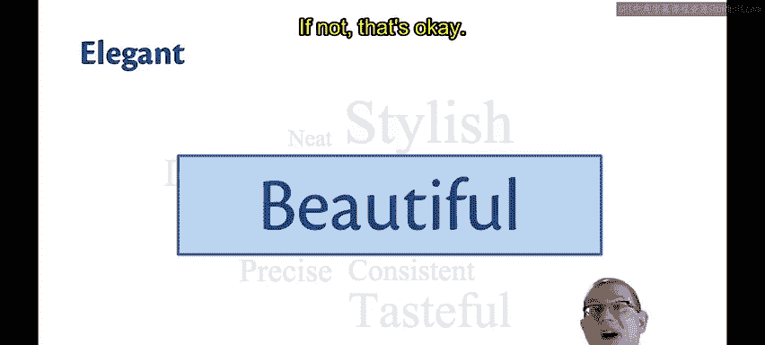

但现在我已经数不清有多少学生在完成这门课程，然后继续用另一种语言（可能是在这里的另一门课，也可能是在工业界）编码后，回来对我说：“是的，这些其他语言，我现在用它们写的程序，在我看来很丑陋。”也许这也会发生在你身上。如果没有，那也没关系。

你可能会问：这些真的重要吗？美学在编程中重要吗？😡

答案是：是的，它们重要。除了主观部分，想想谁阅读和编写代码。机器和人类都阅读代码。对机器来说，你的代码是否美丽并不重要，它不会欣赏这一点。也许人工智能领域的人正在研究这个，但优雅的代码，即使对计算机来说还不重要，对人类却是重要的。

优雅的代码更容易阅读，因此也更容易维护。随着时间的推移，你会发现程序员最终花在编写代码上的时间会变少，而花在维护代码上的时间会变多。维护意味着调整、改进、添加新功能。而且这并不总是你最初编写的代码。😡

所以，阅读他人的代码可能有一天会成为你工作的一部分。到那时，你才会开始欣赏人们写的是丑陋的代码还是美丽的代码。

优雅的代码不一定更容易编写。😡 事实上，编写它可能需要更多时间，通常你首先写出丑陋的版本，然后回头改进它。我并不是说你一开始就能快速写出非常漂亮的代码，因此，这需要努力和实践。但完善这种能力是值得的。

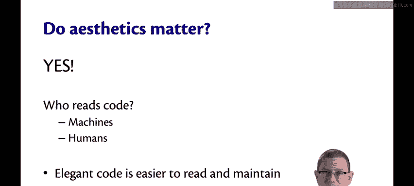

## 总结 📝

以上就是我认为学习函数式编程至关重要的几个原因。😡

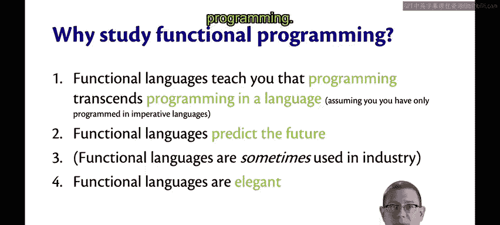

本节课中我们一起学习了函数式编程在工业界的实际应用、其超越职业技能的持久教育价值，以及代码优雅性对可读性和可维护性的重要意义。理解这些原因，有助于我们以更全面的视角投入到后续OCaml语言和函数式编程范式的学习中去。