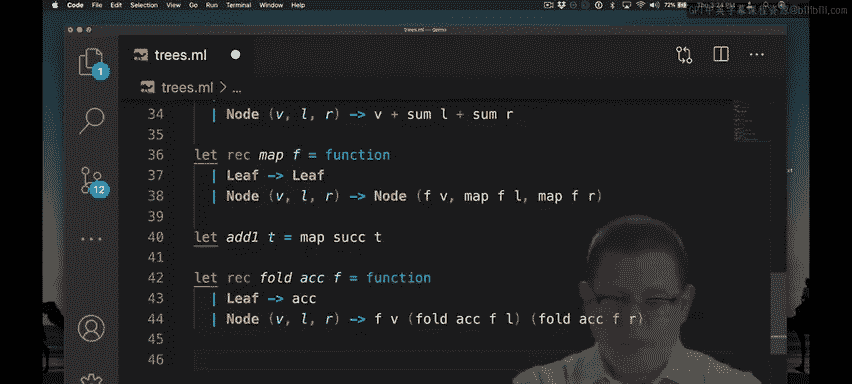
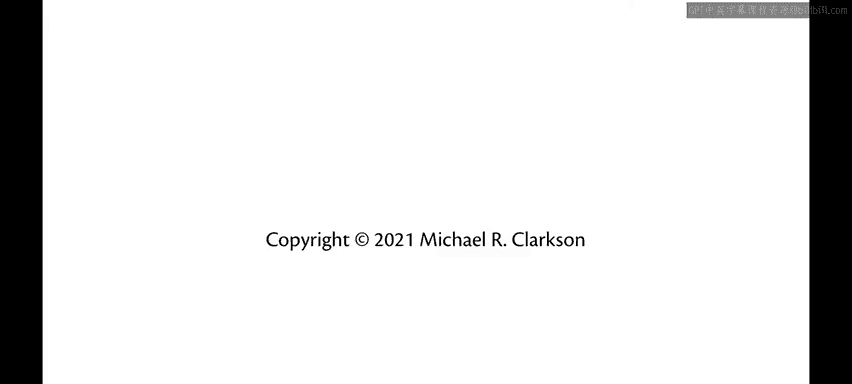

# 康奈尔大学《OCaml编程｜CS3110：OCaml Programming： Correct + Efficient + Beautiful》中英字幕 - P52：-052-Trees with Map and Fold Chap4 Video 7.zh_en - GPT中英字幕课程资源 - BV1Tx4y1s7sP

Map and fold makes sense with more than just lists， you can also use them with trees。

Here's our tree type from before with leaves and nodes， these are binary trees。

Suppose we wanted to map over a tree let's write a function to do that map a function F over a tree。

If the tree is empty， that is it's a leaf， there's nothing to be done。

If the tree has a node with a value， a left subtree and a right subtree。

 what are we going to do with that？Well we're going to return a node。

Where we've applied the function F to the value at that node。

And then we recursively map over the subrees， map F over L， map F over R。

So that's all there is to it once you understand the idea of map。

 it's something that will suggest itself to you with many data structures。

 binary trees just being one of them you could map over a queue， you could map over a stack。

 you could map over a graph， whatever you like。Suppose you wanted to add one to every element of a tree。

 you could now quickly do that with MA。And that's all there is to it。

 so you can see how quick it can be to implement functions when you get used to this higher order style of programming。

What about folds？Suppose we wanted to fold over a tree。With an accumulator， a function F to combine。

 operate combine values。If we add a leaf， we'll return the accumulator。If we're at a node。

With a value， a left subchild and a right subchild then。Let's go ahead and recursively fold。

Over the left subte using the existing accumulator。And recursively fold。Over the right subte。

 using that accumulator。And then use the function F。

To combine the results of that value for the left subt and the right subt。

So you could use that， for example， to sum up all the elements of a tree just like we've summed up all the elements of a list。

What's a little tricky there is this now needs to take in the value at the node。

The value for the left subt， the value for the right subtree or sums for the left subte and right subtree。

 and add them all together。We can try this out with our example treeET。Remember。

 T is that tree that has two at the root， we could add one to T。That increases each node by one。

 you can see there。And we could sum up all the values in the tree。

Which gets us six for the original tree， or if we take T， add one to it。

And sum up all the values and we get nine because we've added one to each of the three nodes。

It's so pleasant and so nice to be able to code in this higher order way。

 I hope you fall in love with it soon。

