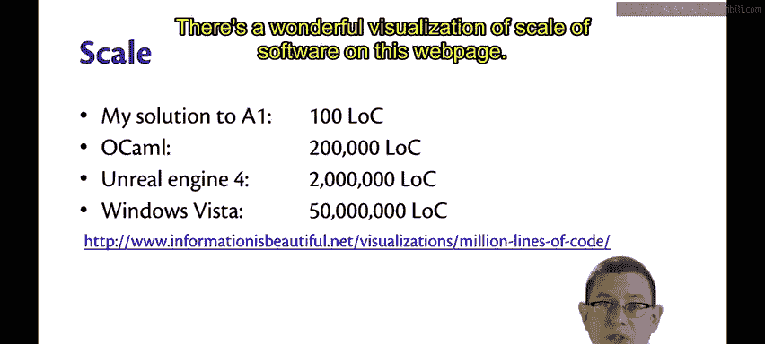
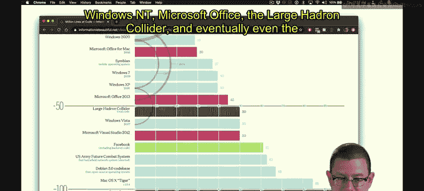
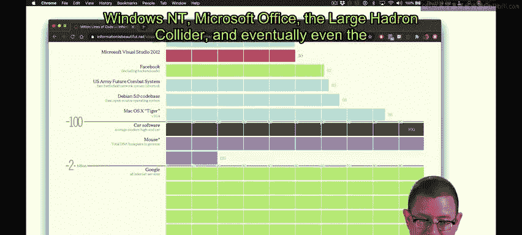
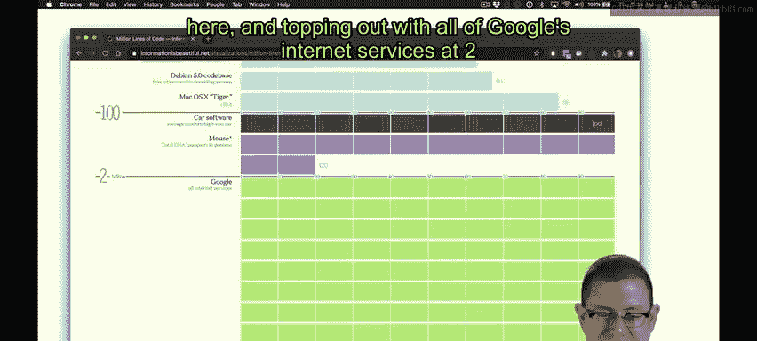
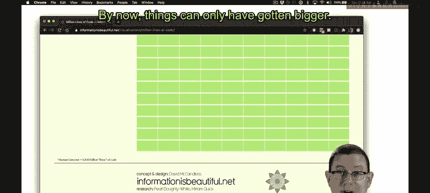
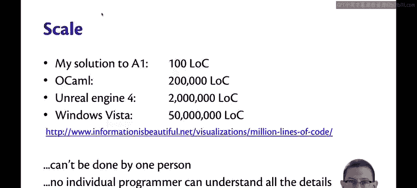
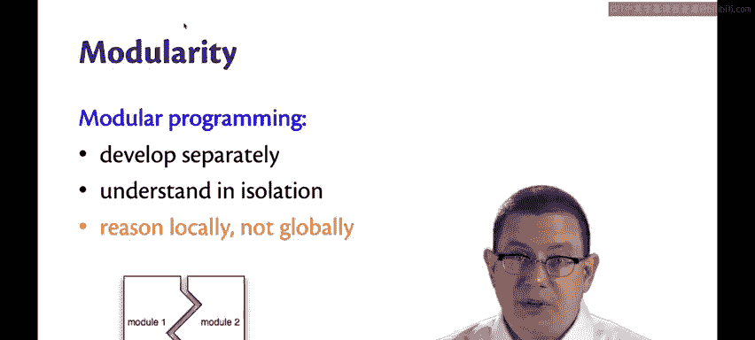
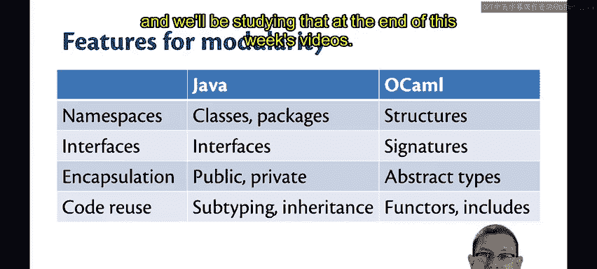

# 康奈尔大学《OCaml编程｜CS3110：OCaml Programming： Correct + Efficient + Beautiful》中英字幕 - P53：-053-Modular Programming Chap5 Video 1.zh_en - GPT中英字幕课程资源 - BV1Tx4y1s7sP

Let's talk about scale。😡，My solution to A1 enigma is about 100 lines of code。

It might feel like a lot when you're first learning the language。

 but it's not that big in terms of software in the real world。

The OCMmel compiler itself is somewhere around 200，000 lines of code。Unreal Engine 4。

 the game engine behind such wonderful games as Fortnite and Final Fantasy 7 Remake is over 2 million lines of code。

And Windows Vista， which is now out of date， was over 50 million lines of code。

 we don't really know how many is in Windows 10， but it's got to be a lot。

There's a wonderful visualization of scale of software on this webp page。

 I invite you to take a look at it yourself， later on。😊。

It scales all the way up from simple iPhone game apps。

To Windows N T， Microsoft Office， the large Hadron collider。

 and eventually even the genome of a mouse somehow represented in terms of lines of code here and topping out with all of Google's internet services at 2 billion。

 This is information from 2015。

By now， things can only have gotten bigger。

So big software has a lot of code in。This can't all be done by one person。

There's just no way that any individual programmer could understand all the details of a Windows operating system。

 let alone even OCMl possibly。And because of that， these kinds of software code bases。

Are just too complicated for one person to build with the constructs we've seen from Ocael so far。

You need more language support。😡，To build this kind of big software。

In particular， you need support for modular programming。A module。In general。

 in software development is a group of related code。

Code that can be developed separately by teams of programmers and understood in isolation。

The main benefit of modular programming is that programmers are able to reason locally， not globally。

They only have to understand a piece of the code base and work on some lines of code。

 not all the lines of code。😡，This is particularly important when it comes to keeping your own sanity as a developer and also just in terms of streamlining the number of meetings you're going to have to have。

The more lines of code you touch， the more pieces of the software you have to be an expert on。

 the more time you're going to have to spend communicating with other people that are part of the development team。

😡，That takes time。It takes time away from the development you could be doing on your own code。

There are many features provided for modularity in any major programming language in Java you already learned a lot about them。

So you've seen classes and packages and interfaces and other such things。

One of the features for modularity that's important is namespaces By that I mean the kind of dot notation that you probably got used to in your first programming language no matter what it was。

In OMl， for example， list dot sort。😡，So there's a hierarchical namespace so that short names like sort can mean different things in different contexts without colliding。

Java provides classes and packages to get hierarchical namespaces。

 of course classes and packages do other things， but that's one of their important benefits。

OcaMel also provides hierarchical namespaces through structures。

 we're going to learn about those soon。Interfaces， and I'm using the term generically here。

 not in the specific sense of Java。Are about related groups of names and specifications for those names。

 those might be type specifications， those might be behavioral specifications through comments。

Java provides interfaces through the very language mechanism it itself aptly names interface。

 which you will have seen in 20110。OCMll provides its own version of interfaces。

 it's called Signatures， we'll learn about those soon。Encapsulation， as you learned in 20110。

 is a really important part of modular programming。It's what enables that kind of local。

 not global reasoning。😡，Java provides encapsulation in part through visibility modifiers like public and private。

OAMl provides similar functionality through something called abstract types。Finally。

 code reuse is an important part of modular programming。😡。

We want to be able to reuse the code modules that we create rather than have to rebuild everything from scratch anytime we want to build a new piece of software。

😡，Java provides code reuse mechanisms through subtyping and inheritance。

 mainly through the extends keyword that you learn in 20110。OAM will provides。

Fairly different mechanisms for code reuse called Fters and includes。

 and we'll be studying that at the end of this week's videos。

