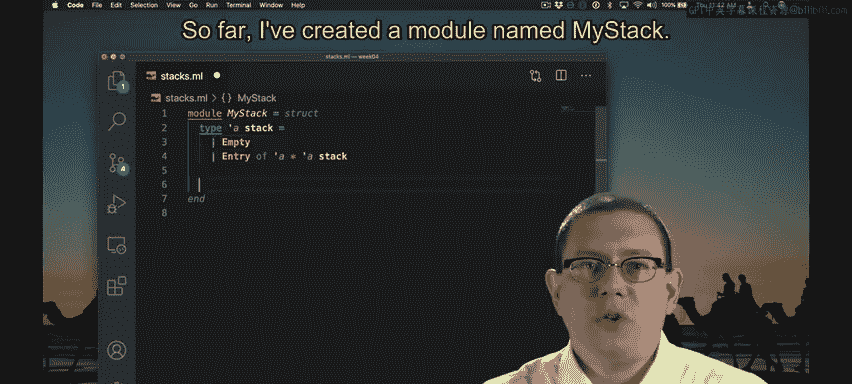
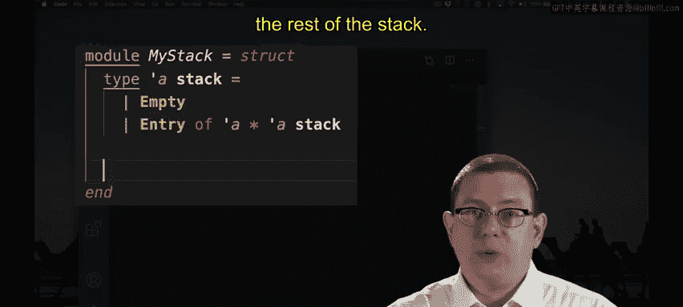
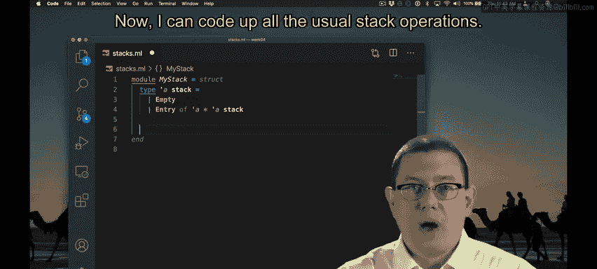
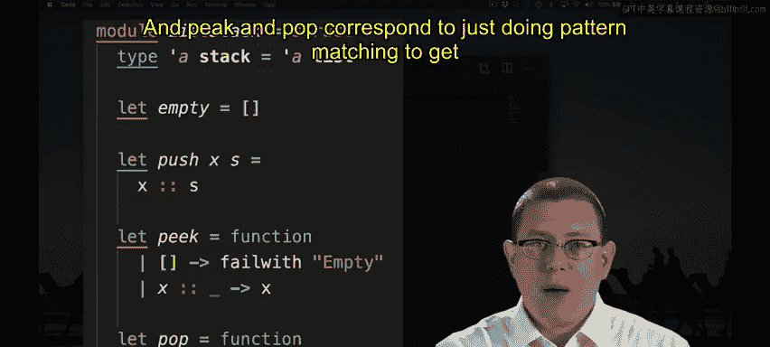
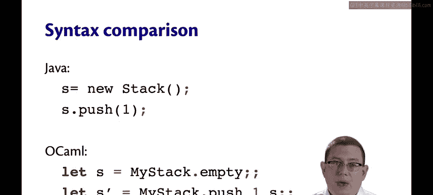
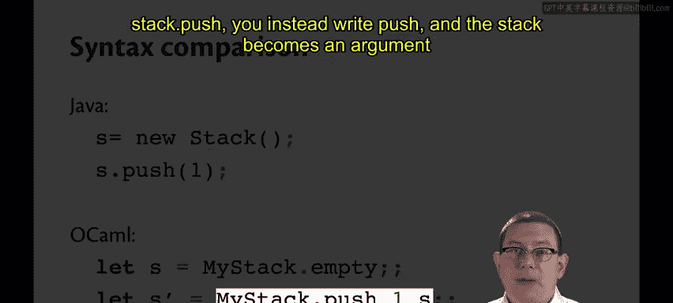
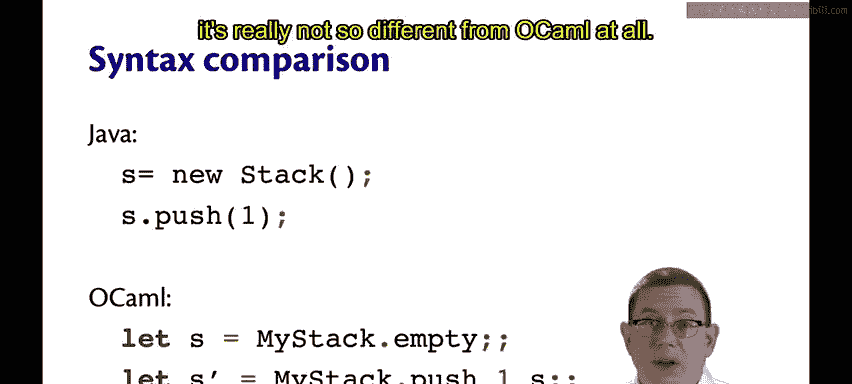

# OCaml编程：5.3：函数式栈 🥞

在本节课中，我们将要学习如何使用OCaml来实现一个经典的**栈**数据结构。我们将从定义栈的类型开始，逐步实现其核心操作，并将其与OCaml内置的列表进行对比，最后探讨其与面向对象语言（如Java）中栈实现的异同。

## 栈数据结构简介



还记得栈这种数据结构吗？它就像自助餐厅里的一叠托盘。数据项被**压入**栈顶，并从栈顶**弹出**。让我们在OCaml中编写栈的代码。

## 定义栈类型



首先，我创建了一个名为`MyStack`的模块。之所以命名为`MyStack`，是因为标准库中已经有一个`Stack`模块，为了避免混淆和错误信息，我使用了不同的名字。



在这个模块内部，我们定义了一个类型`'a stack`。一个`'a stack`要么是`Empty`，要么是一个`Entry`。`Entry`是一个二元组：该元组的第一个分量是栈顶的实际值，第二个分量是栈的其余部分。

```ocaml
module MyStack = struct
  type 'a stack =
    | Empty
    | Entry of 'a * 'a stack
end
```

## 实现栈操作

现在，我们可以编写所有常见的栈操作了。

以下是这些操作的实现细节：
*   **`empty`**：我在`MyStack`模块中创建了一个名为`empty`的值，用于生成空栈。这目前是为了方便。显然，我也可以直接写`Empty`这个构造器。但考虑到我们将要编写许多数据结构，记住数据结构的空值就叫`empty`会很有帮助，无论其内部实现如何。
*   **`push`**：要将一个值`x`压入栈`s`，我创建一个新的`Entry`，其中`x`在栈顶，`s`在其下方。
*   **`peek`** 和 **`pop`**：`peek`的作用是告诉我栈顶的值是什么。`pop`的作用是移除栈顶的值。有些栈数据结构会将这两个操作合并为一个，返回栈顶元素并移除它。我们暂时将它们解耦。因此，这里的`peek`接收一个栈并返回其栈顶值。从类型签名`'a stack -> 'a`可以看出。`pop`接收一个`'a stack`并返回另一个`'a stack`。它不返回栈中的值，而是返回另一个栈。

`peek`和`pop`的实现非常相似，它们都只是进行模式匹配。如果栈是空的，它们会抛出一个异常，提示栈为空。如果栈不为空，则返回`Entry`内部元组的相应分量。

```ocaml
let empty = Empty

let push x s = Entry (x, s)

let peek = function
  | Empty -> failwith "Empty"
  | Entry (x, _) -> x

let pop = function
  | Empty -> failwith "Empty"
  | Entry (_, s) -> s
```

## 栈与列表的关联

如果你一直在看这个实现，并且觉得`'a stack`类型看起来非常眼熟，那么你是对的。它基本上和列表的定义相同。我完全可以把`stack`写成`list`，把`Empty`写成`Nil`，把`Entry`写成`Cons`，这样我们就得到了之前见过的`my_list`类型。

那么，为什么不直接用列表来实现栈呢？让我们试试。

```ocaml
module ListStack = struct
  type 'a stack = 'a list
  let empty = []
  let push x s = x :: s
  let peek = function
    | [] -> failwith "Empty"
    | x :: _ -> x
  let pop = function
    | [] -> failwith "Empty"
    | _ :: s -> s
end
```



在这里，类型`'a stack`只是`'a list`的一个同义词。在这段代码体内，它们含义相同。`empty`就是空列表`[]`。`push`就是一个`::`（cons）操作。`peek`和`pop`则对应着通过模式匹配从栈中获取正确值的操作。

## 使用栈

要使用栈，我可以创建一个空栈，将值压入栈，并查看栈顶的值。让我们在`utop`中看看效果。

```ocaml
let s = ListStack.empty          (* s = [] *)
let s' = ListStack.push 1 s      (* s' = [1] *)
let top = ListStack.peek s'      (* top = 1 *)
```

可以看到，我创建了一个空栈`s`，另一个栈`s'`包含了值`1`，当我查看`s'`的栈顶时，我得到了值`1`。注意，查看栈顶并不会改变栈的内容。`s'`仍然是`[1]`。同时注意，`push`操作创建了一个新栈`s'`，但原有的栈`s`保持不变。我甚至可以弹出`s'`，这会返回空栈，而`s'`本身保持不变。

## 与Java语法的对比

让我们比较一下Java和OCaml中一些类似栈操作的语法。

在Java中，你可能会有一个`Stack`类，你可以实例化它来获得一个新对象`s`，然后你可以将`1`压入那个栈。



```java
Stack<Integer> s = new Stack<>();
s.push(1);
```

在OCaml中，类似的一系列操作是：创建一个栈（可能是`MyStack.empty`或`ListStack.empty`），将这个空栈值绑定到变量`s`，然后如果你想压栈，可以说将`1`压入它。



```ocaml
let s = ListStack.empty
let s' = ListStack.push 1 s
```

请注意，在创建栈时，我们不使用`new`关键字，而是直接引用模块内部定义的那个`empty`值。当你要压栈时，不是写`stack.push`，而是写`push`，而栈本身变成了`push`函数的一个参数。

与Java相比，在OCaml中，这可能会让人觉得有点“反”了，因为点的位置和参数的位置不同。事实证明，如果你学习编译器课程，了解面向对象语言是如何实现的，或者即使你学过Python并记得方法的`self`参数，Java实际上会将`s.push(1)`编译成一个版本，其中`s`作为参数提供给`push`方法。因此，在某种意义上，将对象视为方法的另一个参数，是思考面向对象语言的正确方式。所以，当深入到Java的实现层面时，它与OCaml真的没有太大不同。

## 总结



本节课中，我们一起学习了如何在OCaml中实现函数式的栈数据结构。我们从自定义的代数数据类型开始，实现了`empty`、`push`、`peek`和`pop`等核心操作。接着，我们发现栈的本质与列表高度相似，并实现了基于列表的、更简洁的栈模块。通过实际使用示例，我们理解了函数式栈的**不可变性**特性——操作总是返回新栈，原栈保持不变。最后，我们对比了OCaml与Java在栈操作语法上的差异，并理解了其背后“将对象作为参数”的共通思想。