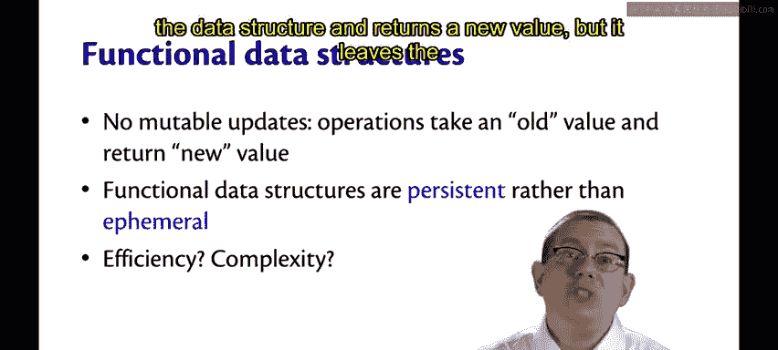
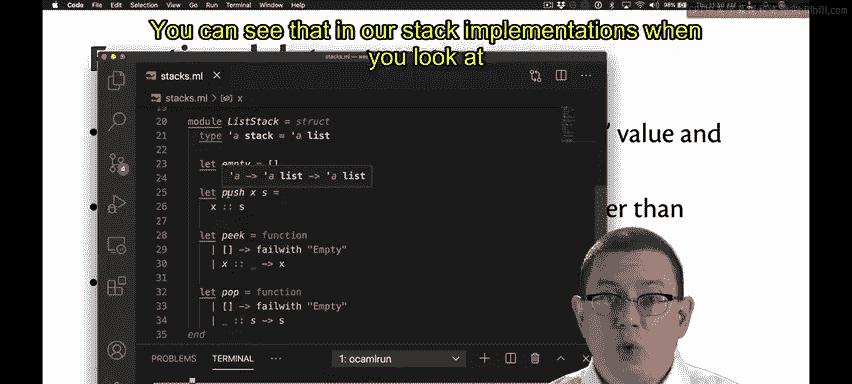
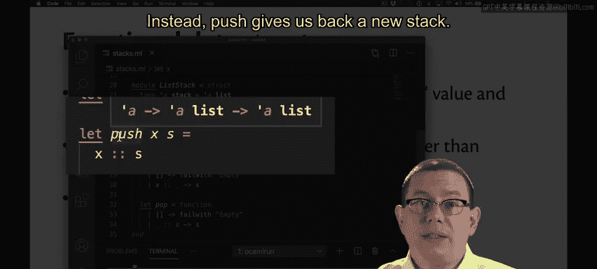
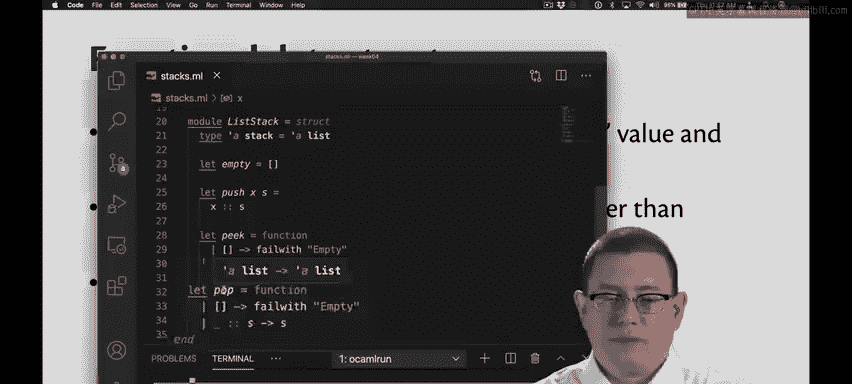
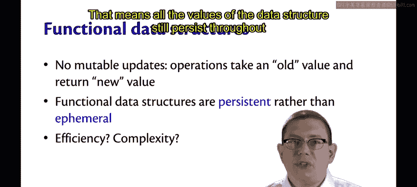
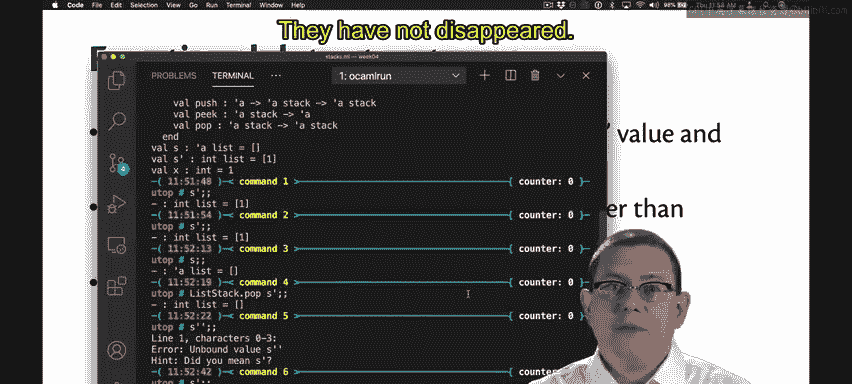
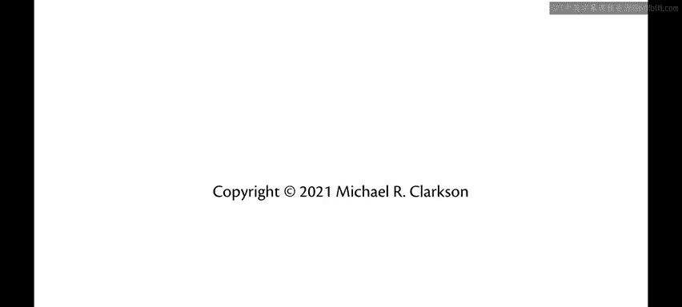

# OCaml编程：5.4：函数式数据结构 🧱

在本节课中，我们将要学习函数式数据结构的概念，理解其与命令式数据结构的关键区别，并探讨其持久性特性带来的优势与效率考量。

## 函数式数据结构简介



上一节我们介绍了栈的实现，本节中我们来看看这种栈所属的类别——函数式数据结构。



函数式数据结构是一种没有可变更新的数据结构。每个操作都接收一个数据结构的“旧值”，并返回一个“新值”，同时保持旧值不变。

## 操作的不变性



你可以通过查看我们栈实现中操作的签名来理解这一点。



以下是栈操作的签名：
```ocaml
val push : 'a -> 'a list -> 'a list
val pop : 'a list -> 'a list
```
`push` 接收一个值和一个栈（此处为 `'a` 和 `'a list`），并返回一个新的 `'a list`。它实际上并不改变底层的栈；那个旧栈始终是不可变的。相反，`push` 返回给我们一个新的栈。



`pop` 也是如此。它接收一个 `'a list` 并返回一个 `'a list`。

## 持久性与短暂性

我们说函数式数据结构是**持久性**的，而非**短暂性**的。这意味着数据结构的所有值在时间进程中持续存在。



我们在栈 `S` 和 `S'` 的例子中看到了这一点。`S` 在对其执行 `push 1` 后保持不变，而 `S'` 在对其执行 `pop` 后也保持不变。那些旧值仍然存在，并且仍然可供使用。它们持续存在，并未消失。

## 效率考量

现在你可能会问，持久性数据结构的效率如何？与短暂性数据结构相比，它是否更难编写、更复杂？

可能是这样。事实证明，OCaml 编译器在效率方面非常出色，它能确保数据结构的表示在内存中共享相同的空间，这样你就不会因为保留所有不同版本而浪费内存。当然，OCaml 中也有垃圾回收机制，就像 Java 和其他面向对象语言一样，垃圾回收器可以回收不再使用的内存。

至于时间效率，存在一种现象：有时函数式数据结构（或者说持久性数据结构）确实需要更多一点的时间复杂度来实现。一个经验法则是，实现一个函数式数据结构可能比实现一个命令式数据结构多花费对数级别的时间。这并不是一个巨大的开销。

## 持久性的优势

为此，你获得了许多好处：既有持久性带来的好处，也有因为缺少命令式特性和可变更新而能够更轻松地推理代码中发生的情况的好处。

---



本节课中我们一起学习了函数式数据结构的核心概念。我们了解到函数式数据结构通过不可变操作实现持久性，旧值在操作后保持不变。虽然实现上可能带来轻微的时间开销，但其在内存共享、易于推理以及通过垃圾回收管理内存方面具有显著优势。理解这些特性是掌握函数式编程范式的关键一步。