# 康奈尔大学《OCaml编程｜CS3110：OCaml Programming： Correct + Efficient + Beautiful》中英字幕 - P57：-057-Module and Structure Syntax and Semantics Chap5 Video 5.zh_en - GPT中英字幕课程资源 - BV1Tx4y1s7sP

Now that we've seen some examples of modules， let's step back and look at their syntax and semantics。

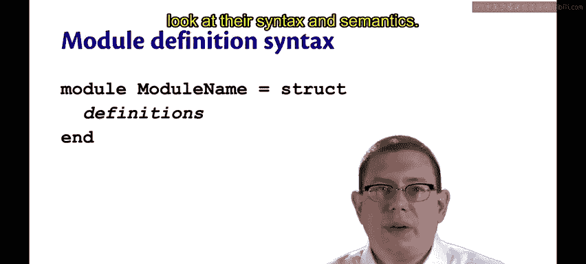

The module definition syntax is similar to the let definition syntax。

 but it uses the keyword module instead of let。

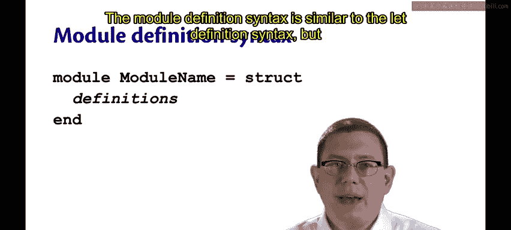

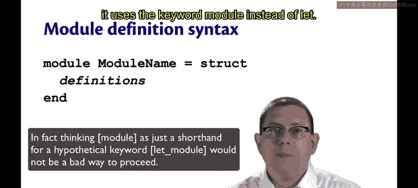

So we write module and then the module name。

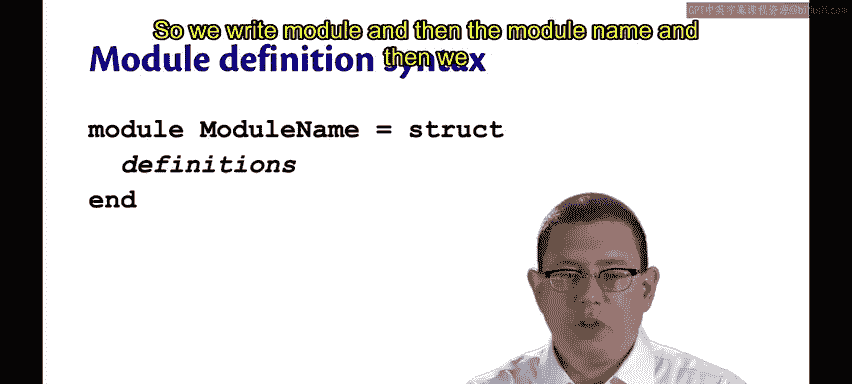

And then we bind that to a module value。😡，One way to construct the module value is with structures。

 so that's astruct keyword， followed by a bunch of definitions， followed by the end keyword。

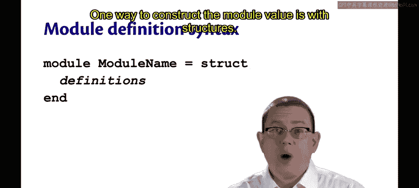

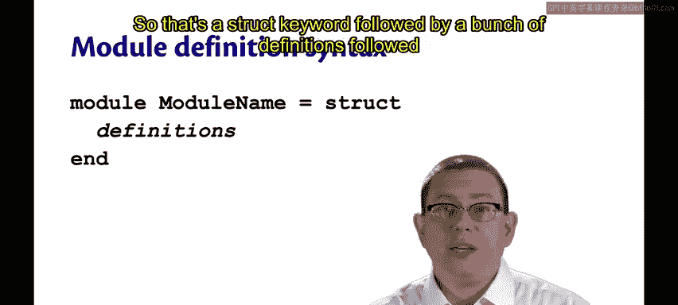

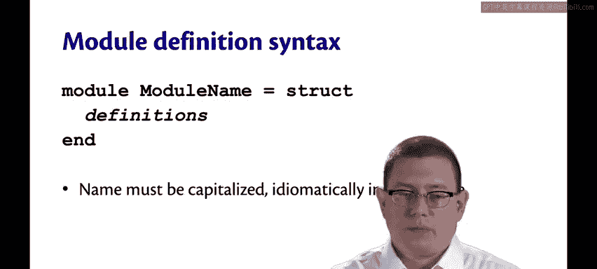

The name of a module must be capitalized， so that's different from other identifiers that we've seen so far。

 when you bind with a module definition， you have to capitalize， when you bind with a let definition。

 it must be uncapitalized。

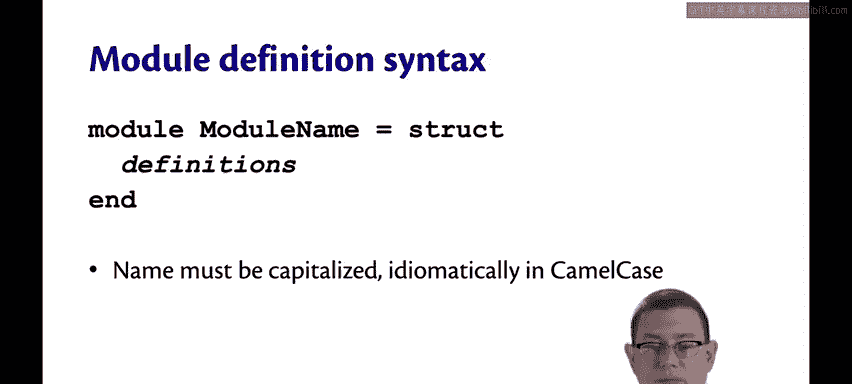

Iioomatically， module names are written in camel case rather than snake case。

 that's another difference from let definitions。

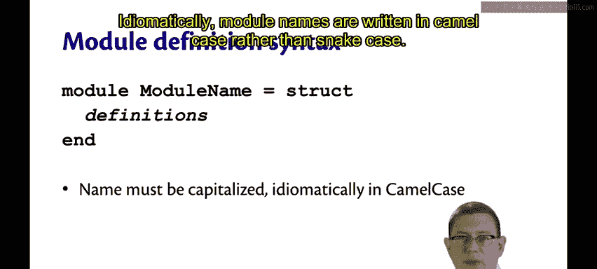

The definitions inside of a module can be anything that we've seen so far that we've written in our code files or that we've typed any YouTubeT。

 so you can have let definitions inside of modules， types， exceptions。

 you can even nest modules inside of modules to get deeply hierarchical namespaces。

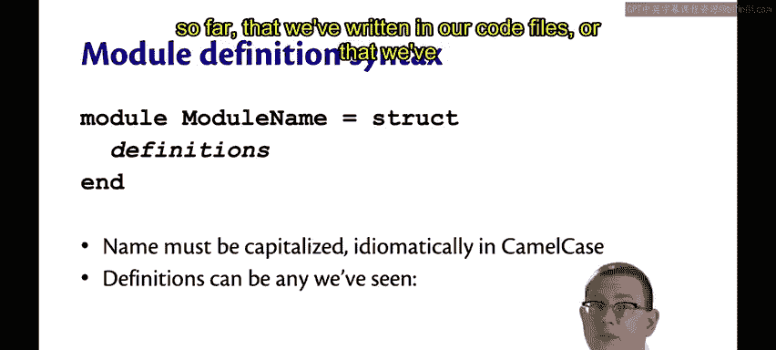

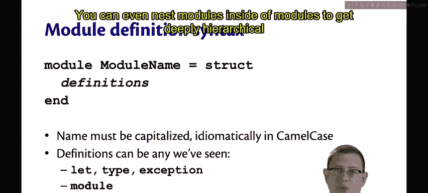

You can terminate every definition inside of a module with a double semicolon。

Much like you would write it in U。And in fact， that's the reason why it's supported for compatibility with Utop。

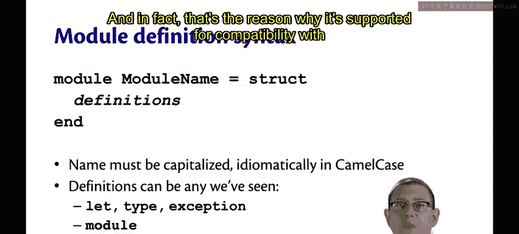

But it's not considered idiomatic these days to write the double semicolon inside of a module。

 you will still sometimes see code bases that do it， but these days we try to leave them out。

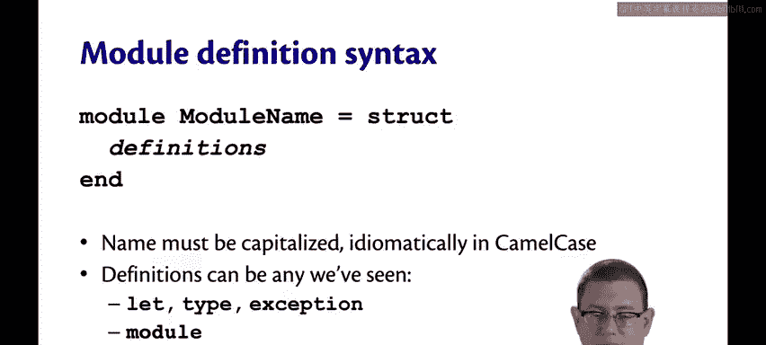

The semantics for structure evaluation are very simple。To evaluate the structure。

 just evaluate each definition in order from the top to the bottom。The result is a module value。

 I will typically just say module instead of saying module value。

A module is going to bind the names inside of it to values themselves。😡。

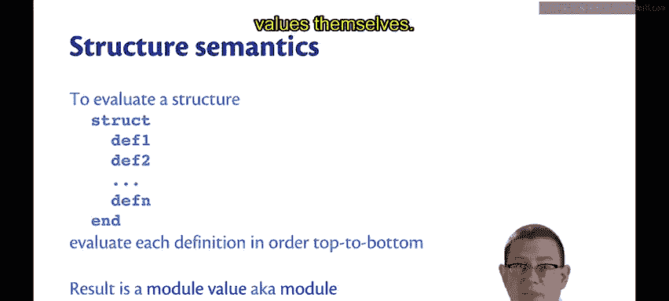

To evaluate a module definition， just evaluate the structure to a module and then bind that module to the name。

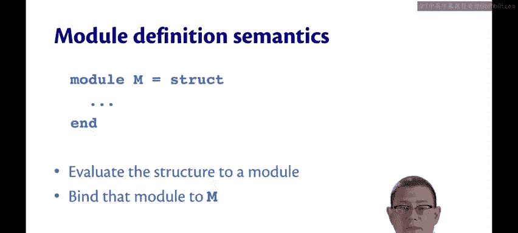

Module values are not like other values。 They are distinct in the Ocaml type system。

You cannot bind a module to a name with let。You cannot pass a module to a function as a parameter。

 you cannot return a module from a function as output。So regular values， if you will。

 are stratified from module values in OamMl。This is not so surprising from other languages。

 if you think about it， class definitions in OO languages typically can't be used in the same way as other kinds of definitions。

 you can't pass a class to a method in Java。You can pass a class object， but that's an object。

 not the class itself。

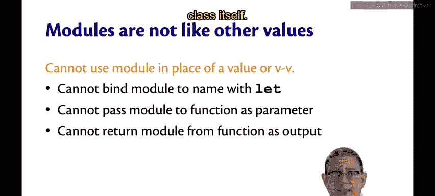