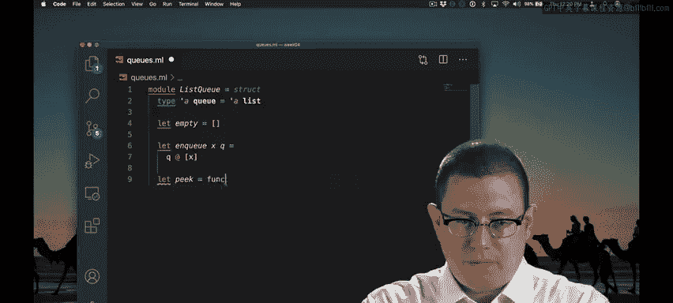
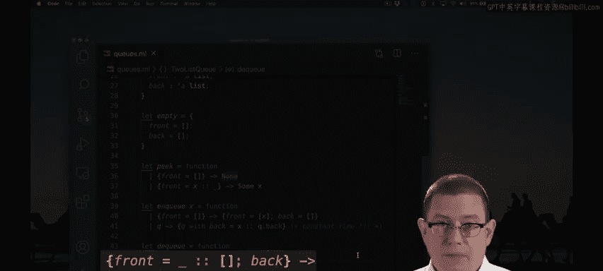

# OCaml编程：5.7：函数式队列 🧑‍💻

在本节课中，我们将学习如何使用OCaml实现函数式队列。我们将从简单的列表实现开始，分析其效率问题，然后引入一种更高效的双列表实现方法。



## 概述：从简单列表开始

首先，我们尝试用列表来实现队列。列表的第一个元素代表队列的头部，最后一个元素代表队列的尾部。

```ocaml
type 'a queue = 'a list
```

空队列就是空列表。入队一个元素时，我们使用`@`操作符将该元素追加到列表的末尾。

```ocaml
let enqueue (x: 'a) (q: 'a queue) : 'a queue = q @ [x]
```

然而，这个操作的时间复杂度是线性的（O(n)），因为需要遍历整个列表才能到达末尾。这对于队列操作来说并不理想。

出队和查看队首元素的操作与我们之前实现的栈类似。

```ocaml
let peek (q: 'a queue) : 'a option =
  match q with
  | [] -> None
  | h :: _ -> Some h

let dequeue (q: 'a queue) : 'a option =
  match q with
  | [] -> None
  | _ :: t -> Some t
```

这里我们选择返回`option`类型来处理空队列的情况，而不是抛出异常。

## 引入高效的双列表实现

为了解决线性时间入队的问题，我们引入一种更高效的表示方法。这种方法是Gries教授的一位博士生在1981年发明的。

核心思想是用两个列表来表示一个队列：一个`front`列表和一个`back`列表。`front`列表按正确顺序存放队列前半部分的人，`back`列表则按**相反顺序**存放队列后半部分的人。

```ocaml
type 'a queue = {
  front: 'a list;
  back: 'a list;
}
```

例如，如果`front = [A; B]`，`back = [E; D; C]`，那么这个队列代表的顺序是A, B, C, D, E。A是队首，E是队尾。

为了使实现简化，我们引入一个重要的不变式：**如果`front`列表为空，那么`back`列表也必须为空**。这个约定保证了队首元素永远只可能在`front`字段中，简化了后续操作。

## 实现队列操作

基于上述设计，我们来实现各个操作。

### 查看队首（Peek）

查看队首元素的操作变得非常简单，只需查看`front`列表的第一个元素。

```ocaml
let peek (q: 'a queue) : 'a option =
  match q.front with
  | [] -> None
  | h :: _ -> Some h
```

### 入队（Enqueue）

入队操作需要考虑当前队列的状态。

以下是入队操作的逻辑：
1.  如果队列为空（即`front`为空，根据不变式`back`也为空），新元素应放入`front`列表。
2.  如果队列非空，新元素作为最新的成员，应放在队列末尾。由于`back`列表是反向存储的，我们可以将其添加到`back`列表的**头部**。

```ocaml
let enqueue (x: 'a) (q: 'a queue) : 'a queue =
  if List.length q.front = 0 then
    { front = [x]; back = [] }
  else
    { q with back = x :: q.back }
```

这个操作是常数时间（O(1)）的，因为我们只是将元素添加到一个列表的头部。

### 出队（Dequeue）

出队操作是本节课最微妙的部分。



以下是出队操作的逻辑：
1.  如果队列为空，返回`None`。
2.  如果队列非空，通常只需移除`front`列表的头部元素。
3.  关键情况：当移除队首元素后，`front`列表可能变空。这违反了我们的不变式（`front`空则`back`必须空）。此时，我们需要将`back`列表反转，并将其作为新的`front`列表，同时将`back`置为空。

```ocaml
let dequeue (q: 'a queue) : 'a option =
  match q.front with
  | [] -> None
  | [h] -> 
      (* 移除最后一个front元素，需要处理back *)
      Some { front = List.rev q.back; back = [] }
  | h :: t ->
      Some { q with front = t }
```

这个操作在大多数情况下是常数时间。只有在`front`列表耗尽、需要反转`back`列表的罕见情况下，才是线性时间。通过本学期后续会学到的**摊还分析**，我们可以证明该实现的平均时间复杂度确实是常数级的。

## 总结

本节课我们一起学习了函数式队列的两种实现方式。
1.  我们首先用单列表实现了简单的队列，但发现了入队操作效率低下的问题。
2.  接着，我们引入了一种巧妙的双列表结构，将队列分为`front`和`back`两部分，其中`back`列表反向存储。
3.  通过维护“`front`空则`back`必空”的不变式，我们实现了高效的常数时间入队操作，以及平均常数时间的出队操作。

这种实现既优雅又高效，是函数式数据结构中的一个经典例子。