# OCaml编程：1.5：OCaml语言简介 🐫

在本节课中，我们将要学习CS3110课程所使用的编程语言——OCaml。我们将了解它的名字来源、所属的语言家族，并探讨它作为学习工具的优势与局限性。

---

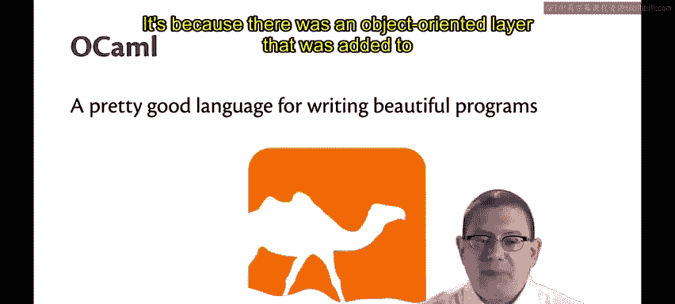

## OCaml的名字含义

上一节我们介绍了课程背景，本节中我们来看看我们将要使用的语言本身。

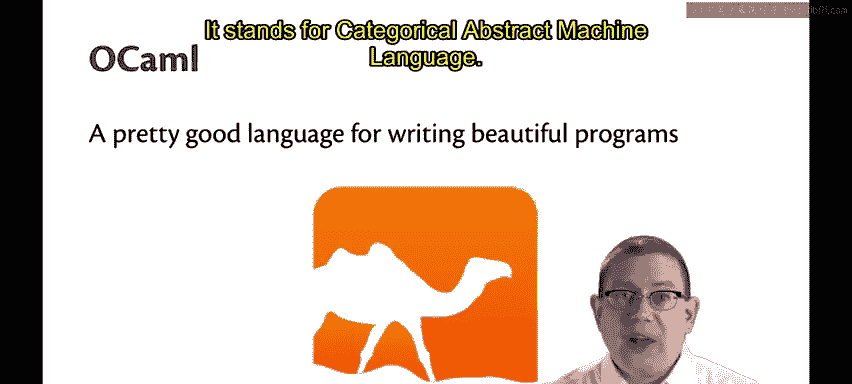

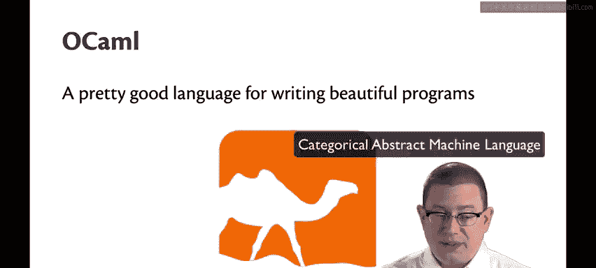

我们将在CS3110课程中学习的函数式语言叫做OCaml。我认为OCaml是一门非常适合编写优美程序的编程语言。

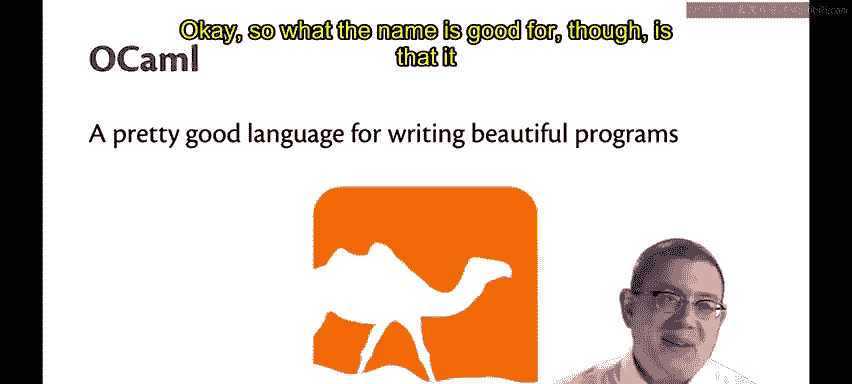

人们总是想知道这个名字的含义。我会告诉你，但我也要提醒你，知道这个含义并没有太大帮助。

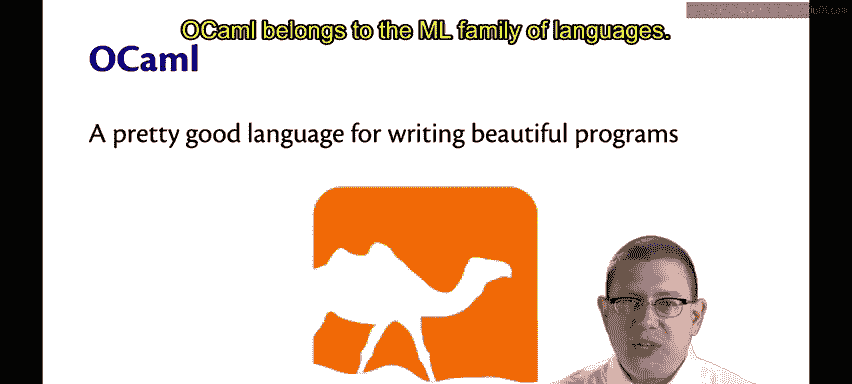

*   **“O”** 代表 **Objective**。这是因为在原始语言的基础上添加了一个面向对象的层。
*   **“Caml”** 是特别没有帮助的部分。它是一个缩写，代表 **Categorical Abstract Machine Language**。

看，我告诉过你这没什么帮助。不过，这个名字的好处是，它给了我很多机会在本课程中使用骆驼的剪贴画，我会充分利用这一点。

---

## OCaml的语言家族

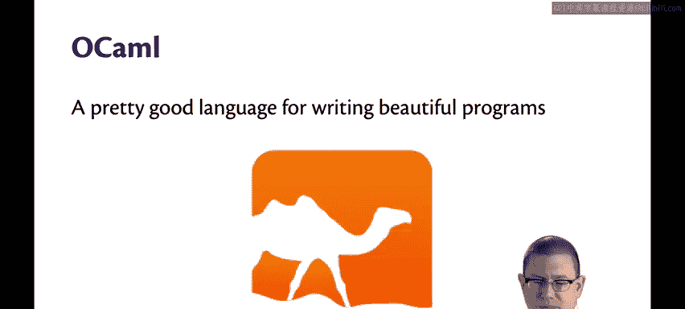

OCaml属于ML语言家族。需要澄清的是，我在这里说的“ML”**不是**指机器学习，尽管你们可能都热衷于学习一些机器学习知识。

ML语言家族起源于一种**元语言**，这就是“M”的由来。它是一种工具的元语言，实际上是一个定理证明器的元语言，用于编写证明。当然，如今我们不再那样使用它，我们用它来编写通用程序。

---

## 为什么选择OCaml？

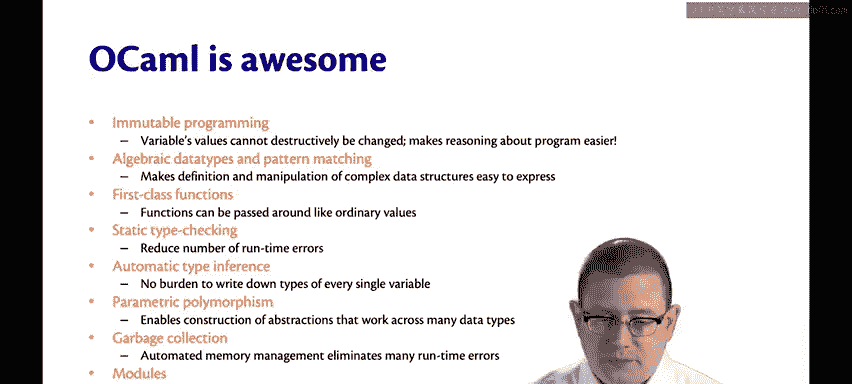

我认为OCaml有很多优点。你可以在课程教材中读到这些，也可以在课程大纲链接的另一本名为《Real World OCaml》的书中读到。但我现在不会详细讨论这些，因为现在讲会太抽象。

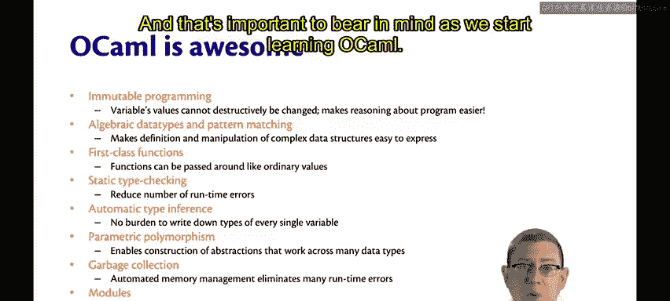

相反，我想做的是在学期末回来详细讨论。所以我现在向你们承诺，我希望在几个月后兑现这个承诺：我们最终会讨论OCaml在整个学期中对我们来说非常棒的那些原因。

---

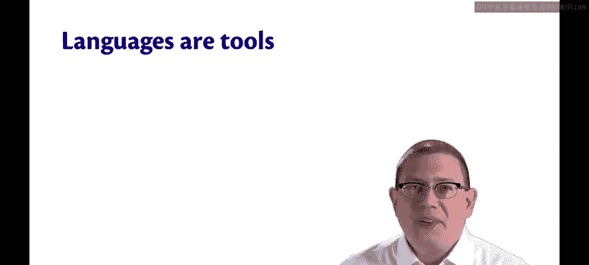

## 没有完美的语言

但没有任何语言是完美的。在我们开始学习OCaml时，牢记这一点很重要。

语言是工具。你应该为正确的工作选择正确的工具。这让我想起一次，我的岳父需要修理电脑里的调制解调器卡，他没有使用应该用的螺丝刀，而是决定用锤子。结果并不好。

这也让我想起了中世纪的**长柄武器**。我喜欢玩《龙与地下城》，我有点书呆子气，我有一个持续多年的家庭战役，每周五晚上都会主持。在D&D中，你掷骰子，假装用武器进行战斗。你可以使用很多武器，其中一些就是长柄武器——这些长杆末端装有某种刀刃。在历史上，它们被发明出来都有特定的目的，在战斗中有不同的用途。

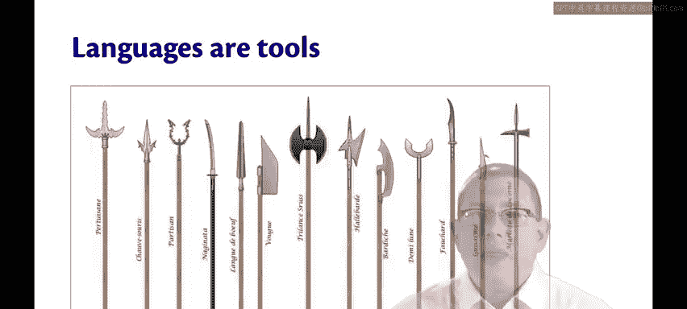

但它们是工具。你要为正确的工作使用正确的工具。

**没有普遍完美的工具**。看看有多少种长柄武器被开发出来就知道了。同样，**也没有普遍完美的编程语言**。所以请理解，尽管我喜欢用OCaml编程，但我并不是在试图告诉你它是完美的。

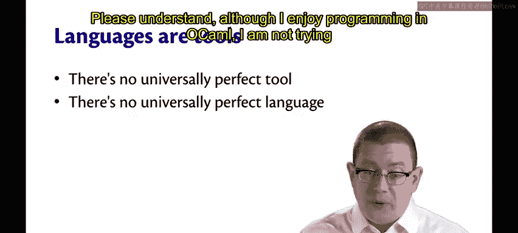

---

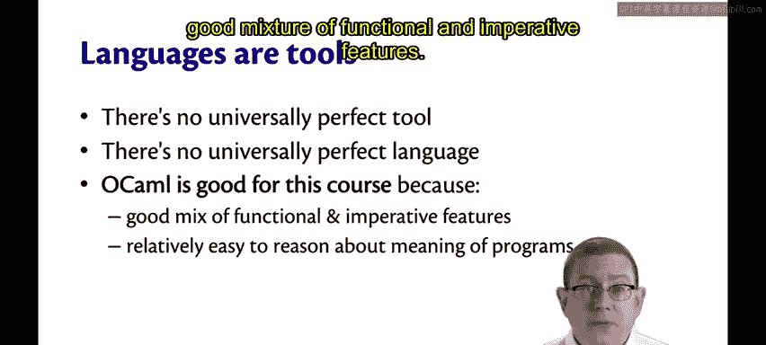

## OCaml在本课程中的适用性

OCaml恰好很适合这门课程，因为它很好地混合了函数式和命令式的特性。

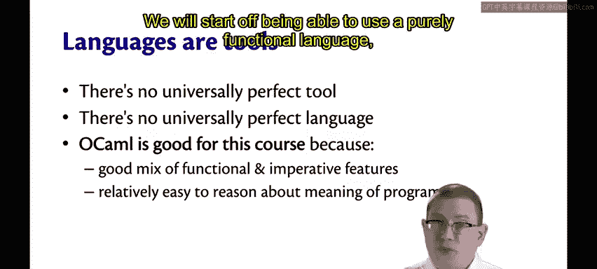

我们将从能够使用纯函数式语言开始，然后在学期后期，我们能够以隔离的方式融入一些命令式特性。

在OCaml中，推理程序的含义相对容易，特别是因为你可以主要将其用作函数式语言，而且我们本学期将对程序进行证明。

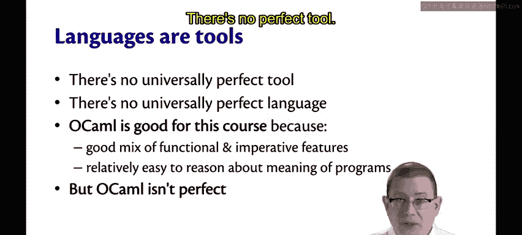

但OCaml并不完美。没有完美的工具，也没有完美的语言。

我们需要克服一些障碍，因为你会怀念过去使用过的任何语言中的某些特性。基于你对语言应该如何工作的期望，也会产生一些烦恼。

因此，作为一个指导过许多人学习OCaml和函数式编程的人，我请求你尝试将这些烦恼放在一边。有这些感觉是完全可以的，只是试着去识别它们。承认那种挫败感，然后把它放在一边。最终，它会过去的。我保证你会适应的。

在此过程中，我只要求你尝试保持开放的心态并享受乐趣。因为我认为学习函数式编程和学习OCaml有很多乐趣。

---

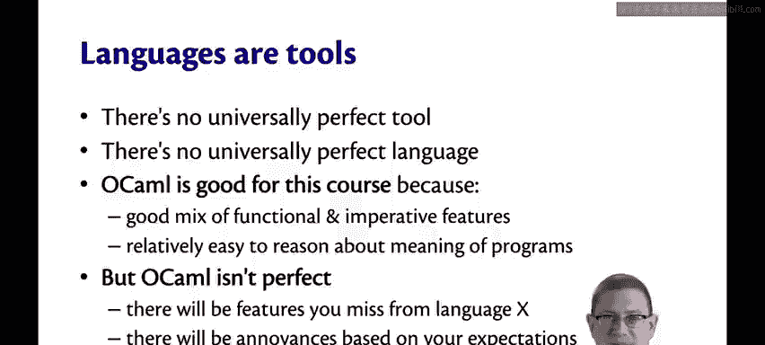

本节课中我们一起学习了OCaml语言的名称由来、它所属的ML家族，并客观地探讨了其作为教学语言的优缺点。重要的是要记住，语言是工具，OCaml是我们为学习特定编程范式而选择的合适工具。