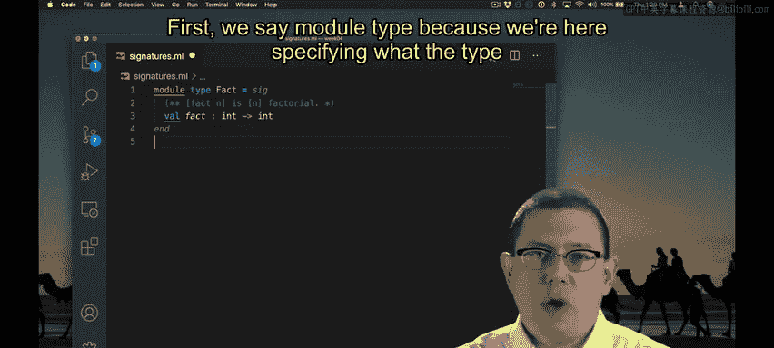
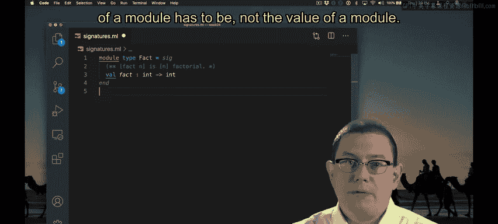
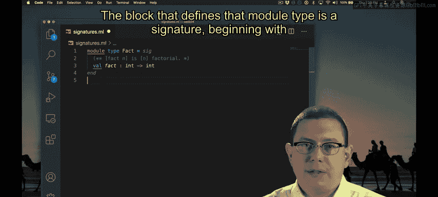
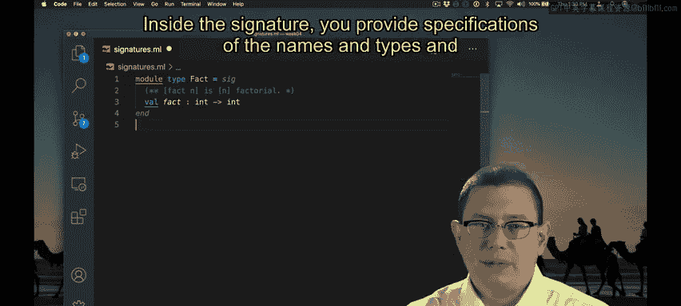
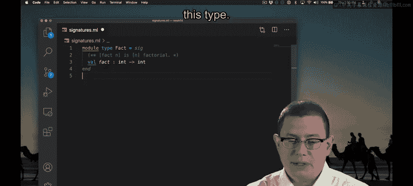
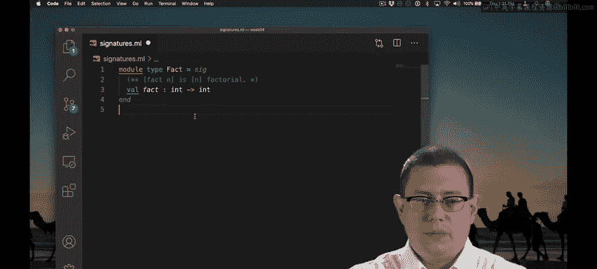
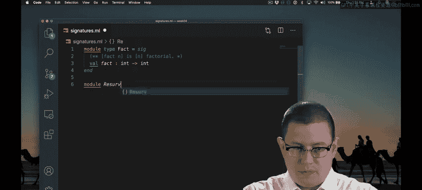

# OCaml编程：5.9：模块类型与签名 🧩


在本节课中，我们将要学习OCaml中的模块类型与签名。它们是定义模块接口的强大工具，用于规定模块必须提供哪些功能，同时隐藏实现细节。

---


## 接口与签名


接口是一系列名称及其规范的集合。这些名称通常以某种方式相互关联，使得整个接口作为一个代码单元具有意义。


在Java中，你已经习惯了接口的概念。OCaml有一个类似的功能，称为**签名**。


---

## 编写一个签名





让我们为那些包含阶乘函数的模块编写一个签名。



```ocaml
module type Fact = sig
  (** [fact n] is [n] factorial. *)
  val fact : int -> int
end
```


你立刻会发现，这看起来很像一个模块的定义，但有一些变化。



首先，我们使用 `module type` 关键字，因为这里我们指定的是**模块的类型**，而不是模块的具体值。定义该模块类型的代码块就是一个**签名**，它以关键字 `sig` 开始，以 `end` 结束。




在签名内部，你需要提供所有值的名称、类型和行为的规范，这些值将出现在任何属于此类型的模块中。

在这里，我声明必须有一个名为 `fact` 的值，其类型为 `int -> int`。并且我为它提供了一个规范注释：`fact n` 是 `n` 的阶乘。


请注意这里 `val` 关键字的使用。你在UTop中已经见过它：每当我们创建一个值，UTop会回应说有一个名为 `x` 的值，其类型是 `int`，以及它的具体值是什么。这里使用 `val` 关键字是同样的含义，它表示存在一个名为 `fact` 的值，其类型是 `int -> int`。只是在我们定义模块类型时，我们并不说明这个值的具体实现是什么。


---

## 实现签名的模块

我可以提供具有此类型的模块。



```ocaml
module RecursiveFact : Fact = struct
  let rec fact n =
    if n <= 1 then 1 else n * fact (n - 1)
end
```




这个名为 `RecursiveFact` 的模块，拥有模块类型 `Fact`。它通过提供一个具有正确类型的 `fact` 定义来实现该模块。当然，类型检查器会验证类型是否正确。例如，我不能在这里返回一个字符串。

OCaml编译器无法检查这个函数是否真的是阶乘函数。关于代码正确性相对于文档注释的部分，是不会被检查的。

请注意，注释是放在模块类型中的，而不是模块里。模块类型是我们为外界记录所有关于函数应如何工作的规范的地方。这是客户端阅读类型文档的地方。因此，在OCaml中，文档被分解在接口和实现之间：接口中的文档是面向公众的，说明函数应如何行为。

模块类型要求必须有一个名为 `fact` 的函数，其他函数不行。

```ocaml
module WrongFact : Fact = struct
  let ink n = n + 1
end
```

我会得到一个类型检查错误：😡 签名不匹配，模块不匹配。类型为 `int -> int` 的 `val ink` 未被包含。😡 实际上，需要值 `fact` 但未提供。

这个相当冗长的错误信息是说，这里有一个名为 `fact` 的值被这个模块类型注解所要求，但声称要实现该接口的结构并未提供它。

---


## 隐藏内部实现

我可以有其他实现相同接口的模块。

```ocaml
module TailRecursiveFact : Fact = struct
  let fact_aux acc n =
    if n <= 1 then acc else fact_aux (acc * n) (n - 1)
  let fact n = fact_aux 1 n
end
```

这个尾递归模块实现了阶乘接口，确实提供了一个阶乘函数。我可以从模块外部使用这个阶乘函数。

但是，有一件事我做不到，那就是使用辅助函数 `fact_aux`。

```ocaml
(* 这会导致错误：Unbound value TailRecursiveFact.fact_aux *)
```

当我们对这个模块加上模块类型注解时，我们不仅是在说它必须提供该接口中的所有名称，我们还在说这些将是暴露给外界的**唯一**名称。因为 `Fact` 签名只提到了函数 `fact`，而没有提到函数 `fact_aux`，所以 `fact_aux` 被隐藏在 `TailRecursiveFact` 内部。

如果我去掉模块类型注解，那么这个编译错误就会消失，因为 `fact_aux` 不再被隐藏在那个接口后面。

---

## 总结

本节课中，我们一起学习了OCaml的模块类型与签名。我们了解到，签名（使用 `module type` 和 `sig ... end` 定义）是模块的接口规范，它规定了模块必须公开哪些值及其类型。实现签名的模块必须提供所有指定的值，并且只有签名中列出的值才会对外暴露。这实现了信息隐藏，将公共接口与私有实现分离开来，是构建模块化、可维护代码的重要机制。