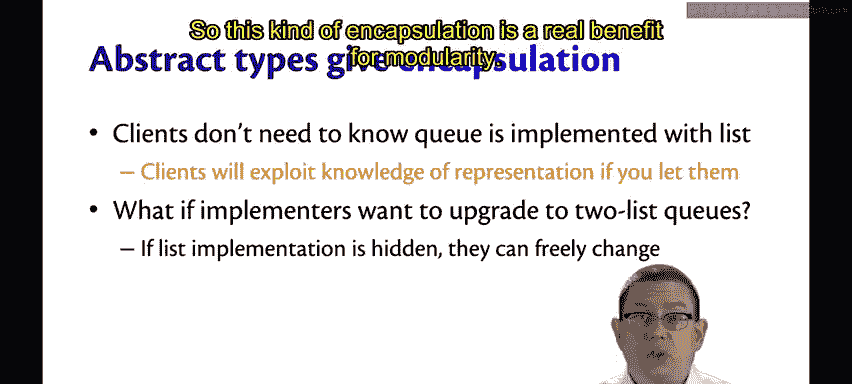
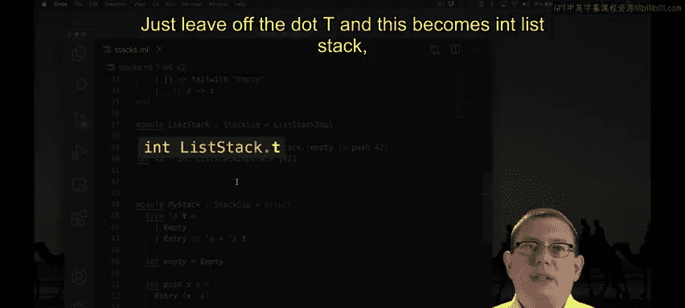

# 康奈尔大学《OCaml编程｜CS3110：OCaml Programming： Correct + Efficient + Beautiful》中英字幕 - P64：-064-Abstract Types Chap5 Video 12.zh_en - GPT中英字幕课程资源 - BV1Tx4y1s7sP

Signatures provide an even more powerful encapsulation mechanism than we've seen so far。

Recall that if a signature doesn't mention any names， then when a module is sealed to that signature。

 those names are not exposed to the outside world。This applies to types as well in our signature for stacks。

 we declared a type alpha stack in the signature， but we didn't specify what that type was。

List stack provided its own implementation of that type。

My staff provided a different implementation of it。

Because the signature does not mention what the implementation actually will be。😡。

When a module is sealed at that signature， the outside world doesn't get to know what the type is。So。

 for example， if I wanted to write some code here that used a list stack。That works perfectly fine。

But the following would not。Now， in the end， those two pieces of code would cause the same underlying data structure to be created。

 both of them create a list containing just the element 42。

But the second line is rejected by the type checker。This expression has type alpha list。

 but an expression was expected of type int list stack dot stack。

What's going on is that the fact that the stack is actually a list has been hidden behind that interface。

When we said stacksig was the module type of list stack。

 we hid this piece of the type definition from the outside world。

 because the signature does not reveal that fact。As we saw before。

 it's good that the signature doesn't reveal that fact because it lets us use that same signature for both implementations of the stack interface recall that we don't have to give a module type to a module as we define it we can define a different module later and give it a type。

List stack is still sealed at Sta SIig， but now I have a module list stack Iple。

 which is not sealed with that signature。So I can write lists stack Iple here。And that will compile。

 it's perfectly fine。The list stack Iple version of this module reveals the fact that alpha stack is the same as alpha list。

 because there is no module type that is specified as part of the definition。

 You can think of this as a private version of a class in Java with no ceiling going on versus this is like the public version of the class after you've sealed it after you've removed all of the private fields and so forth from visibility。

Leaving the type definition off from a signature。Is known as creating an abstract type。

So alpha stack in our stack signature was abstract。The signature is just declaring that exists。

 it's not defining what that type actually is。Every module that implements that signature does have to define the abstract type。

 though it must provide a definition， not just leave it declared。

Abstract types are giving us encapsulation。The client of a stack or a queue doesn't need to know how it's implemented。

 They don't need to know that it's a list or some other custom variant behind it。

Clients will exploit this knowledge if you let them。

 If you reveal the fact that your cu is implemented as a list。

 then someone one's going to write code that directly use lists。

That's not so good because maybe one day you want to upgrade and provide a more efficient implementation。

 you want to use two list cues instead of single list cues。😡。

When you encapsulate and hide that representation type。😡。

Which is to say you don't expose to the outside world that list is being used。

Then as the implementer of the data structure， you are perfectly free to upgrade the internals of it。

If you expose that representation type though。Well。

 you're going to break all your client code when you try to do that upgrade。

So this kind of encapsulation is a real benefit for modularity。

One common idiom for abstract types of data structures is to just name the type T。

Let me show you what that would look like。Now we're just calling the representation type inside of Sta SIig T instead of stack。

It's much shorter and idiomaticically OMl programmers expect that that type T is whatever the primary data structure type is there going down here I need to replace that stack with T。

And now you can just leave off the dot T when you read these types inside your own mind at this point。

Just leave off the dot T and this becomes int list stack， a list stack events。

 so not only does this save characters and typing， but once you get used to reading things in this way。

 it actually makes them a little quicker to read。

