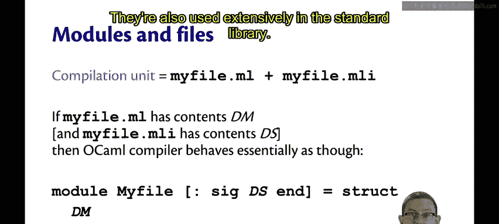
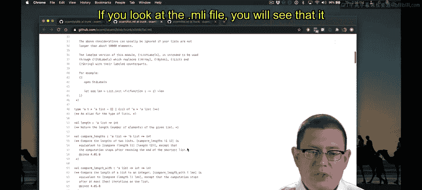
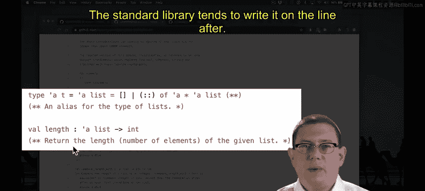
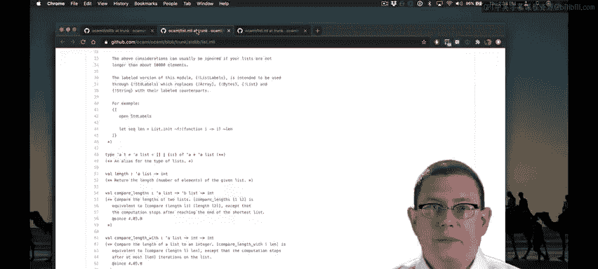

# 康奈尔大学《OCaml编程｜CS3110：OCaml Programming： Correct + Efficient + Beautiful》中英字幕 - P65：-065-Compilation Units Chap5 Video 13.zh_en - GPT中英字幕课程资源 - BV1Tx4y1s7sP

So far， we've been implementing modules and module types within dot ML files。

There's another way to do all of this without the module type and module keywords。😡。

And that's to factor out the code into two separate files。One of the files is a dot MLI file。

 it's the first time we've ever written such a file， the other is a dot ML file。

So the idea is we put the signature in the dot MLI file， it's the interface to the module。

And we put the implementation in the ML file。It is the module itself。

So here I've put my stack interface into a file named Sta。mI。

 and I have all of the specifications for the names， the types and the behaviors of each of them。

In the ML file， I put the implementations of all of those。

I don't put those specification comments in， we don't repeat them between the two files that would be redundant eventually they would get out of sync。

 you wouldn't know which one was right， so we put the public facing specifications in the MLI file。

And then in the ML file， we put comments that are specifically for those who are going to be implementers or maintainers of the code。

So here I've written， stacks are represented by lists， the top of the stack is the head of the list。

 the bottom of the stack is the last element of the list。That's a comment that。

People who know that the stack is implemented with the list will need to know about。

But for the rest of the world， for the public， they don't need to know that This factoring of code into two files is known as a compilation unit A compilation unit is a pair of files with the same base name。

 one ends with dot ML， the other ends with dot MLI， and they're both in the same directory。

If the dotM file has some contents， let's call it DM， those are the definitions by the module。

And if the MLI file has some contents DS， that's the declarations in the signature。

Then Ocael essentially behaves as though you had written the following syntax。Module。

 my file and note that my file is now capitalized， so even though the file name is lowercase。

 OML behaves as if it's defining a module here and module names， of course， must be capitalized。😡。

The MLI file becomes the signature that's provided there。However。

 there's no signature name that's created for this it's just an anonymous signature。

 so it's as if you had written colon SG and then all of the contents of that specification from the MLI file and end in place there。

And then follow that with equalsstruct and then all of the contents from the dot ML file。

Compilation units are something we'll start using soon enough in our programming assignments。

 even though we're not quite there yet。They're also used extensively in the standard library。😡。

If you're ever curious what the implementation of something looks like in the standard library。

 it's easy to find， just Google Ol GitHub。Click on that link that you find there。

Scroll down to standard Lib。And now you will see the dot ML and dot MLI files for all of the modules in the standard library。

We've been using lists a lot， so let's look at that one。Here's L MLI and Lta MLl。

If you look at the MLI file。You will see that it documents， well。

 specifies the names like the function length。

Their type， and then it provides a behavioral specification for it in a comment。

You can actually provide that specification either on the line before the Val declaration or on the line after we tend in this class to write it on the line before the centered library tends to write it on the line after。

The implementation of the list module is then provided in list。 MLl。

And you can see here the implementation of the length function， as you'll see。

 it actually uses a tail recursive helper function。That function length Oux is hidden。

 never revealed to the outside world， you can't get to it by using listist dot length O in Utah。

Because of the compilation unit。Length aux is not mentioned in the interface file。

 and therefore because OCML behaves as though this is the signature for the module。

 it's not revealed to the outside world， it's encapsulated， nobody can get to it。

