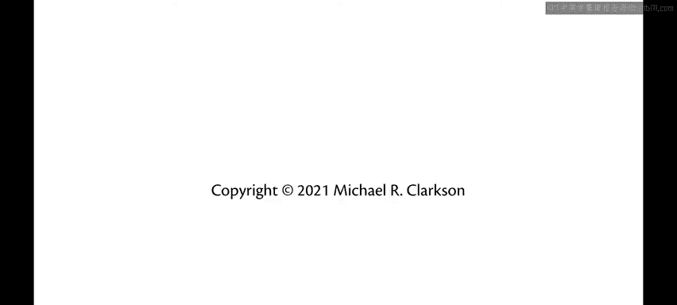

# 康奈尔大学《OCaml编程｜CS3110：OCaml Programming： Correct + Efficient + Beautiful》中英字幕 - P66：-066-Utop with Modules Chap5 Video 14.zh_en - GPT中英字幕课程资源 - BV1Tx4y1s7sP

When working with modules， there are a few subtleties about Utah that you need to be aware of。

When you type use in U， it's as if you were directly issuing the commands from that file into U itself。

So if I use stackax。ml， which had our listT and My stack implementation。

It's as if I had directly type all of those into UP itself， let's recall what those definitions were。

 we had a stack SIG， we had a list stack Iple， we had a list stack， we had two stacks。

 S1 and S2 and so forth， and you can see that those got defined here in UP and I can use those exactly as normal。

When I printed out this value S1 here。Notice how it printed out that the value was abstract or that's really short for abstract。

It's in angle brackets， we've seen that before， angle brackets means that Ochemel has something unprintable。

S1 is unprintable here because it is abstract。Remember。

We made that representation type abstract in the stack signature， and we sealed。

List stack at that signature。Which means values of that type。

 we don't even know what they are because we don't know what the type is externally from that module。

So OCMl is able to tell us that it's a value of type list stack。

But it's not able to tell me exactly what the value is。S 2 is different。S 2 was from List Imple。

 which was never sealed。So it's able to print out exactly as that list because it's known to the external world what the representation type is that it is a list As we go into the future with programming assignments。

 we're more often going to be using OcaelBuild， which is what the make targets we ship to in the release code actually use。

And OL Bill is going to compile our code a little differently。

 it's not as if we just directly typed it in Utah， let's return to the stack compilation unit we created before to see this in action。

Stack。ml has all the definitions for our stack implementation as a list。And I could use that in Utah。

😡，That makes all those definitions available。But it's as if I had directly typed them。

And so there's no notion that there's an interface provided for this code at all。In particular。

 the fact that the representation type is a list is totally exposed here。So what is empty。

 it's the empty list we get to see that。Of course， the whole point of having a compilation unit though is that the interface can actually provide some encapsulation。

So normally what will happen is we will build the compilation unit。

Now I had to type those commands directly to build the compilation unit。

 you don't usually have to type that because we provide a make file target that runs the appropriate OCM will build commands for you。

But what that Ochemo build command did was created some files in the build directory， in particular。

 stack。cmiI and stack。cO。So stack。cmi is the compiled version of the MLI file。Stack。

c is the compiled version of the module file of the MLl file。Now that those exist in that directory。

 I can load them inside of Utah。First， I have to tell you top what directory I want it to load code from by default it will only look in the current directory。

 of course， okay well build puts all of its compiled files in underscore build。

 so I have to add that as a directory。Now I can load the compiled stack code。

And the stack module is now available to me， but it has the name stack。

So I can enter stack dot empty， and now that is an alpha stack， but it's abstract。

 the interface has been used to seal that module。And notice that I have to write stack do empty at this point。

 I can't just write empty anymore。It's not as if I had just typed these commands in。

Because I used load rather than use。Now， load is more complicated as you can see here。

 but it more closely mimics the way you would really use this code in the rest of a code base。

 if you were using the stack module in some other module of your code base。

 you would be writing stack dot the stack values would be abstract there because the type would be abstract from being sealed by the interface。

If you were going to do a lot of testing with the SAT module。

And you found yourself having to reender these commands all the time， well。

 there's a solution for that too put them in the dot Ocaml inniF。

Because all the commands in the doOchem Lni file are run every time you launch Utah。

 I now have the stack module available。And in the future。

 you'll see some of the programming assignments we ship to you well do just that。Finally。

 when you want to load code from a third party library， not a module from your own code base。

 not a module from the standard library， there's yet another director for that which is require。

I've now loaded the O unit third party library and its definitions are now available。

