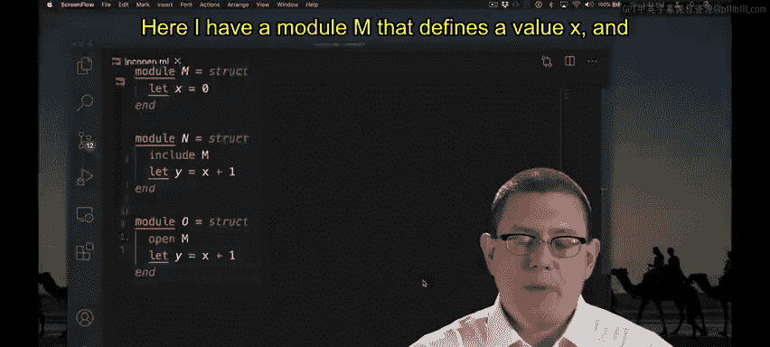
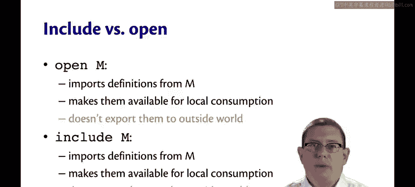

# OCaml编程：5.16：Include与Open的区别 🧩

在本节课中，我们将学习OCaml中两个容易混淆的概念：`include`和`open`。我们将通过具体的例子来理解它们之间的核心区别，以及各自的使用场景。

## 概述

`include`和`open`在初次接触时看起来非常相似，它们确实有一些共同点，但也存在关键差异。本节我们将深入探讨这两个指令，帮助你清晰地理解它们各自的行为。



## 核心概念解析

为了理解`include`和`open`，我们首先定义三个模块。

以下是模块`M`的定义，它包含一个值`x`：
```ocaml
module M = struct
  let x = 1
end
```

接下来，我们定义两个新模块`N`和`O`，它们分别使用`include`和`open`来引入模块`M`。

模块`N`使用`include M`：
```ocaml
module N = struct
  include M
  let y = x + 1
end
```

模块`O`使用`open M`：
```ocaml
module O = struct
  open M
  let y = x + 1
end
```

## 关键区别


现在，让我们来看看`include`和`open`的核心区别。

上一节我们定义了三个模块，本节中我们来看看它们在交互环境（如UTop）中的实际表现。加载这些模块后，我们可以很快发现差异。

模块`N`最终包含两个值：`x`和`y`。这是因为`include`指令将模块`M`中的所有定义都**包含**到了模块`N`的内部。由于`M`定义了值`x`，`N`也因此拥有了`x`。

模块`O`最终只包含一个值：`y`。这是因为`open`指令只是将模块`M`中的名称**打开**到当前作用域，使其在模块`O`内部可用，但并不会将这些名称重新**导出**到外部世界。

以下是两种指令行为的总结：
*   **`include`**：导入模块`M`的定义，使其在本地可用，**并且**将这些定义导出到外部世界。
*   **`open`**：导入模块`M`的定义，使其在本地可用，但**不会**将这些定义导出到外部世界。

## 总结



本节课中我们一起学习了OCaml中`include`和`open`指令的区别。`include`会将一个模块的全部内容复制并合并到当前模块中，并对外暴露；而`open`仅是将另一个模块的命名空间在当前作用域内打开，方便内部使用，但不会改变当前模块对外提供的接口。理解这一区别对于构建清晰、模块化的代码结构至关重要。