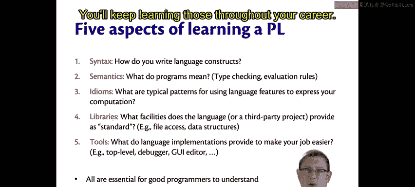
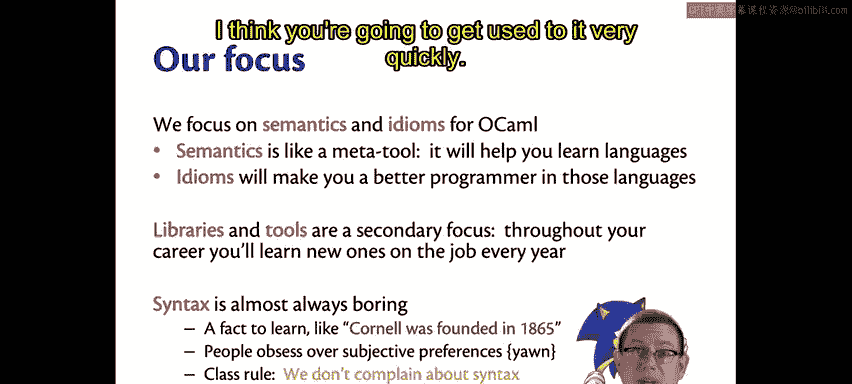

# 康奈尔大学《OCaml编程｜CS3110：OCaml Programming： Correct + Efficient + Beautiful》中英字幕 - P6：-006-Five Aspects of Learning a Programming Language Chap2 Video 1.zh_en - GPT中英字幕课程资源 - BV1Tx4y1s7sP

As we embark on this journey of learning a new programming language together。

 it's worth while to take a step back and ask what is involved in learning a new programming language。

 This is maybe at least the third， if not fourth or fifth language you have learned in the past。

So what are the aspects of learning a programming language？Well。

 there are five different aspects that I'd like to focus on。The first is the syntax of the language。

 This is the most basic level。 How do you write language constructs， What are the keywords。

 How do you use punctuation， What kinds of parentheses have to go there， and where do they go。

 That sort of thing。Beyond that is the semantics of the language。

 this is actually the more interesting aspect。 it's what do programs mean。

When you write a piece of code， how is it going to be understood by the computer。

There are two really important pieces to this that will be a running theme for the entirety of the time we learn Ocael and for really the entire course。

 type checking and evaluation rules。Type checking helps decide which programs do have a meaning。

 valuationuation rules tell us what the meaning of the program is。

 We'll study these extensively this semester。A third piece of learning a programming language is the idioms of that language。

What are the typical patterns。That people who speak that language fluently will use to express their thoughts。

As anyone who studied a language thats a natural language， not one that grew up speaking will know。

Just being able to say something in a language doesn't mean you can say it in a way such that native speakers of it are going to intuitively and immediately grasp your meaning。

You may use synonyms that really don't work in that context of the foreign language。

It's the same thing with a programming language。 You can express yourself in maybe a very Java like way inside of Ocamel。

 but native speakers of Ocamel will have a little trouble understanding what you're saying。

So learning to speak idiomaticically or to program idiomaticically is important。

A fourth piece of learning a programming language is learning the libraries that are available。

What facilities does the language give you or maybe third party projects give you that are standard or that you can download as additional libraries to make use of？

Things like accessing the file system， data structures that have been provided for you in Java you probably learn to use libraries for perhaps hash mapps。

 for example， in OMM youll also need to learn to use certain libraries。

And a fifth aspect of learning and programming language， the tools that are available。

Languages provide more or less tools， depending on how rich of an ecosystem that language has in Java you got used to using the Eclipse IDE probably in 20110。

In Python， you didn't necessarily have an ID like that to work with。

 you might have worked more just on the command line and in a code editor。

Other languages may have things like debuggs that are available or something called a top level。

 You've probably seen a top level before it's like J shellll in Java or like the Python interpreter in Python。

An area in which you can interact with the language and issue some commands or expressions and get results back。

As opposed to just putting your code into a file and editing it there。 Of course。

 the latter is what we need to build big software， but the former is useful when we're just trying to play with language constructs or figure out what a command or an expression does。

So those are the five distinct aspects of learning a programming language and they're all challenges to master as we go through this semester with OKMl。

But some of them are more important than others。If you break down your learning of the language into these aspects。

 it can help you focus on what's challenging you at the moment and where you need to work to improve。

The syntax will be the initial challenge， but really what we want to move on to is the semantics。

 what the language means， what programs mean in it。The others are important。

 Learning to speak idiomaticically is actually especially important。But the libraries and tools。

Those are somehow less important。 You'll keep learning those throughout your career。

So our focus is on semantics and idioms。Semantics is kind of like a meta tool。

 Once you understand programming language， semantics。Not just for a particular language。

 but how semantics can be described and communicated between humans。

 that will help you learn new languages。 It will give you a boost in your future。The idioms。

 once you become aware of how to speak idiomaticically in an imperative versus a functional language。

 they will help you be a better programmer in those languages。The libraries and tools， though。

 those are of secondary importance throughout your career。

 you're going to learn new ones on the job every year， maybe every week。

 So we're not going to focus too much on that here in this course。

And syntax is basically always boring。It's just facts to learn like Cornell was founded in 1865。

 right that's an interesting fact， but that's about as far as it goes for our purposes。

People obsess too much over their own subjective preferences about syntax。

Let's not get caught in that trap。Syntax is boring。 People are going to complain about it。

 If you want to complain， that's fine。 Hater's going to hate。 It's going to happen。

But I'm going to establish a class rule here， Okay， so go with me on this one。

 Our class rule is we don't complain about syntax。Now。

 if you get to the point in your career where you have developed a programming language that is in use at many universities and tens of thousands of people learn it every year or use it every year。

 okay， then you'll get to complain about syntax and I will not tell you otherwise。But for now。

 in this class， we're not going to complain about the syntax of Ocabell。

 I think you're going to get used to it very quickly。

