# OCaml编程：6.1：抽象与规范 📚

在本节课中，我们将要学习计算机科学中的一个核心概念：**抽象**，以及如何通过**规范**来清晰地定义抽象的行为。

---

## 什么是抽象？🤔

有人说，计算机科学是关于抽象的科学，或者说是关于高效抽象的科学。

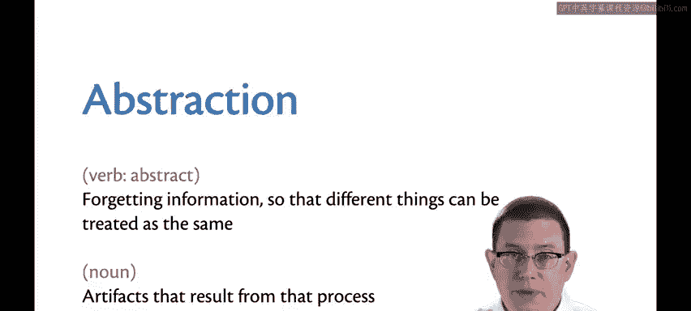

那么，什么是抽象？作为一个动词，“抽象”意味着**遗忘信息**。其目的是能够将相关的事物视为相同。也就是说，你忽略掉不重要的细节，专注于重要的、共性的部分。

作为一个名词，**抽象**指的是这个过程中产生的**制品**。这些制品可能是函数、模块、类，或者你的编程语言用来组织代码的任何结构。

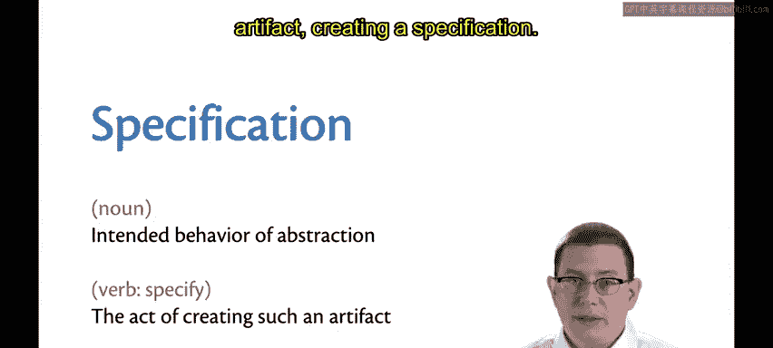

当我们创建这些函数时，抽象的一个重要环节就是编写**规范**。

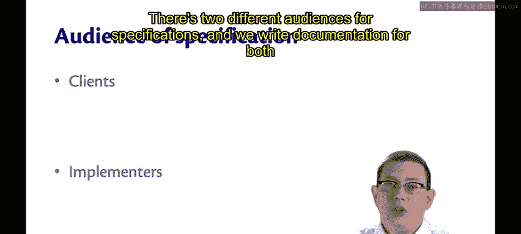

---

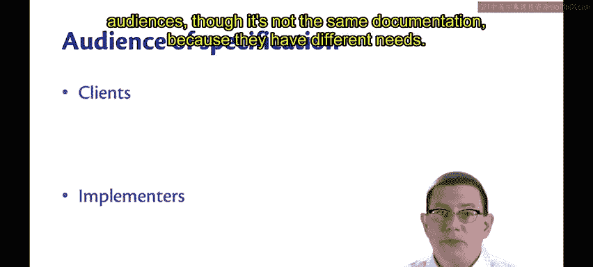

## 规范的作用 📝

规范作为一个名词，指的是抽象的**预期行为**。我们通过它向其他人传达该行为应该是什么样子。作为一个动词，“指定”就是创建这样一个制品的行为。

规范面向两种不同的受众。我们为这两种受众编写文档，但文档内容并不相同，因为他们的需求不同。

以下是两种受众：

*   **客户端**：将要使用规范的人。例如，你可能是一个标准库的客户端，因为你正在阅读标准库的文档。
*   **实现者**：将要维护代码或首次编写代码的人。这些人需要理解比客户端可能更底层、更详细的规范内容。

---

## 规范的双重角色 ⚖️

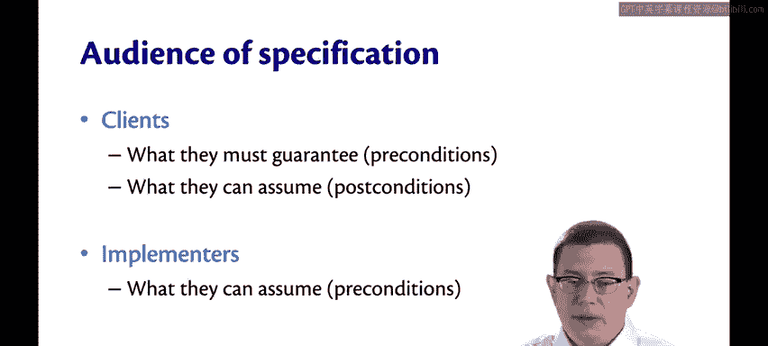

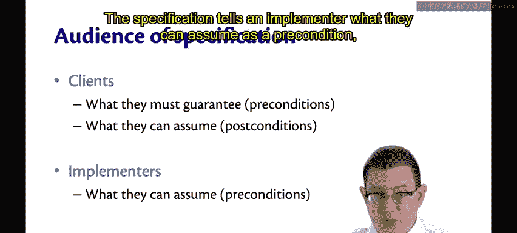

对于客户端而言，规范告诉他们**必须保证什么**（这里我特别以函数为例）。这就是**前置条件**。客户端必须确保在调用函数时，已经满足了该函数的前置条件。

同时，规范也告诉客户端**可以假设什么**，即**后置条件**。他们可以根据文档知道函数的输出是什么。

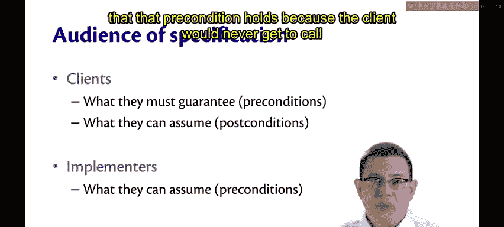

对于实现者而言，情况则有些相反。

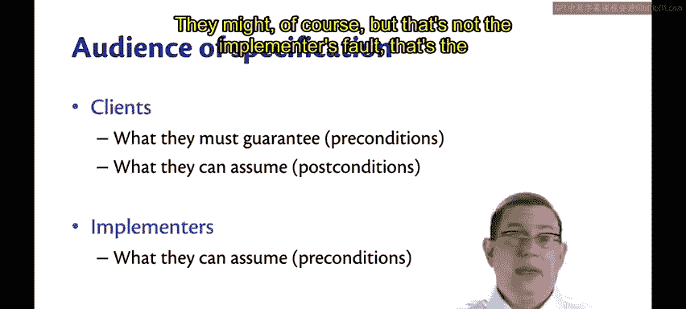

规范告诉实现者**可以假设什么**作为前置条件。因为客户端必须满足它，所以在函数边界处，实现者可以说：“好的，我确信前置条件成立，因为如果它不成立，客户端就无法调用我。”当然，客户端可能违反，但这不是实现者的错，而是客户端的错。

规范也告诉实现者**必须保证什么**作为后置条件。现在，确保某些条件成立是**实现者**的责任，而不是客户端的责任。

因此，在客户端与实现者之间、前置条件与后置条件之间、假设与保证之间，存在着一种**二元性**。

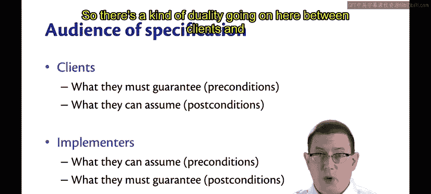

---

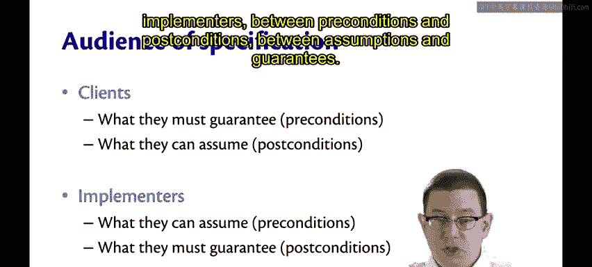

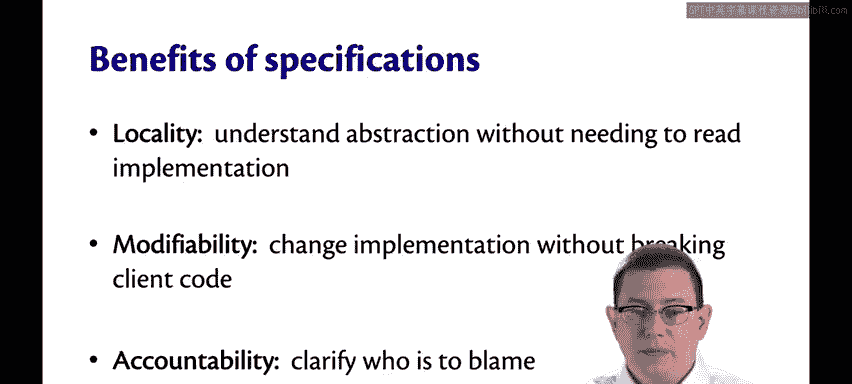

## 规范带来的好处 ✨

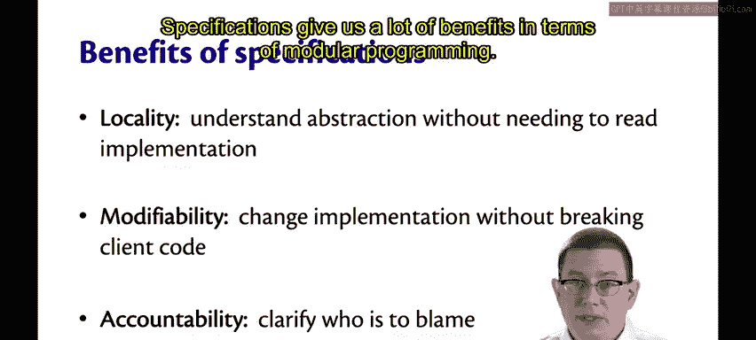

规范为模块化程序带来了许多好处。

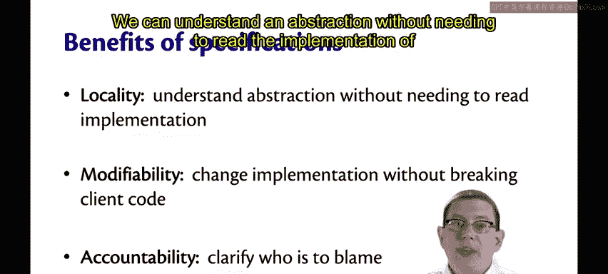

它帮助我们实现**局部性**。当规范向客户端提供足够的信息时，我们可以在不阅读其实现的情况下理解一个抽象。

规范也有助于**可修改性**。通过明确代码应该做什么，实现者在后续演进代码时，可以更改其实现，而不会破坏客户端代码，因为客户端可以依赖什么是清晰的。

最后，规范提供了**责任归属**。它们明确了当出现问题时应该归咎于谁。是客户端因为违反了前置条件而受责，还是实现者因为违反了后置条件而受责？

---

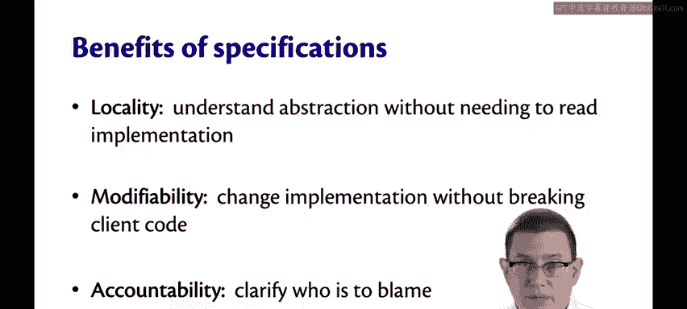

## 实现与规范的关系 🔗

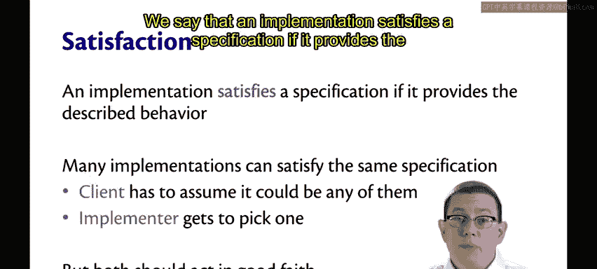

我们说，如果一个实现提供了所描述的行为，那么它就**满足**一个规范。

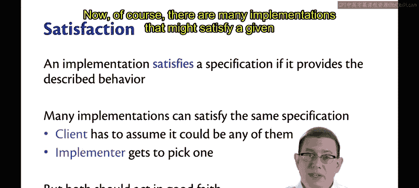

当然，对于一个给定的规范，可能有许多不同的实现能够满足它。

这里再次体现了客户端与实现者之间的二元性。客户端不能对实现者选择了哪个具体实现做出任何特定假设。但实现者最终确实有权选择他们想要的那个。

这并不意味着实现者应该故意刁难或恶意行事。双方都应本着诚信行事，以就规范的含义达成一致。

但歧义可能会出现。让我们从实现者的角度来思考这个问题。

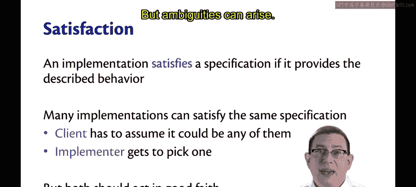

以下是可能产生歧义的一些因素：

*   客户端可能并未真正理解他们希望你实现什么。
*   客户端可能确实不在乎，他们留下了一些未指定的部分，因为他们对你提供的任何方案都满意，只要它满足规范的其他部分。
*   或者，你作为实现者可能并不理解规范中某些部分的含义。

所有这些都可能导致规范中存在感知上或实际上的歧义。

---

## 处理歧义规范 💡

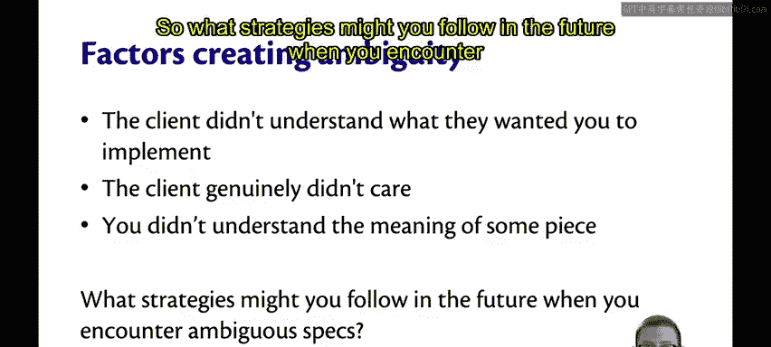

那么，当你遇到有歧义的规范时，未来可以遵循哪些策略？

首先，要认识到歧义是生活中的一个事实。但同时，也要本着诚信行事。作为实现者，我们应该尝试做最合理的事情。

诚然，当前置条件被违反时，你可以做任何你想做的事情，比如让电脑着火。但让电脑着火很可能不是最合理的做法。

所以，让我们问：谁写的规范？如果你是编写规范的人，并且发现了歧义，你可以寻求改进它，将规范细化为更清晰的内容。

如果是客户端提供的规范，那么你可以向客户寻求澄清。但对此需要小心一点。请求几次澄清和请求500次澄清是有区别的。如果你做了后者，客户可能不会再雇佣你，因为你无法自己解决低层次的歧义，而只把真正重要的问题抛给他们。

这是一种平衡行为，需要培养一些良好的常识。正如伏尔泰所写：常识并不那么常见。

---

## 总结 📋

本节课中，我们一起学习了抽象与规范的核心概念。我们了解到，抽象是通过忽略细节来关注共性，而规范则是定义抽象行为的契约。规范在客户端（使用者）和实现者（编写者）之间建立了清晰的权责边界，通过前置条件和后置条件来划分假设与保证。良好的规范能提升代码的局部性、可修改性和责任明确性。最后，我们还探讨了如何处理规范中可能出现的歧义，强调了沟通与常识的重要性。