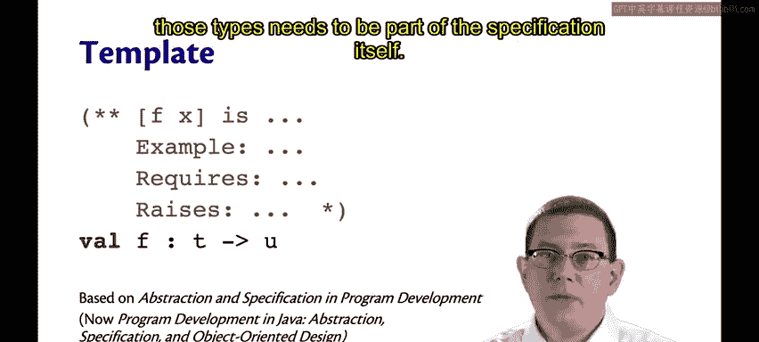
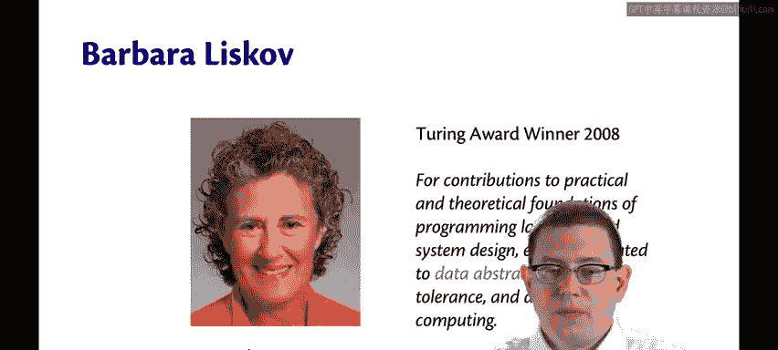
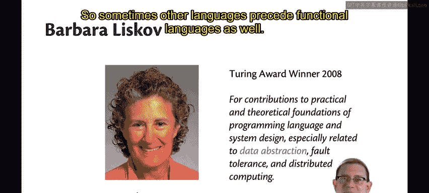
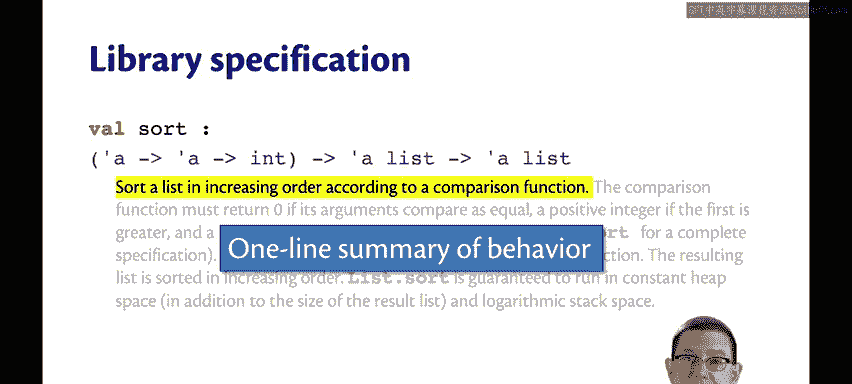

# OCaml编程：6.2：函数规范详解 🧾

在本节课中，我们将学习如何为OCaml函数编写清晰、完整的规范。函数规范是连接函数实现者与使用者之间的重要契约，它精确描述了函数的行为、前提条件和预期结果。

## 规范模板的起源 📜

上一节我们介绍了函数规范的重要性，本节中我们来看看一个被广泛采用的规范模板。这个模板源自Barbara Liskov和John Guttag的著作《Program Development in Java: Abstraction, Specification, and Object-Oriented Design》。在OCaml中，我们使用的规范模板包含四个核心部分。

以下是该模板的四个组成部分：
*   **首行摘要**：用一行文字概括函数的行为，描述输出与输入之间的关系。
*   **示例**：提供如何使用该函数的具体例子。
*   **`requires` 子句**：即**前置条件**，规定了调用函数前输入必须满足的条件。
*   **`raises` 子句**：这是**后置条件**的一部分，说明了函数在何种情况下会抛出异常。

接下来，我们将详细探讨每一个部分。





## 规范与类型声明 📝

规范通常写在`.mli`接口文件中，位于函数名称的声明之上。该声明同时提供了函数的类型签名。

```ocaml
(* 规范写在类型声明之上 *)
val function_name : input_type -> output_type
```

因此，类型信息本身不需要成为规范的一部分，它们作为源代码的一部分被单独书写。

## 关于Barbara Liskov 👩‍🔬

顺便一提，Barbara Liskov是图灵奖得主，她于2008年因对编程语言和系统设计的实践与理论基础，特别是数据抽象（我们现在正在学习）、容错和分布式计算方面的贡献而获奖。她也是我的“祖师爷”——即我博士导师的博士导师。她更是最早获得计算机科学博士学位的女性之一。



她的一项主要成就是设计了CLU语言。CLU是现代许多面向对象语言的前身，它首创了一些如今广为人知的理念，例如**迭代器**和**异常处理**。此外，CLU也拥有类型安全特性，甚至早于ML语言家族。

## 实例解析：List.sort函数 🔍

让我们看一个来自OCaml标准库的规范实例，这是针对`List.sort`函数的。



```ocaml
(** 根据给定的比较函数对列表进行排序。
    比较函数必须返回一个整数：
    如果第一个参数小于第二个，则返回负数；
    如果相等，则返回0；
    如果大于，则返回正数。
    结果列表按递增顺序排列。
    当前实现以常数堆空间和对数栈空间运行。*)
val sort : ('a -> 'a -> int) -> 'a list -> 'a list
```

观察这个规范，你可以看到它包含了模板中的所有部分：
1.  **首行摘要**：第一行概括了行为——“根据给定的比较函数对列表进行排序”。对于排序这种通用概念，有时无需用复杂的数学语言描述，直接说明其目的更为清晰。
2.  **前置条件**：第二行虽然没有以“requires:”开头，但它是一个前置条件。它规定了传递给`sort`函数的比较函数`compare`必须满足的行为：必须返回一个整数，其符号表示两个参数的大小关系。
3.  **后置条件**：第三行给出了后置条件（可以想象前面有“returns:”）。它承诺“结果列表按递增顺序排列”。
4.  **效率保证**：最后一句是规范的另一个部分，关乎函数的效率。它承诺当前的排序实现将在**常数堆空间**和**对数栈空间**内运行。

因此，**效率可以作为函数规范的一部分**，虽然不总是必要，但完全可以包含。

## 总结 📚

本节课中，我们一起学习了如何为OCaml函数编写规范的四个核心部分：首行摘要、使用示例、前置条件（`requires`）和异常说明（`raises`）。我们通过`List.sort`函数的实例分析了这些部分在实际中如何呈现，并了解到规范甚至可以包含对算法效率的承诺。编写良好的规范是构建可靠、可维护软件的关键步骤。