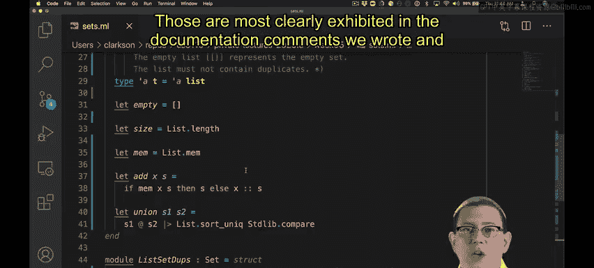
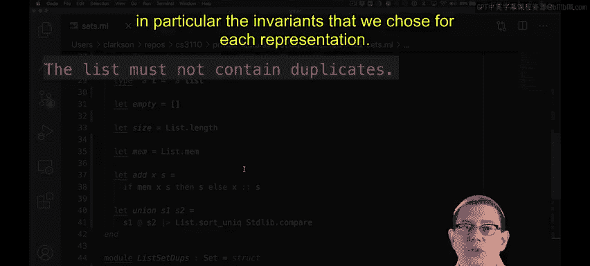
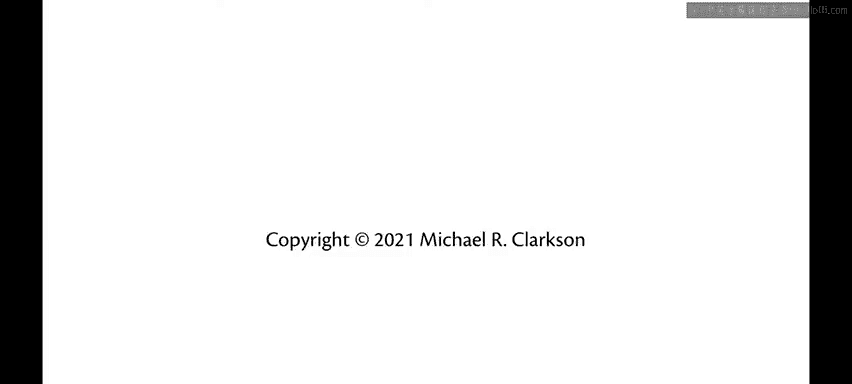

# OCaml编程：6.6：集合的另一种实现 🧮

在本节课中，我们将探讨集合（Set）数据结构的另一种实现方式，重点关注其操作的效率权衡，并学习如何通过调整不变式（invariant）来优化某些操作。

---

## 概述

之前我们实现集合时，要求其底层列表不能包含重复元素。这确保了 `size` 操作的简单性，但增加了 `add` 操作的负担。本节我们将尝试另一种设计：允许列表包含重复元素，并分析这对其他操作效率的影响。

---

## 重新审视不变式

上一节我们介绍了基于无重复列表的集合实现。本节中，我们来看看如果我们放宽这个限制，允许列表包含重复元素，会发生什么。

显然，如果我们不必检查元素是否已存在于列表中，`add` 操作可以实现为常数时间。但这违反了之前为表示类型（representation type）设定的不变式。

让我们尝试做出不同的决定，允许列表包含重复元素。

---

## 操作的效率权衡

当然，现在 `add` 操作变成了常数时间。但 `size` 操作变得不正确了。

由于列表可能包含重复元素，它可能会多算集合中的元素数量，因此我们需要修复这个实现。

为了计算列表的大小，我们必须检查它的每个元素是否已经出现在其尾部（tail）中。这效率并不高。实际上，我们将需要多次遍历尾部。这最终导致 `size` 操作的实现是**二次方时间**的，比我们之前线性的实现要差得多。

---

## 寻求改进

我们能做得更好吗？如果我们能移除列表中的所有重复元素呢？那样的话，`size` 操作就又可以简化为取列表长度了。让我们试试这个方案。

我使用了一个名为 `sort_uniq` 的库函数。这个函数除了对列表排序外，还会同时移除重复元素。该函数的文档说明其运行时间为 **O(n log n)**，这比二次方时间好得多，但仍然不如线性时间。

顺便提一下，我也可以清理一下 `add` 函数的代码。

---

## 添加并集操作

假设我想添加一个 `union` 操作来计算两个集合的并集。

现在，由于我在签名（signature）中添加了 `union`，我得到了一个类型检查错误，因为我的模块实际上还没有提供这个操作，所以我需要将它添加到两个模块中。

让我们在这里暂停一下。很自然地会想用列表追加（list append）来实现 `union`，因为我们可以直接将两个列表拼接在一起，并说这就是结果集合。但这违反了我们在文档中设定的不变式——列表不能包含重复元素。

因此，我们需要做更多的工作来使这个实现正确。`sort_uniq` 函数在这里可能再次派上用场。

---

## 另一种视角的实现

当然，对于这种允许重复的列表集合实现，使用 `append` 作为 `union` 操作是完全没问题的，因为重复元素的存在无关紧要，`size` 操作稍后会为我们处理它们。事实上，我们甚至可以稍微清理一下这段代码。

---

## 总结

本节课中，我们一起学习了两种使用列表来实现集合数据抽象的数据结构。这两种结构之间存在一些相似之处和差异，这些差异最明显地体现在我们编写的文档注释中，特别是我们为每种表示形式选择的不变式。

通过比较这两种实现，我们理解了在设计数据结构时，对不变式的选择会直接影响核心操作的效率，需要在不同操作之间进行权衡。