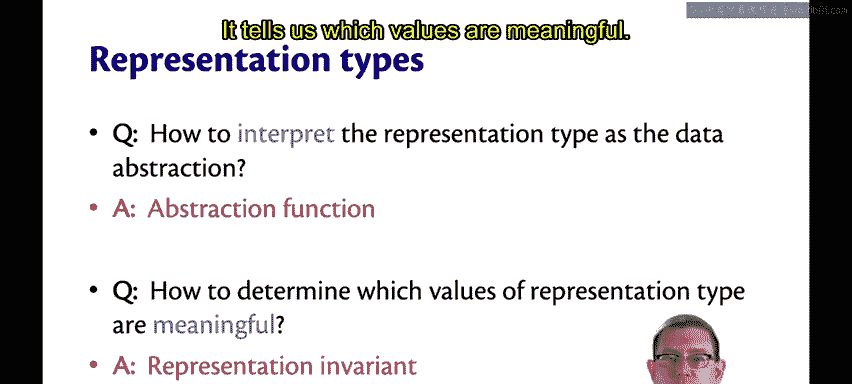
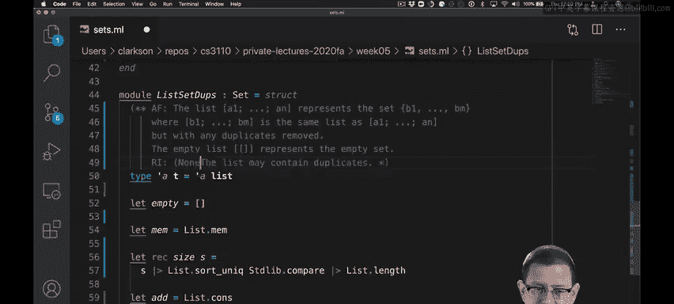
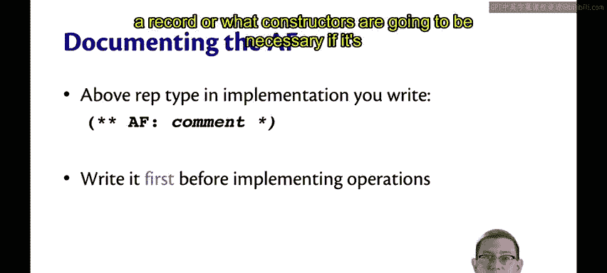

# OCaml编程：6.7：抽象函数 🧠

在本节课中，我们将学习数据抽象实现中的两个核心概念：**抽象函数**和**表示不变量**。我们将探讨它们如何帮助我们清晰地定义数据结构的内部表示与外部抽象视图之间的关系。

---

## 抽象函数与表示不变量

在实现集合数据抽象时，我们为每个实现方案都需要回答两个关键问题：
1.  如何将表示类型解释为数据抽象。
2.  如何确定表示类型中哪些值是有意义的。

这两个问题有专门的技术术语。第一个称为**抽象函数**，它告诉我们如何解释表示类型。第二个称为**表示不变量**，它告诉我们哪些值是有意义的。

回顾我们的代码，可以看到我们已经对这两者进行了文档化。对于“无重复列表集合”，抽象函数是文档的第一部分，说明了如何将列表解释为集合。表示不变量则告诉我们哪些表示值实际上是有意义的：列表不能包含重复项，因此任何包含重复项的列表在此表示中都是无意义的。

对于“允许重复列表集合”，抽象函数同样是文档的第一部分。但回顾那个抽象函数，我并不完全满意，因为它没有很好地处理重复项的概念。它说列表 `[a1, ..., an]` 表示集合 `{a1, ..., an}`。那么如果我们有列表 `[1, 1, 2, 3]` 呢？它表示集合 `{1, 1, 2, 3}` 吗？这看起来不是一个很好的集合，实际上它可能更像一个“包”。因此，让我们改进这个抽象函数，以消除关于如何解释该表示类型值的任何不明确之处。

现在，我明确了如何处理重复项：列表 `[a1, ..., an]` 表示集合 `{b1, ..., bm}`，其中列表 `[b1, ..., bm]` 与 `[a1, ..., an]` 相同，但移除了所有重复项。这是一个更好的抽象函数。

至于表示不变量，当然是列表可能包含重复项。由于在 OCaml 中，列表通常总是可以包含重复项，我们甚至不一定需要记录这个表示不变量。虽然记录它有帮助，但从技术上讲，我们可以直接消除它，并说没有表示不变量。或者完全删除那条注释。但后者可能会让人怀疑我们是否忘记了记录表示不变量，所以也许最好的选择实际上是保留原始的注释，但我们可以澄清它确实没有效果：没有表示不变量。

---

## 抽象函数的重要性

抽象函数如此重要的原因之一是，它告诉我们如何从客户端的角度理解数据抽象。

回想一下，从客户端的角度看我们的集合，它们就是集合。客户端不知道底层列表实现的任何信息。因此，在客户端看来，它们只是像集合 `{1, 2}` 或集合 `{7}` 这样的东西。但从实现者的角度来看，这些是列表。并且有许多可能的列表可以表示这些集合中的每一个。

例如，集合 `{1, 2}` 可以由列表 `[1, 2]` 或列表 `[2, 1]` 来表示。

因此，这里存在客户端理解的**抽象值**与实现者理解的**具体值**之间的差异。抽象函数（即这里的黑色箭头）告诉我们如何将具体的值解释为抽象的值。它们从列表表示映射到集合表示。

当然，当我在这里使用“函数”这个词时，我是在数学意义上使用它，而不是在 OCaml 的意义上。我们还没有编写任何接受列表并返回集合的 OCaml 函数。这是一个先有鸡还是先有蛋的问题：我们实际上还没有一个集合抽象，所以当我们正在编写 `list_set_dupes` 或 `list_set_no_dupes` 时，我们无法编写一个从列表映射到集合的函数。因此，抽象函数主要是存在于我们脑海中的东西。

它是一个**多对一**函数，你可以在这里看到，因为它可能将多个列表映射到一个集合。它也可以是一个**部分函数**，也就是说，可能存在具体类型的某些值，它们作为抽象类型的值是没有意义的。这由表示不变量来决定，我们很快就会讲到。

---

## 抽象屏障

在客户端的视图和实现者的视图之间存在一个边界，我们称之为**抽象屏障**。可以把它想象成一条警戒线，上面写着“不要越过犯罪现场”。客户端不能越过这个屏障，他们不能查看数据抽象的内部实现。

当然，我这里是假设性地说的，也许客户端可以获取源代码并查看它。但在他们的思维中，他们不应该考虑具体的值。向客户端保证的只是规范所揭示的内容。除此之外的任何信息都是危险的知识，通常不应被客户端利用。这就是为什么我们在语言中内置了诸如抽象类型和密封之类的机制，以防止这类信息泄露给客户端。换句话说，抽象屏障是封装的一部分。

因此，我们说抽象函数将**有效的**具体值映射到抽象值，这里的“有效的”一词很重要，因为可能有一些具体值我们无法有意义地映射，就像在我们不允许重复的实现中那样。

---

## 如何记录抽象函数

为了记录抽象函数，我们将其写在表示类型上方的注释中，正如你已经看到我所做的那样。在开始实现操作之前，首先编写抽象函数非常重要。我是随着我们的进展逐步制定了一些抽象函数，并与你一起改进了它们，但如果你能第一次就写对，那么当你发现可能搞错了抽象函数的某些方面时，需要回头重新实现某些操作的可能性就越小。

从技术上讲，你不必在前面写 `AF:`，如果你想更详细，也可以写 `Abstraction Function:`，有时你可能根本不写 `AF`，但重要的是这个决定要记录在表示类型旁边。

为什么首先要做这件事？因为这是在实现数据抽象时必须做出的首要决定。它赋予了表示以意义。如果它是一个记录，它还决定了需要哪些字段；如果它是一个变体，则决定了需要哪些构造函数。

---

## 总结

本节课中，我们一起学习了数据抽象实现的两个基石：**抽象函数**和**表示不变量**。抽象函数定义了如何将内部的具体表示映射到外部的抽象概念，而表示不变量则规定了哪些内部状态是合法有效的。理解并明确记录这两者，是构建健壮、清晰且易于维护的数据抽象的关键。我们还探讨了**抽象屏障**的概念，它强调了封装的重要性，确保客户端代码依赖于接口规范而非内部实现细节。