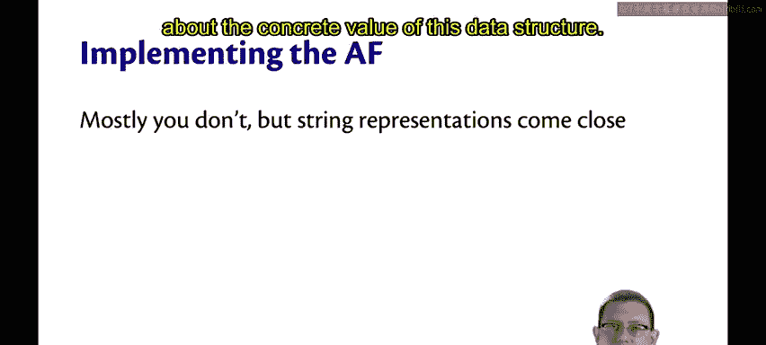
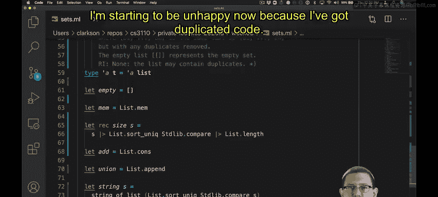
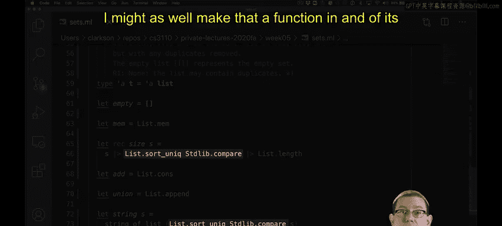
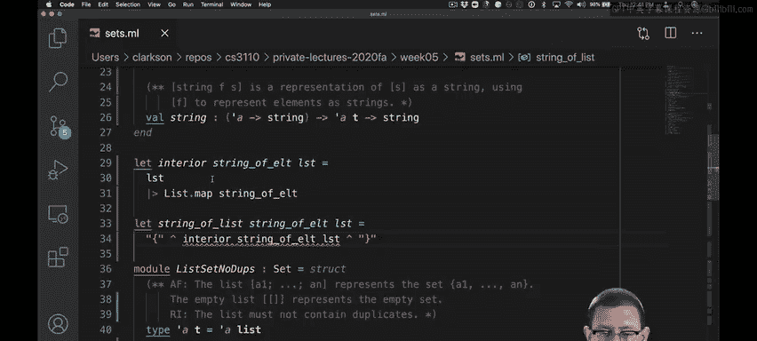
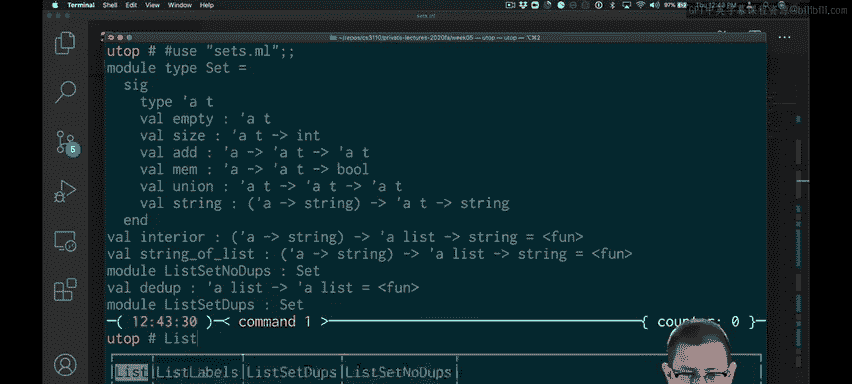
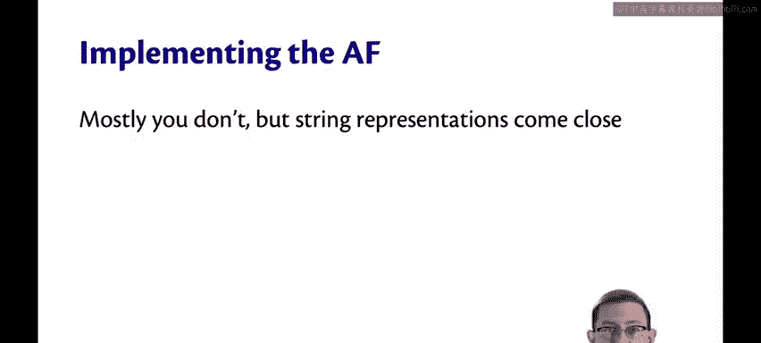

# OCaml编程：6.8：实现抽象函数 🧠

在本节课中，我们将要学习抽象函数的概念，并探讨如何在实践中通过实现字符串表示函数来近似地体现它。我们将以集合数据抽象为例，一步步构建其字符串表示功能。

---

## 概述



抽象函数是连接具体数据表示和抽象数学概念之间的桥梁。虽然我们通常不会在代码中显式地实现一个数学意义上的抽象函数，但为其创建字符串表示函数是一个常见的实践。这能帮助开发者理解数据结构的抽象含义。本节我们将为两种集合实现（允许重复列表和去重列表）编写 `to_string` 函数。

## 设计字符串表示函数

首先，我们为集合模块定义一个 `to_string` 函数。其规范暂时不限定字符串的具体格式，只要求它能提供集合的某种可读表示。

```ocaml
val to_string : (’a -> string) -> ’a set -> string
```
函数接受一个将元素转换为字符串的函数，以及一个集合，最终返回该集合的字符串表示。

## 重构代码以消除重复





在实现过程中，我们发现两个集合实现都需要一个将列表转换为字符串的辅助函数。为了避免代码重复，我们将其提取为一个独立的函数 `list_to_string`。

此外，对于“允许重复列表”的实现，在进行集合操作前需要先对元素去重。我们也将这个去重逻辑提取为一个独立的辅助函数 `dedup`。

```ocaml
let dedup lst = … (* 去重逻辑 *)

let list_to_string to_str lst = … (* 将列表转换为字符串的逻辑 *)
```
通过提取 `dedup` 和 `list_to_string`，我们简化了主函数的实现，并提高了代码的可维护性。`dedup` 函数被放在模块外部，以展示其可见性；若想隐藏它，可将其移至独立的编译单元。

## 实现列表到字符串的转换

现在，我们来具体实现 `list_to_string` 函数。我们希望输出的字符串格式为 `{元素1, 元素2, …}`。

核心挑战在于，我们需要一个将任意类型 `’a` 的元素转换为字符串的函数。因此，我们将这个函数 `to_str` 作为参数传入。



1.  首先，使用 `List.map` 和传入的 `to_str` 函数，将列表中的每个元素转换为字符串，得到一个字符串列表。
2.  接着，使用 `List.fold` 操作将这个字符串列表折叠（连接）成一个单独的字符串，并在元素间插入逗号分隔符。

初步实现后，测试发现字符串开头会多出一个逗号。为了解决这个问题，我们对空列表和非空列表进行特殊处理：空列表返回空集表示；非空列表则单独处理第一个元素，避免在其前面添加逗号。



```ocaml
let list_to_string to_str lst =
  match lst with
  | [] -> “{}”
  | hd::tl ->
      let hd_str = to_str hd in
      let tl_str = List.fold_left (fun acc x -> acc ^ “, “ ^ (to_str x)) “” tl in
      “{“ ^ hd_str ^ tl_str ^ “}”
```

## 测试与最终效果

使用 `string_of_int` 作为元素转换函数进行测试，现在我们的 `to_string` 函数可以正确输出格式良好的集合字符串，例如 `{42, 43}`。

对于“去重列表”实现，由于 `dedup` 函数可能对元素进行了排序，输出的字符串中的元素顺序可能与输入不同。但这符合集合的无序特性，且我们的规范并未对输出顺序做出承诺。

## 抽象函数的其他实现形式

字符串表示只是实现抽象函数思想的一种方式。根据不同的抽象，我们可能有其他实现：
*   对于映射（Map）抽象，可以编写一个函数将其转换为关联列表。
*   对于树形结构，甚至可以生成基于底层数据结构的图形化图示。

---

## 总结



本节课我们一起学习了如何通过实现 `to_string` 函数来近似体现抽象函数的概念。我们经历了从设计函数签名、重构代码以消除重复、到具体实现并处理边界条件（如多余的逗号）的完整过程。关键在于，这个字符串函数旨在向开发者揭示数据结构的抽象数学视图，而具体的输出格式可以根据需要灵活定义。