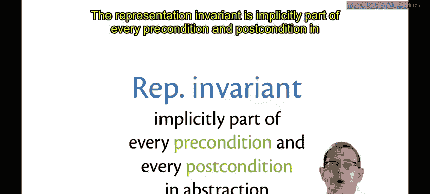
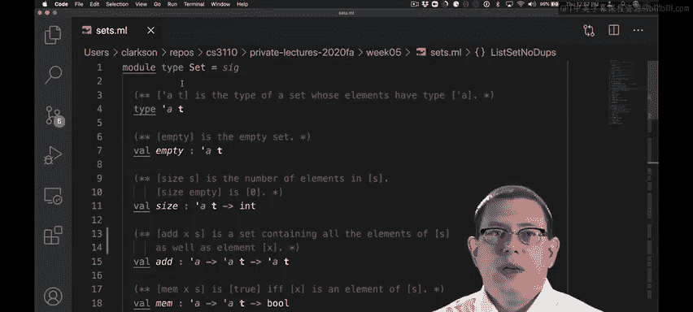
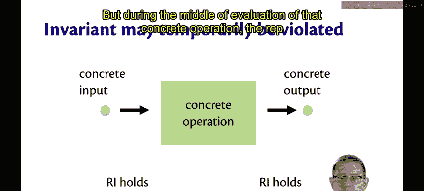
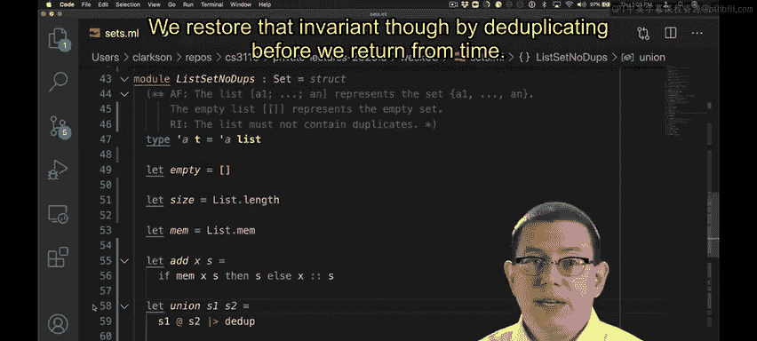

# OCaml编程：6.9：表示不变量 🛡️

在本节课中，我们将要学习**表示不变量**的概念。表示不变量是抽象数据类型实现中的一个关键设计原则，它定义了具体表示类型的哪些值是“合法”的，从而确保抽象类型的正确性。

## 概述

上一节我们讨论了抽象函数，本节中我们来看看与之紧密相关的**表示不变量**。它帮助我们区分哪些具体类型的值是有效的抽象值，哪些不是。

具体类型的某些值，作为抽象类型的值是没有意义的。也就是说，抽象函数在应用于这些值时，其结果是无意义的。

在我们禁止重复元素的集合实现中，我们绝不希望该模块的任何操作接收一个包含重复元素的列表。否则，操作会得到错误的结果。例如，我们的 `size` 函数，如果列表包含重复元素，它将返回一个偏大的数字。

表示不变量的任务，就是识别具体类型的哪些值是允许的，哪些是不允许的。

## 理解表示不变量

你可以将表示不变量想象成具体值集合中的一条**粗红线**，它将有意义的具体值与无意义的具体值分隔开来。

*   **有效具体值**是那些满足表示不变量的值。
*   **无效具体值**是那些不满足表示不变量的值。

因此，表示不变量是区分有效具体值与无效具体值的标准，从而标识出我们实际希望在计算中使用哪些具体值，以及我们希望避免哪些具体值。

## 如何记录表示不变量

正如我们所见，在文件中表示类型的上方，通过注释来记录表示不变量。

以下是几种常见的写法：
*   `RI:`
*   `invariant:`
*   `representation invariant:` （如果你想更详细）

你使用哪一种并不重要，重要的是你明确地标识了它是什么。

再次强调，这应该是你在实现操作**之前**首先写下的内容。当然，这是因为这迫使你仔细思考表示类型的设计，并从一开始就确保其正确性。当然，有时你可能最终需要重新审视它。

## 表示不变量与操作契约

表示不变量隐含地构成了抽象中每个前置条件和后置条件的一部分。

因此，`ListSetNoDups` 中的每个操作都隐含地具有这个表示不变量：列表不能包含重复元素，这既是其前置条件的一部分，也是其后置条件的一部分。

不允许任何人传入一个包含重复元素的值，并且此数据结构的任何操作也绝不允许返回一个包含重复元素的列表。

这个不变量对客户端是隐藏的，我们不会在面向客户端的地方记录它。例如，我们不会在模块类型 `SET` 中写下它。😡

隐含地，如果客户端是程序员，他们应该注意到，如果存在表示不变量，它是在那个抽象屏障之后被维护的。😡

## 表示不变量的暂时违反

与循环不变量类似，表示不变量是在某些地方成立，但在其他地方不一定成立的东西。

在一个操作的执行体内部，作为朝着完成该操作目标前进过程的一部分，表示不变量可能会被**暂时违反**，但可能尚未完全达到目标。😡

这就像在循环体中，循环不变量可能暂时不成立，但最终在循环体结束时会被恢复。

我们可以从具体操作的输入和输出来思考这个问题：有一个具体输入和一个具体输出。我们保证表示不变量对于具体输入成立，并且对于具体输出也成立。这就是表示不变量作为前置条件和后置条件的本质。

但是，在该具体操作的执行过程中，表示不变量可能会被暂时违反。

## 一个例子：`union` 操作

一个很好的例子出现在我们 `ListSetNoDups` 中 `union` 操作的实现里。

这里的表示不变量规定列表不能包含重复元素。但是，当我们执行 `s1 @ s2` 时，我们确实暂时构造了一个可能包含重复元素的列表。

不过，我们在从函数返回之前，通过**去重**操作恢复了那个不变量。

## 总结

本节课中我们一起学习了**表示不变量**。我们了解到，表示不变量定义了具体实现中哪些值是“合法”的，它是确保抽象数据类型内部一致性和正确性的关键。它像一份内部契约，所有操作都必须维护它（至少在输入和输出时），尽管在操作执行过程中可能会暂时违反它。正确地定义和维护表示不变量，是构建健壮、可靠的抽象数据类型的基础。