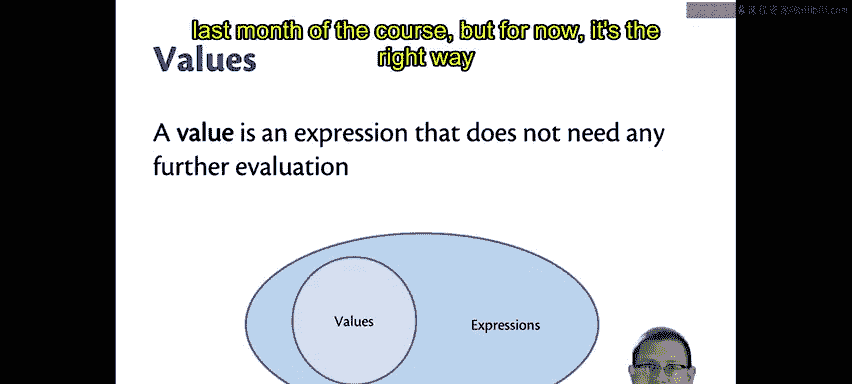
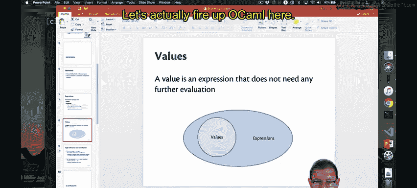
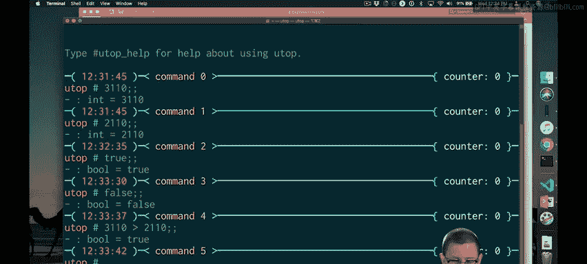
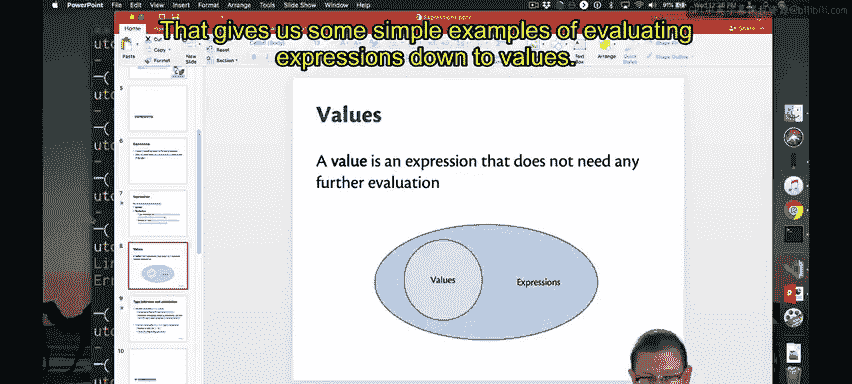
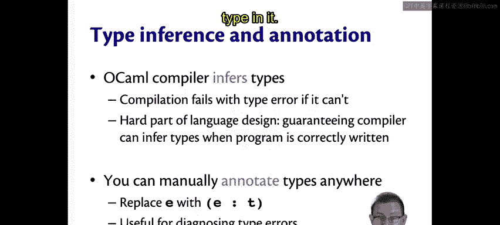
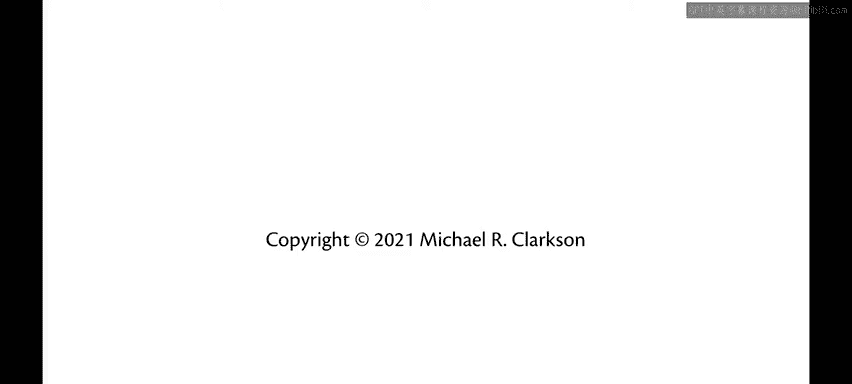

# 康奈尔大学《OCaml编程｜CS3110：OCaml Programming： Correct + Efficient + Beautiful》中英字幕 - P7：-007-Expressions Chap2 Video 2.zh_en - GPT中英字幕课程资源 - BV1Tx4y1s7sP

In functional programming， the basic building block of any program is an expression。

Expressions are kind of like statements or commands in imperative language。

 They're what we use to compose programs。And every expression has two important pieces to how it can be written that we want to understand。

It's syntax and its semantics。The syntax is the key words and the punctuation that we use。

 the semantics is its meaning。There's two pieces of the semantics that I want to distinguish。

 The first is the static semantics or the type checking rules。

 So you're used to type checking from Java in 20110。In Java， the compiler runs on your program。

 decides whether the types are legal or not， and if they are illegal。

 you aren't allowed to run the program。It's the same in Ocael。 There is a static semantics。

 a set of type checking rules that either produces a type for each expression or fails with an error message。

 If it fails， you're not allowed to run to evaluate that program。

Why is it called static because the notion is it's something that's like at rest？

This is the program at rest before it gets to run to execute to do things。 So the compiler。

 of course， is running on the program， but the program itself is not being run yet。

 That's the sense in which static is used here。So the complement of that is the dynamic semantics when the program actually is running and doing things。

The dynamic semantics or the evaluation rules tell us how programs get evaluated。

They take an expression and reduce it down to a value in the language。Now， that's the normal case。

 There's actually two other things that can happen besides producing a value。

 One is you could instead get an exception that gets raised。

The other is maybe the program never terminates， maybe no value or exception ever happens。

 instead you go off into what's colloquially referred to as an infinite loop。Okay。

 so really there's three pieces there for every expression then it's syntax。

 it's type checking rules， and it's evaluation rules。

And that's how we're going to break down each piece of Ocal that we learn as we learn all of the constructs that it has to offer。

As far as the relationship between expressions and values。 for now。

 here's the way I want you to think about it。 A value is an expression that doesn't need any further evaluation。

 That's what it's done。 Basically， We've boiled it down to its essence。 There' is nothing left to do。

In terms of a Venn diagram， all values are expressions， but not all expressions are values。

 I will tell you right now this is a slight bit of a lie that we will see when we get to the very last month of the course。

 but for now it's the right way to think about it。

Let's actually fire up Ocal here。

So I will start Ocael， I will launch Utop the universal top level for Ocael。

 in which we can interact with Ocael and just look at some simple expressions。

So let's begin with the integer 3110。So the UT prompt here starts with a what looks like a pal sign or a hash sign。

 that's the prompt to tell us where we're going to enter。

 and I've entered the integer 3110 followed by a double semicolon。

 so double semicolon is how we tell Utopop that we are done entering an expression and that we want O Caml to go ahead and evaluate that expression down to a value。

You'll notice if I don't put the double semicolon in and hit return。

 actually it just drops down a line and is waiting for me to enter some more code here， right？

I don't want to enter them more code。I just want to evaluate this expression now。

 so I enter double semicolon and hit return。And I get a response back from U。

And the way to read this response is from right to left。So it starts with 3110 on the right。

That is the value to which the expression eventually evaluated。 Now。

 it's the same thing here because 3110 is already a value in O Caml。

 there's no computation left to be done with it。That value has type int。

 so that shows up moving further to the left on that response。

So it is the type of integers in Ocheml。And then there's a third piece to the response。

 which is just dash， we're going to ignore that for now， we'll come back to it later。Okay。

 so what did 3110 evaluate to， it evaluated to the int 3110。You can evaluate other integers。

 of course， like say 2110。That's another integer。You could evaluate Booleions。

 So the Booles in Ocal are written true and false with。All lowercase and their type is bool。

 not boolean， as it might be in some other languages。Those are very basic values。

 all of those that needed no computation， of course we could have more complicated kinds of expressions like you could ask is 3110 greater than 2110？

Of course， only in the integer sense， right？And that is a bo， it is the bo true。

 So the result of doing that comparison between integers gave us back that bo。

OM has strings， they are written in double quotations as they are in so many other languages。

 so here's the string big， it is of type string。😊，We could concatenate two strings together so we could take big and red。

 for example。The concatednation operator in Oamel is writtenden with carrot。

So that gives us the string big red。Oh Camel also has floating point numbers as so many other languages do。

 so we could have say 2。0 times 3。14， so this would be sort of like2 pi。But when I enter this。

 we're going to get an error。This expression has type float。

 but an expression was expected of type int。This perhaps mysterious error message to begin with。

Actually refers to the fact that in Ocael。There's two different sets of operators for arithmetic。

One for ints and the other for floating point numbers。And you need to put a。Point after the operator。

 if you want the floating point version of it， so 2。0 times 3。14 that gives us a float 6。28。

 so float is the type here of floating point numbers。

This sometimes catches people off guard at first， you'll get used to it very quickly。

 You might wonder why Ocael made this choice。 It is a design choice not to overload operators in Ocal so that there is a meaning that's unambiguous for asterisk versus asterisk dot。

And whether you like it or not， the designers at Ocamel decided that was the right way to do it in this language。

That gives us some simple examples of evaluating expressions down to values。

 we've also seen some types as we did that。OM does type inference What that means is you don't always have to write down the types of expressions in your programs as much as you would in some other languages in Java。

 for example， you very frequently have to write down the types of variables of parameters and so forth。

😡，In O Caml， you will almost never need to do that。Now。

 there's a difference here between what Java does and what Python does。In Java。

 there are types at compile time。In Python， there are not。In Java。

 the type checking is done at compile time。In Python。

 there is some type checking that's done at runtime as the program executes。

So Ocal is like Java in these respects， in that it does the type checking at runtime。

But it's a little like Python in that you won't see the types written down in the program。😡。

Nonetheless， they are there and they are there at compiled time。😡。

And compilation will fail with a type error if the compiler can't infer types that would make the program correct。

 according to the type checking rules。That happened in our example just now that happened when OKm tried to infer the type of 2。

0 star 3。14 and couldn't it got stuck because the type checking rule for that operator says the two operas on either side of it need to be integers not floating point numbers that's why we had to switch to starDt。

One of the tricky pieces of language design is ensuring that the compiler can always successfully infer the types when you leave them out。

 At least if your program is possibly type correct。

 there are some programs that could never be type correct。

 The language designer sometimes even has to make tradeoffs in that design possibly rejecting more programs that would be ideal in order to guarantee that the compiler can always find a correct type。

Now， if you want to add the types yourself to a program。

 you can do that with something called a type annotation。😡。

You just wrap the expression in parentheses and put colon and the type in it。

 this can be useful for diagnosing type errors on occasion。

Going back to Utah here。If you actually wanted to fully satisfy yourself that 3110 is an int。

 you could say 3110 colon int in parentheses and indeed the compiler would then check that type annotation as part of type checking so you could never say you 3110 colon bo for example。

 that will be rejected because the compiler cannot treat the int as a bo so this is not like a type cast that you might be familiar with from other languages。

 it's a type annotation， it's an additional constraint that you're asking the type checker to verify for you。

