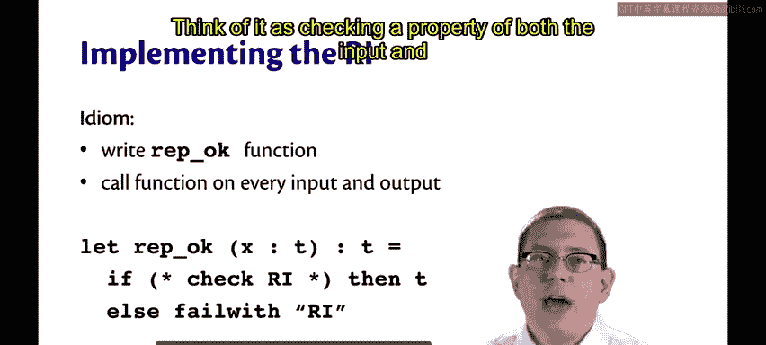
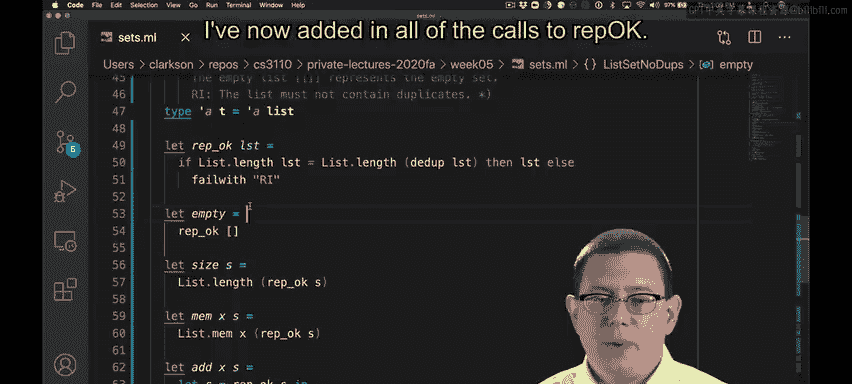
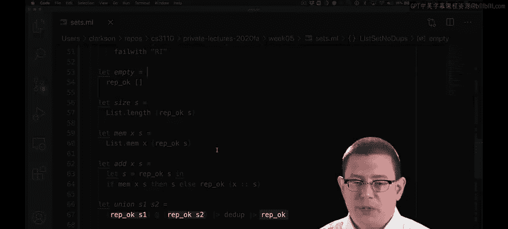
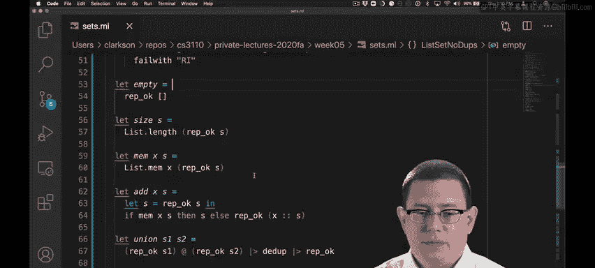
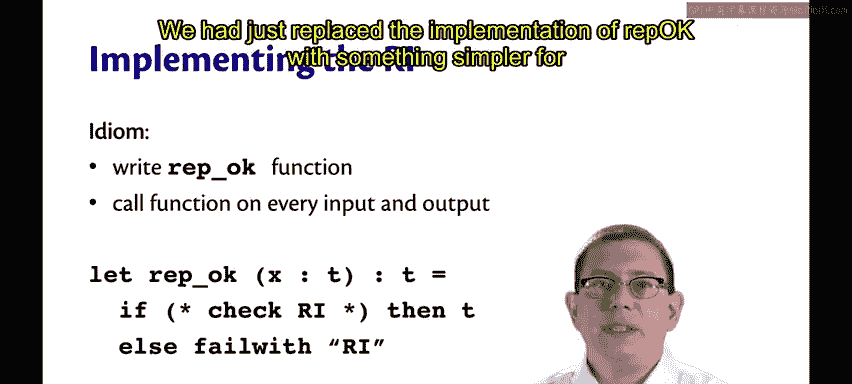

# 康奈尔大学《OCaml编程｜CS3110：OCaml Programming： Correct + Efficient + Beautiful》中英字幕 - P80：-080-Implementing Representation Invariants Chap6 Video 10.zh_en - GPT中英字幕课程资源 - BV1Tx4y1s7sP

Do you ever implement the weaponend variant？Yes， actually， this is a useful technique。

You can write a function， let's call it rep OK that checks whether the representation invari holds。

And then call that function on every input to test whether the rep and variant holds of the input。

And call the function on the output。To see whether the weapon variant holds of the outfit that's being。

That function can go ahead and check the weaponin variant， and if it holds。

 just return the value of that type。 so it's sort of just passing through the function。Otherwise。

 the function could fail， showing that there is some sort of violation of the weaponend variantrian going on。

This is another example of defensive programming。Think of it as checking a property of both the input and the output of a function。

Let's see what it would look like to implement RepokK for list set， no dus。First。

 I've implemented the ReffoK function。Its type is Alphaistarrowalphaist。

 so it's really just supposed to be the identity function on values of the concrete type with one exception。

 which is literally an exception， if the representation andvari doesn't hold。

 then it raises a failure。Now， checking the representation andvari in this way by computing the length of the list and then seeing if that changes when the list is deuplicated。

 that's an expensive operation。Checking this representation invari is actually going to increase the time complexity of all the operations of this data structure。

Let's not worry about that for now， we'll come back to that in a minute。😡，For now。

 let's go ahead and add in all of the calls to ReokK that we would need to check whether the representation andvari holds on inputs and outputs of values of the concrete type。

I've now added in all of the calls to repPK。

I check whether repoquet holds of the output value of empty。

I check whether reppoque holds of the input value of size， as well as the input value of M。In Add。

 I have to check whether RepoK holds both of an input and an output I check whether it holds the input S as well as the output that is the new set that is constructed when icons X onto S。

In Union， I have to check that the repoque holds for both S1 and S2 on input and then check that it also holds of the output。

And finally， for string， I checked that Repoquet holds it。

Is this an expensive way to code， Yes， we're adding in more characters， more typing。

 more thinking about this， more implementation of each of these operations and checking that rein variant as we implemented it for sets is expensive。

 You're not going to want to do this in production code， probably。😡。

But not all implementations of data structures are like our list implementation of sets Sometimes there are cheap pieces of the rein variant that can be checked maybe it only takes constant time。

Or maybe as a general course of action， you don't want to check the weaponend variantant all the time。

But you want to have code in there that you can turn off or on in order to check the weapon variant。

That actually saved a 3110 tournament one year when we were having a kind of final project in which people wrote bots that played games against each other。

The course staff had writtenden a server for that tournament， and it was buggy。

 it was flaking out in the middle of this tournament， things were going very wrong。

But we had rep okay。 We had put that in the code。We had just replaced the implementation of repoque with something simpler for a while。

😡。

Let me show you what I mean。Suppose I had everything implemented as before， but in Reokque。

 I just commented out everything here。😡，And instead， replaced it with let ReokK list equal list。

 so now it literally is the identity function。Now， all of this code will work without any performance penalties that the compiler will probably optimize away all those calls to rep OK。

But if I ever get into a situation in which I'm encountering bugs and I need to figure out what's going on quickly。

I can restore the implementation of repoK。 Yes， it's expensive to check， but it's okay。

 I've got bugs I'm trying to find。 I'm willing to pay that penalty temporarily。

The advantage of having it coded up already in this way is that when you need to go and do a kind of hot fix in production。

 you can make it happen right away instead of pausing then and having to go in and add all of the calls are repokK everywhere。

😡，So build those in as part of your implementation first。

 that becomes a really great form of defensive programming that you can then enable later on if you need to。

