# 康奈尔大学《OCaml编程｜CS3110：OCaml Programming： Correct + Efficient + Beautiful》中英字幕 - P81：-081-Abstraction Functions and Commutative Diagrams Chap6 Video 11.zh_en - GPT中英字幕课程资源 - BV1Tx4y1s7sP

One more benefit of the abstraction function is that it gives us a very nice way of thinking about the correctness of the operations of a data abstraction。

Here I've drawn what in math is called a commutative diagram。😡，In this case。

 it's kind of a fancy way of saying there's two ways to get to the same point。

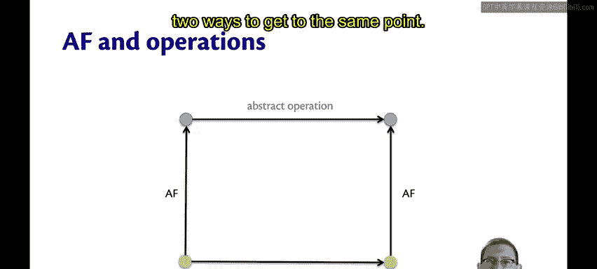

Imagine that you start in the bottom left of this diagram。 You've got a concrete value。

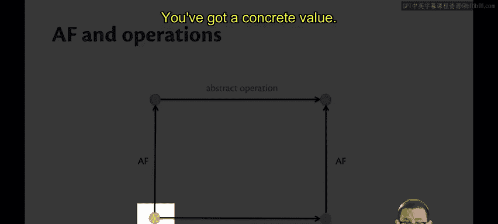

You want to do an operation on that value。

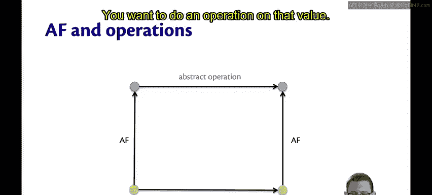

Well， there's two ways of thinking about it， you could either think about doing the concrete operation as it's been implemented。

😡。

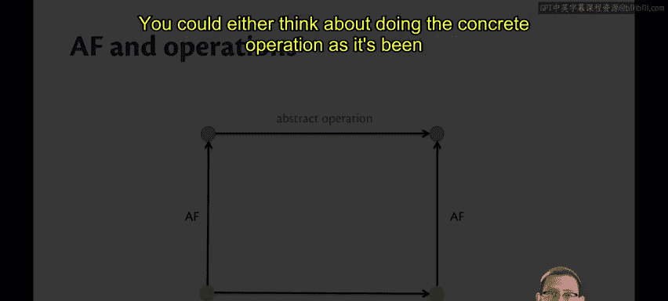

Or you could think about using the abstraction function to convert that concrete value to an abstract value and using the abstract version of that operation。

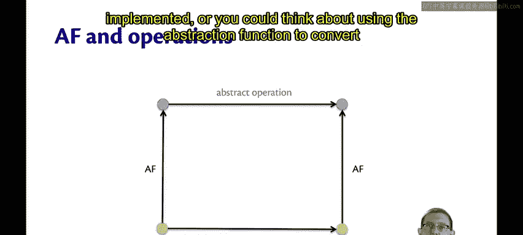

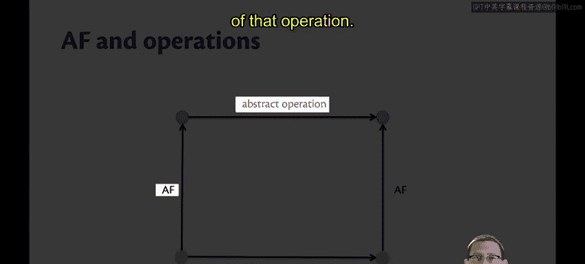

For example， imagine we were working with sets。😡，That are represented as lists。

And have duplicates allowed。So we could start off with the concrete value 12， which is a list。

I could apply the abstraction function if I wanted to think of that as a set。

 the set containing one and  two。😡，Now imagine that I had another list， 1， two，2，3， this is allowed。

 duplicates are fine。If I use the abstraction function to think of that as a set。

 it's just the set 1，2，3。Now， imagine I we were thinking about operation。😡，In particular。

 let's think about unioning the set23 together with the set one2。That's an abstract operation。

 so if I union 1，2 together with two，3， I get  one，23。Well， what about the concrete operation？😡。

That's going to be appending2，3。 and if I append the list 2，3 to the list 1，2， I get 1，2，2，3。

Notice what happened when I completed this diagram。😡。

I can take either one of two paths through the diagram。

 either take the abstraction function and do the abstract operation or do the concrete operation followed by the abstraction function。

Either way， I get to the same point。We say that the diagram commutes。

This leads to a notion of correctness for operations of a data abstraction。

The implementation is correct if the abstraction function commutes。😡，Which is to say。

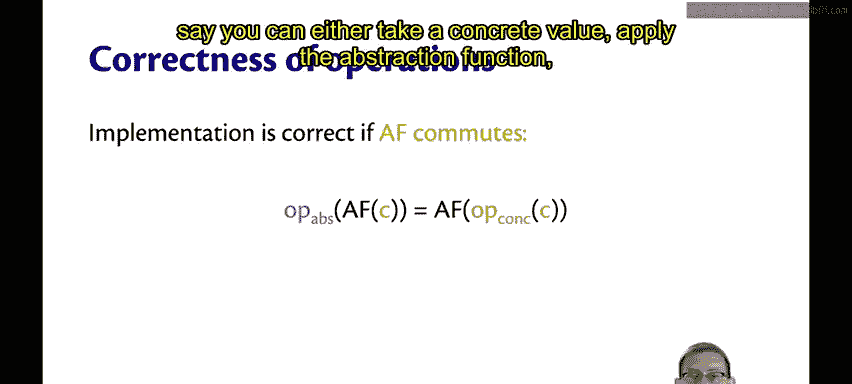

You can either take a concrete value， apply the abstraction function。

And then apply the abstract version of the operation。😡。

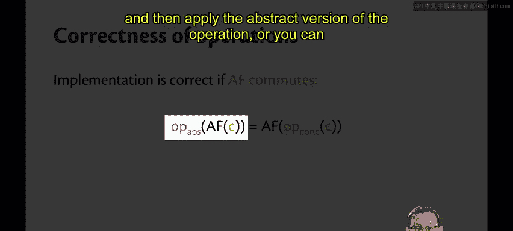

Or。

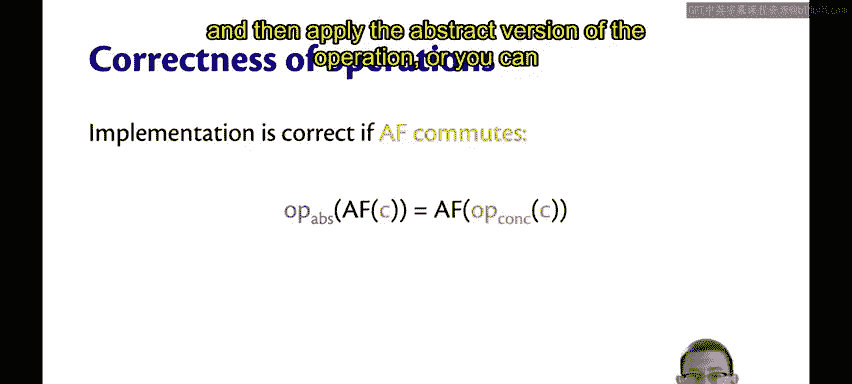

You can take the concrete value， apply the concrete version of the operation。

 and then apply the abstraction function。

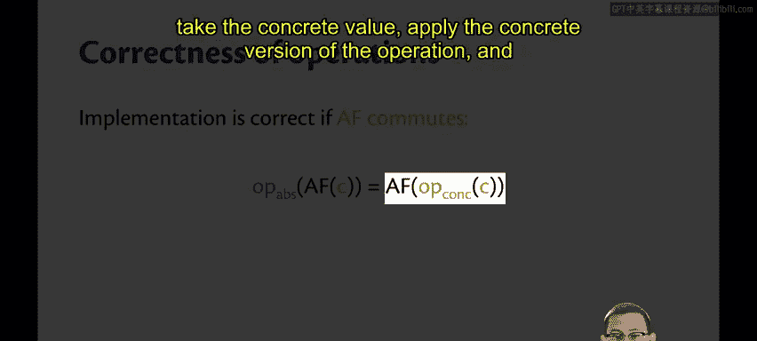

So notice how the abstraction function there is commuting with the operation。

 it can go on either side of it。😡，Well the implementation of the concrete operation is correct if the abstraction function commutes in this way。

 isn't it neat how much an abstraction function can do for us？

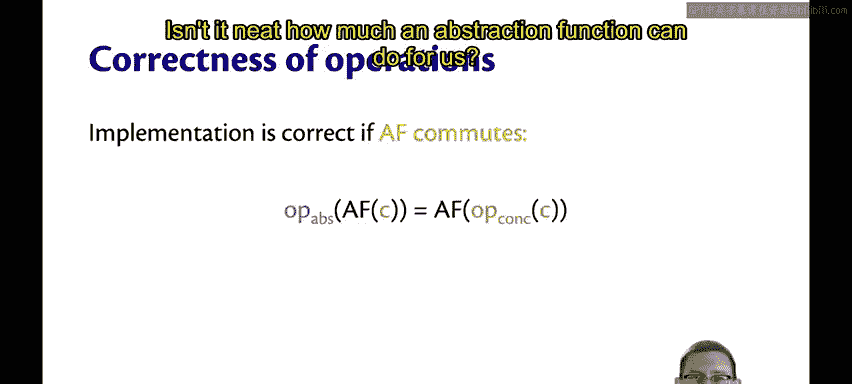