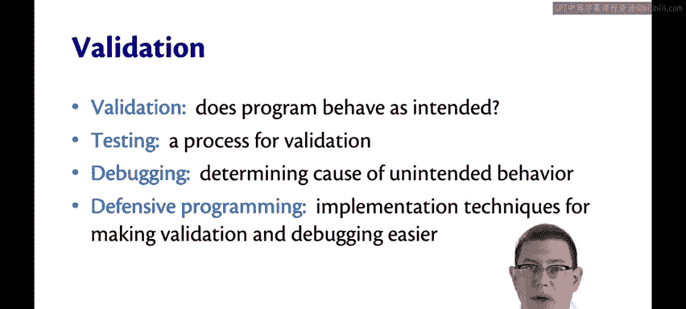
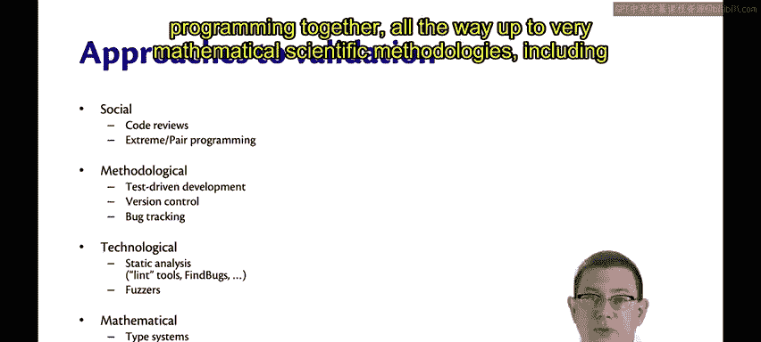
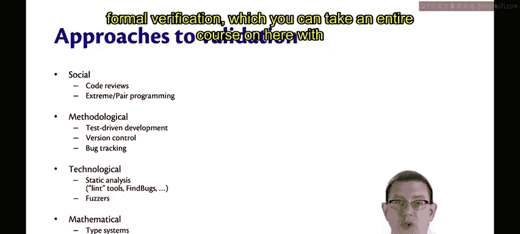
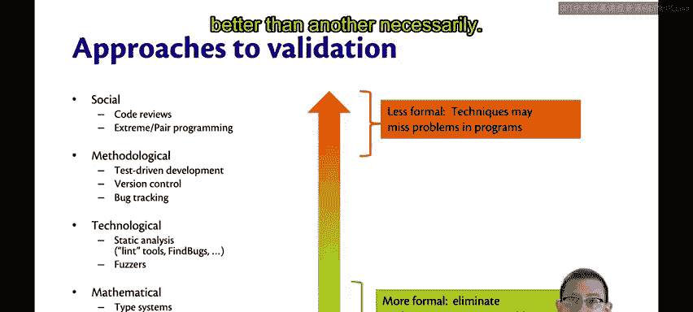
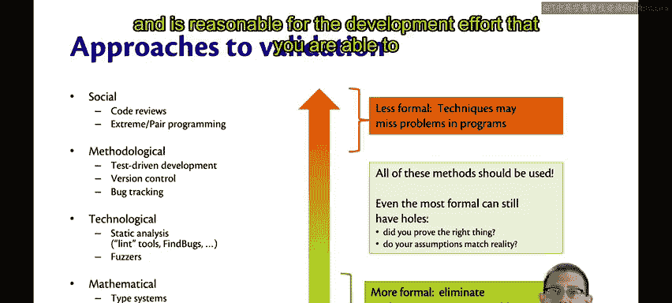
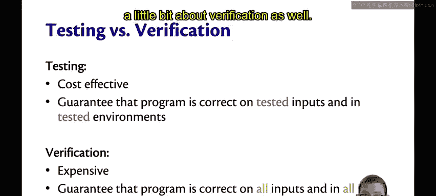
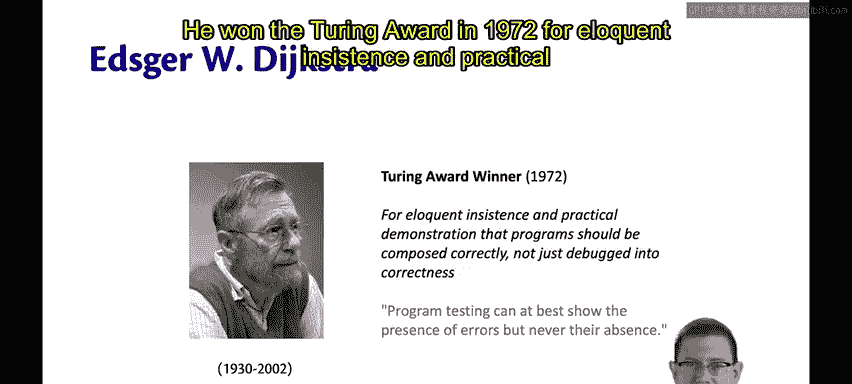
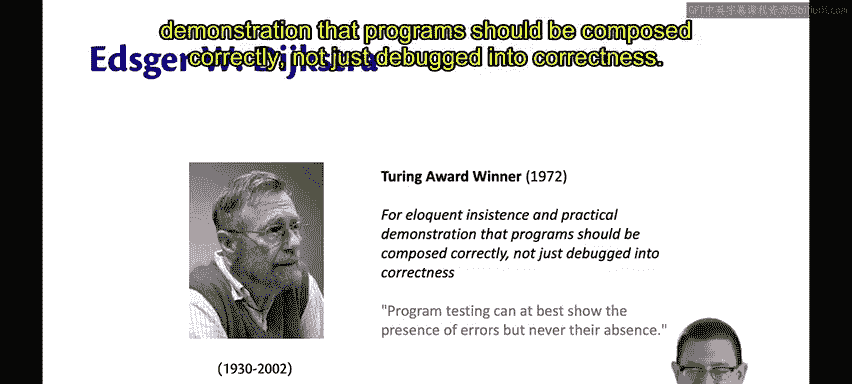
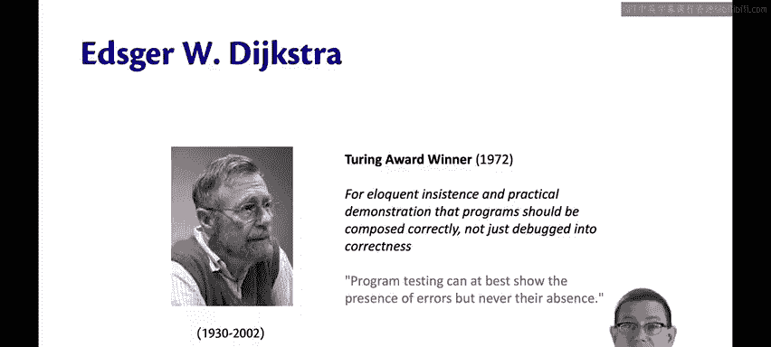

# 康奈尔大学《OCaml编程｜CS3110：OCaml Programming： Correct + Efficient + Beautiful》中英字幕 - P82：-082-Testing and Validation Chap6 Video 12.zh_en - GPT中英字幕课程资源 - BV1Tx4y1s7sP

Testing is an important part of software engineering。

But testing is part of a bigger picture of validation。😡，Validation is answering the question。

 does a program behave as it is intended to？😡，Testing is one process for achieving validation。😡。

As we test， we tend to discover that programs aren't behaving exactly the way they're supposed to。

Debugging is the task of determining the cause of that unintended behavior。

Defensive programming is a body of implementation techniques for making all of this easier。

 for making it easier to validate， for making it easier to debug。😡。

There are a lot of approaches to validation。 I've listed some of them here。

They range from social methodologies such as having code reviews or pair programming together。

All the way up to very mathematical scientific methodologies， including formal verification。

 which you can take an entire course on here with me， CS4160。

Really， there's a spectrum of possibilities here。😡，The methodologies at the top are less formal。

 they're going to miss some problems and programs and find others。

The ones at the bottom are more formal。 they're going to eliminate with certainty as many problems as possible。

Now I'm not trying to say that you should always be at one place on this spectrum more that one end of it is better than another necessarily。

 in fact， all of these methods should be used to some extent in developing software。😡。

And even the most formal of methodologies for validation can still have holes。

Even if you've mathematically proved the correctness of a program， you still have to ask。

 did I prove the right thing？That can only be answered informally。

So make use of as many of these methodologies as you can and is reasonable for the development effort that you are able to give。

What's focused in on testing versus verification。Testing。

 which you're familiar with from programming classes already。

 is a very cost effective methodology for validation。

It's relatively cheap for programmers to write unit tests for functions。

 to put them into automated test suites， and to run those frequently。😡。

Tests can guarantee that a program is correct。But only on tested inputs and only in tested environments。

Tests might or might not imply anything about other inputs that could have been provided to the program or about running on other operating systems or in the cloud versus local。

😡，Now compared to testing。Verification is quite expensive。

It requires a lot of training of the personnel in advanced mathematical and computer science techniques。

 it also tends to require knowledge of specialized tools for doing the verification。

The advantage is that it can guarantee that a program is correct on all inputs and in all environment。

So verification is something that's traditionally used for high stakes software development。

 where reliability and safety are paramount。For example。The space shuttle。

Or medical machines that dispense radiation。 and so could kill a patient if the software is incorrect。

Or avionics systems that pilot airplanes automatically。

These are all places where it makes sense to pay a lot of cost to get a lot of correct。

In our situation here， we're going to study testing for a little while。

 and a little later in the course we're going to study a little bit about verification as well。

One of the people who thought deeply about verification and testing and the relationship of the two was Edgar Dyigtra you know him from Dyktra's algorithm in 20110。

He won the Tring Award in 1972 for eloquent insistence and practical demonstration that programs should be composed correctly。

 not just debugged into correctness。

He famously said，Program testing can at best show the presence of errors， but never their absence。

The presence of errors。 That's an important way to think about the process of testing。

It's not about showing that your program is right。It's about finding the ways in which it's wrong。😡。

You want to write test cases that find errors in your program so that you can fix them。

But just because your entire test suite is passing。

 That doesn't mean there's an absence of errors in your program。 In fact。

 maybe there are some still lurking to be discovered。

