# OCaml编程：6.14：测试方法 🧪

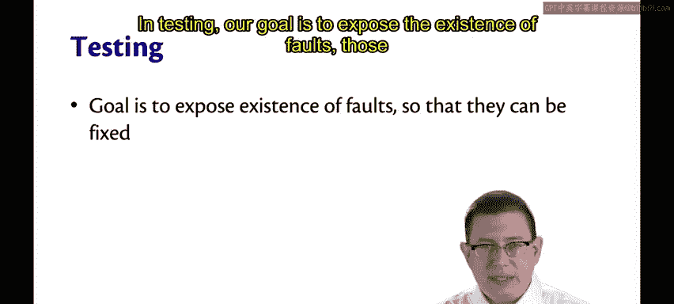

在本节课中，我们将要学习软件测试的不同方法。测试的目标是发现系统中存在的缺陷（即人为错误），以便修复它们，从而防止它们导致系统故障。

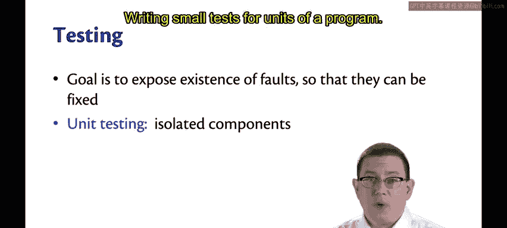

## 测试的目标

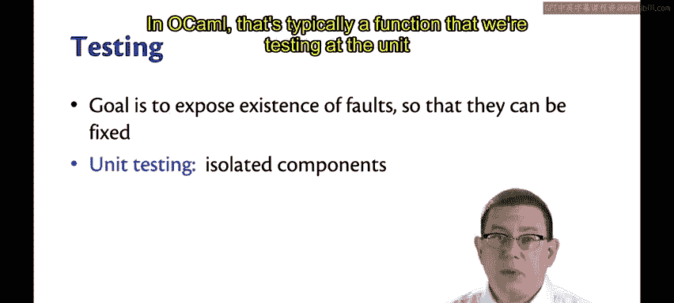

测试的核心目标是暴露系统中存在的**缺陷**。这些缺陷是人为引入的错误。通过测试发现它们，我们就能进行修复，防止它们演变为实际的系统故障。

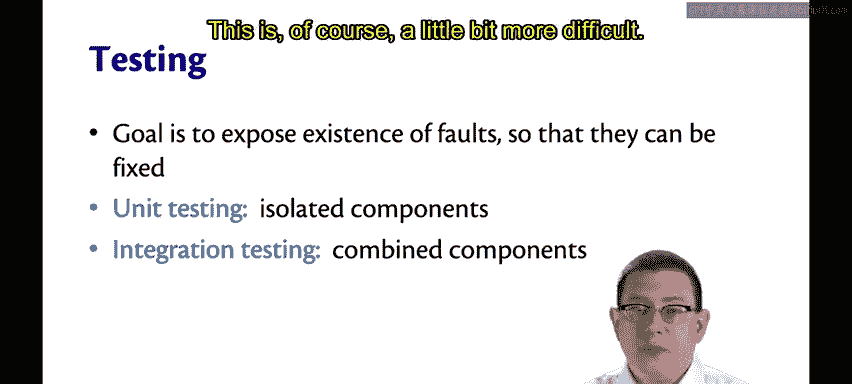

## 测试的类型

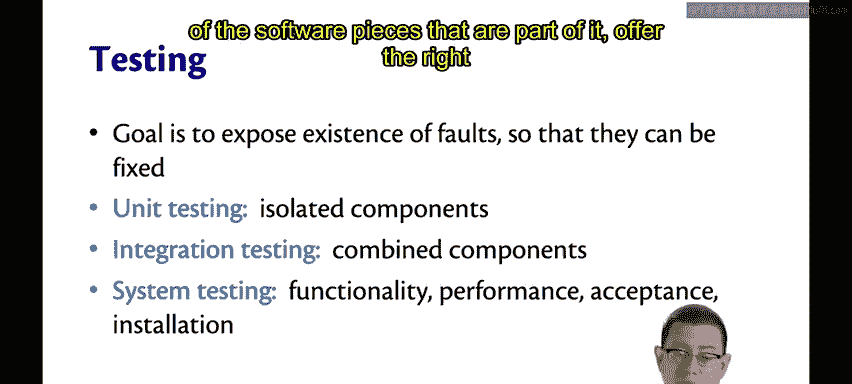

有多种方法可以进行测试。以下是几种主要的测试类型：

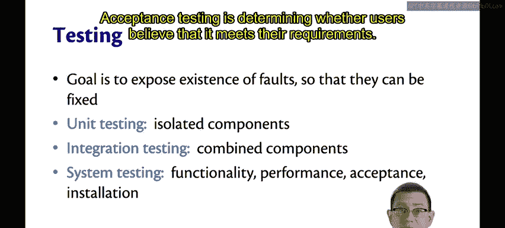

上一节我们介绍了测试的总体目标，本节中我们来看看具体的测试类型。

以下是几种主要的测试类型：

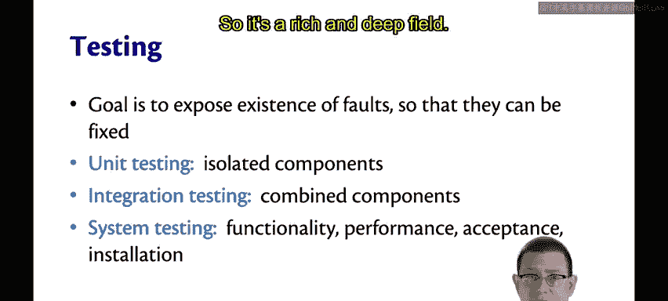

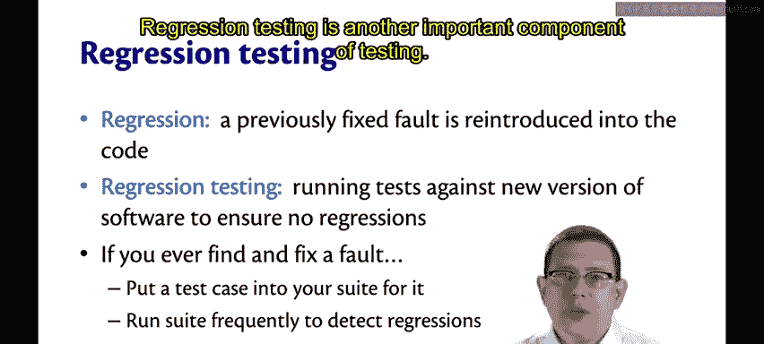

*   **单元测试**：为程序的单元编写小型测试。在OCaml中，我们通常在函数级别进行单元测试。
*   **集成测试**：测试各个单元如何协同工作。例如，两个类或两个OCaml模块是否能正确交互。这比单元测试更复杂。
*   **系统测试**：在更高层次上测试整个软件系统，验证其所有组成部分是否能提供正确的功能和足够的性能。
*   **验收测试**：确定用户是否认为系统满足了他们的需求。
*   **安装测试**：测试系统是否能在其需要运行的环境中成功安装。

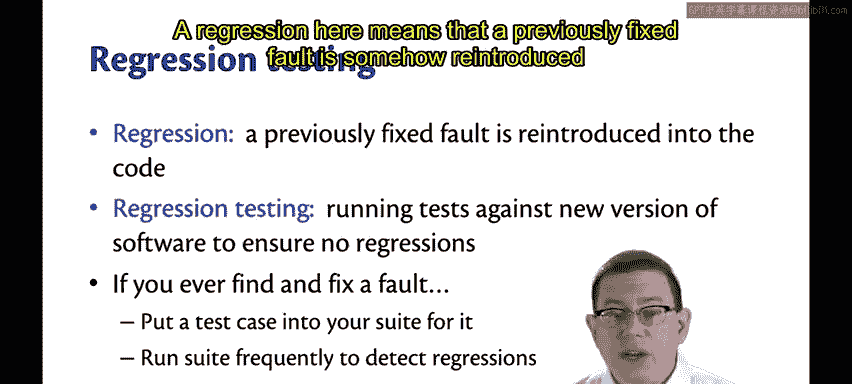

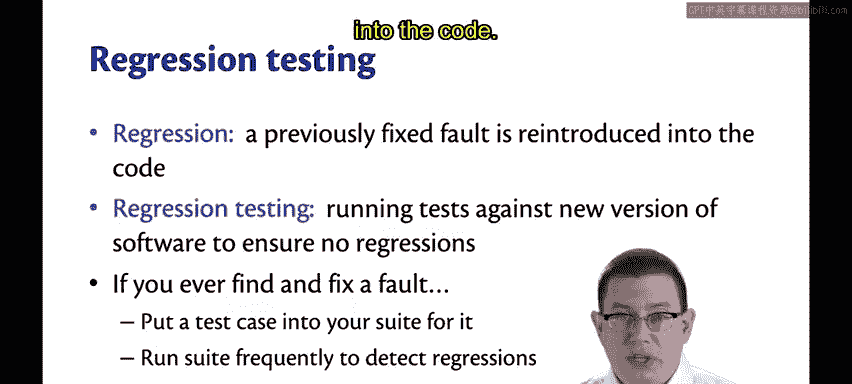

在本课程中，我们主要关注**单元测试**。如果你将来在其他大学攻读软件工程硕士学位，你会发现有专门的课程来深入探讨测试，这是一个丰富而深奥的领域。

## 回归测试

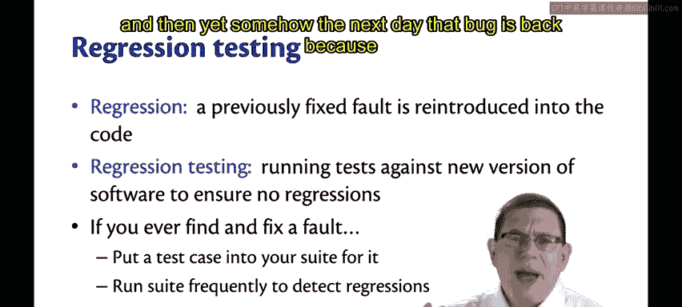

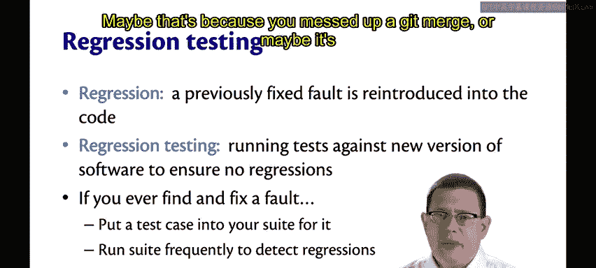

回归测试是测试的另一个重要组成部分。

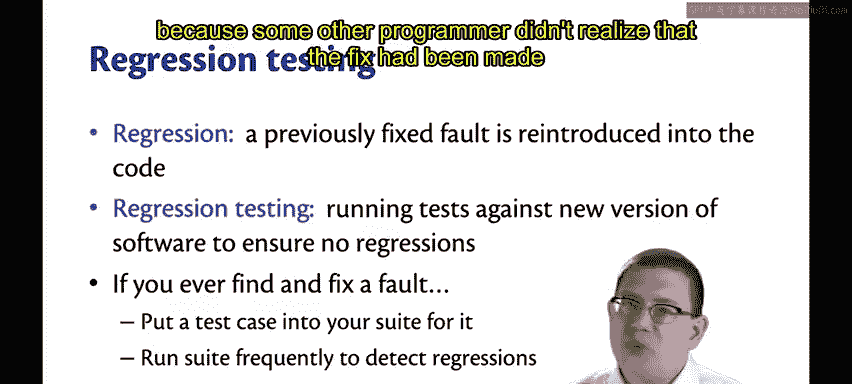

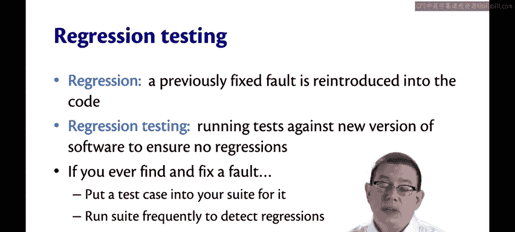

“回归”在这里指的是一个先前已修复的缺陷，由于某种原因被重新引入了代码中。换句话说，你今天修复了一个错误，但第二天这个错误又出现了，可能是因为代码合并出错，或者其他程序员没有意识到这个修复而被覆盖了。

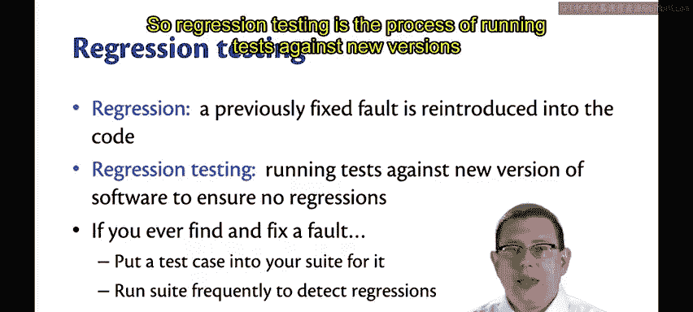

所以，**回归测试**是针对软件新版本运行测试的过程，以确保没有发生回归。

目前，实现回归测试的最佳方法是：**任何时候你编写了一个能暴露缺陷的单元测试，就把这个测试放入测试套件中，并自动化其运行过程**。在本课程中，你们已经在使用OUnit测试套件或多或少地实践这一点。你把一个测试放入套件，它现在和将来都会运行。

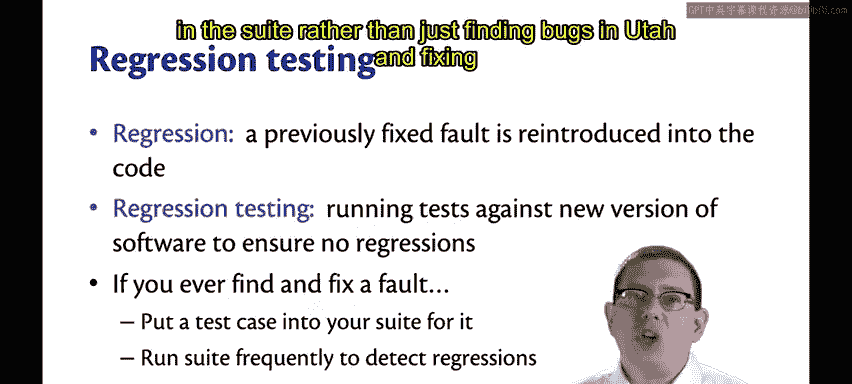

这就是为什么将所有测试都放入套件中非常重要，而不是仅仅在头脑中发现错误并在代码中修复它们。当你将从头脑中获得的知识转化为测试套件中的测试时，你就能保证在未来如果你再次犯错，你会立即发现，而不是让缺陷潜伏在系统中。

## 一个有趣的事实

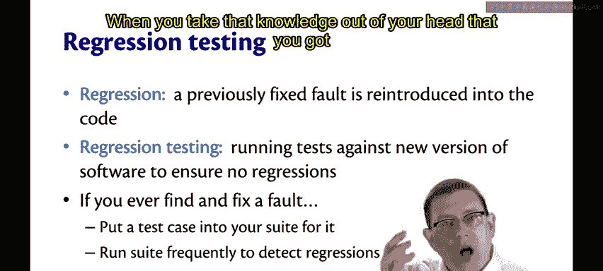

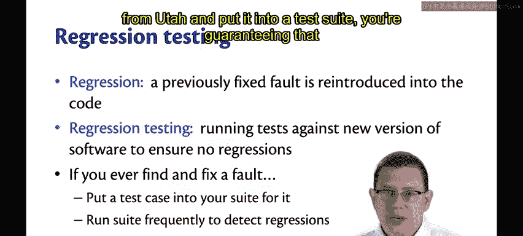

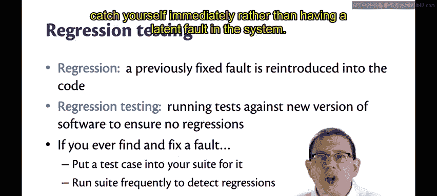

你认为**未检测到缺陷的概率**与**目前已检测到的缺陷数量**之间是什么关系？

假设一个系统中已经发现了许多缺陷。你认为这使得系统中仍然存在待发现缺陷的可能性是更大还是更小？

认为可能性更小的理由是：系统中的缺陷总数是有限的，如果我已经发现了大部分，那么任务可能就快完成了，剩下的工作可能很少。

但事实并非如此。实际上，根据20世纪70年代末和21世纪初重复进行的研究，**未检测到缺陷的概率会随着已检测到缺陷数量的增加而增加**。也就是说，一个系统迄今为止发现的错误越多，该系统可能仍然存在的错误也越多。

造成这种现象的根本原因尚不完全清楚。一种可能性是，编写有缺陷代码的程序员会持续编写有缺陷的代码。因此，如果你已经发现了许多缺陷，以后很可能还会发现更多。这可能不仅仅是因为他们编写了有缺陷的代码，也可能是因为需求定义不清、程序员理解有误，或者在我们修复错误时，倾向于在修复一个错误的同时引入新的错误。

所有这些潜在现象都可以解释这个统计事实：**如果你已经发现了一些错误，那么总会有更多的错误等待被发现**。

这个故事的寓意是：**首先编写正确的代码**，不要先编写有缺陷的代码然后再去修复。

## 何时停止测试？

那么，你应该在什么时候停止测试呢？以下是一些不好的答案：

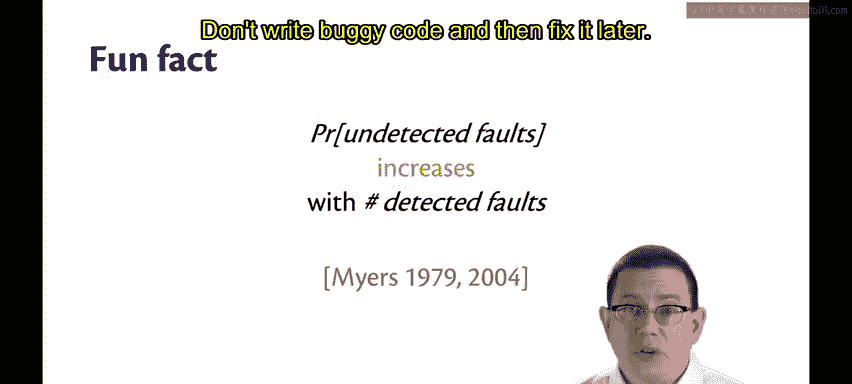

上一节我们了解了缺陷的统计规律，本节中我们来看看何时应该停止测试。

以下是一些**不好的**停止测试的理由：

*   **时间到了**：你只有有限的时间，一小时后就必须停止。
*   **所有测试都通过了**：不，这只是意味着你还没有编写足够的测试，仍有更多测试需要编写。
*   **课程评分系统说你可以停止了**：例如，当CS3110的测试评分系统说你已经获得了所有分数时。测试不是为了分数，而是为了确保质量。

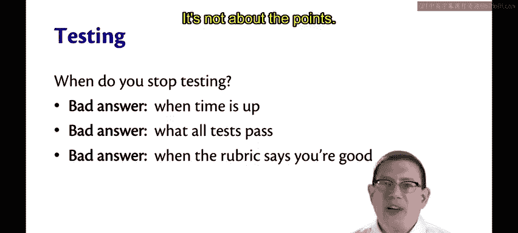

那么，什么是**好的**答案呢？

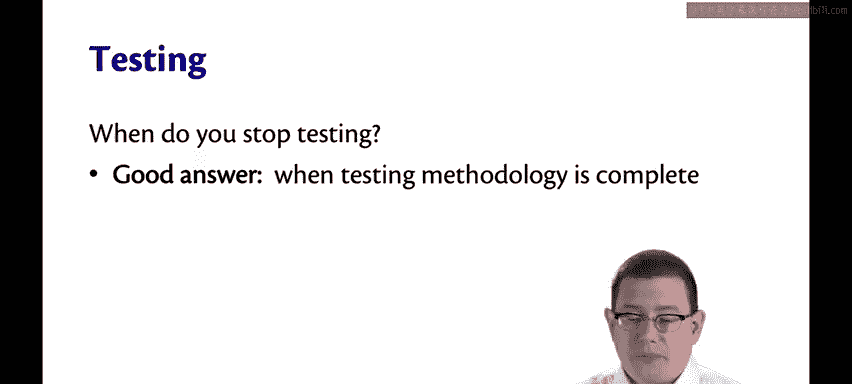

以下是一些**好的**停止测试的理由：

*   **你遵循的测试方法论已经完成**：我们很快会讨论两种不同类型的测试方法来了解更多。
*   **（未来的目标）基于统计估计**：我们希望未来软件工程能有足够的研究，使我们能够进行统计估计。我们想知道未检测到缺陷的概率确实足够低。虽然我们目前还不知道如何做到这一点，但人们正在努力研究。也许20年后我再次教授这门课程时，就能引用你们中某位的研究成果，因为你们已经为我们解决了这个问题。

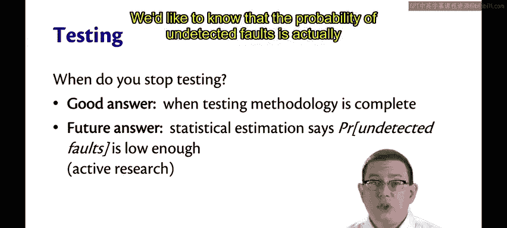

---

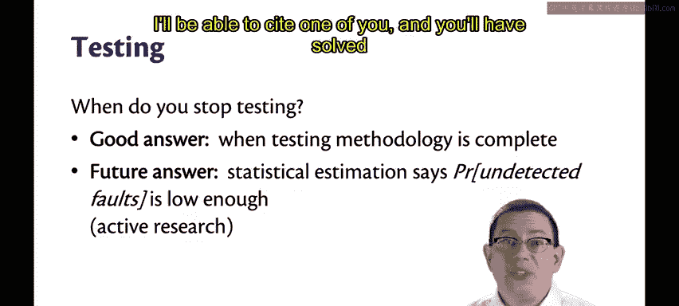

本节课中我们一起学习了软件测试的多种方法，包括单元测试、集成测试、系统测试等不同类型，并重点探讨了回归测试的重要性及其最佳实践。我们还了解了一个关于缺陷概率的统计事实，并讨论了何时应该停止测试。记住，测试的目标是编写正确、可靠的代码，而不仅仅是完成一项任务。