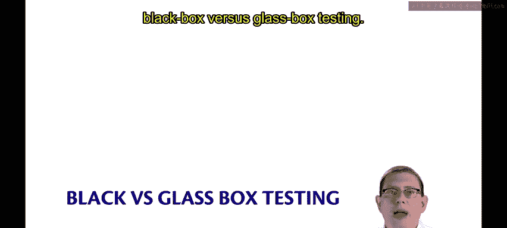
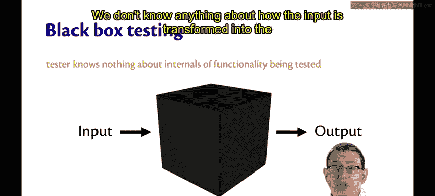
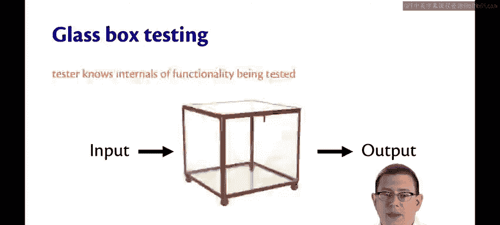
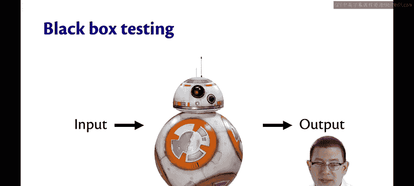
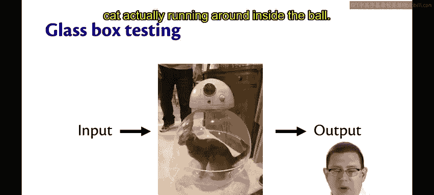

# 康奈尔大学《OCaml编程｜CS3110：OCaml Programming： Correct + Efficient + Beautiful》中英字幕 - P85：-085-Black Box vs Glass Box Testing Chap6 Video 15.zh_en - GPT中英字幕课程资源 - BV1Tx4y1s7sP

One of the most important distinctions in testing methodologies is that of black box versus glass box testing。

In black box testing， the tester， the human who's writing the tests。

 knows nothing about the internals of the functionality being tested。

It's as if the system is a black box with opaque walls that cannot be seen through。Inputs go into it。

 outputs come out， we don't know anything about how the input is transformed into the output when we're doing black box testing。

Glass box testing is kind of the opposite of that sometimes it's called white box or clear box testing white box doesn't make sense to me because if white would still be opaque you wouldn't be able to see through。

With glass box testing， the tester does know the internals of the functionality being tested。

One way to make that distinction might be with black box。

 you don't get access to the source code as the tester with glass box you do。

So with glass box testing， the tester does actually know how the input is transformed into the output。

If you imagined BB8， for example， you were trying to unit test BB8 with black box testing。

 you would have no idea how the internals of BB8 work。

But with glass box testing， maybe you could see inside to the cat actually running around inside the ball。

