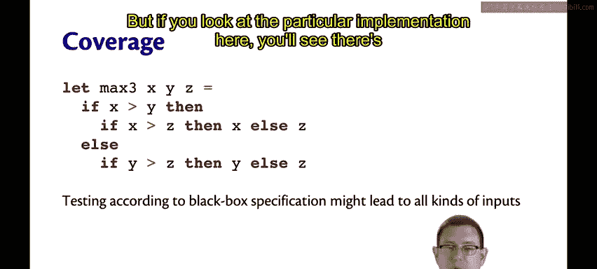
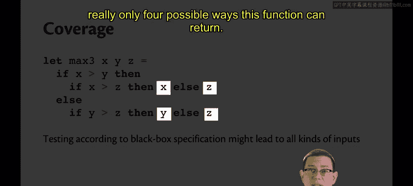
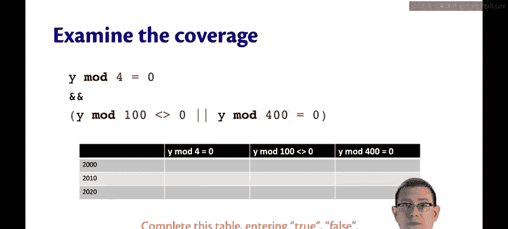
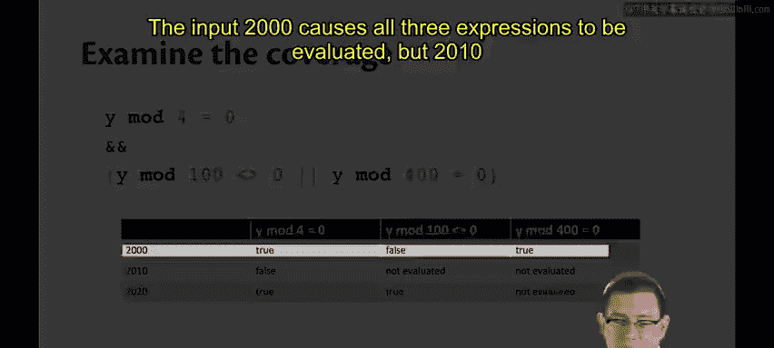
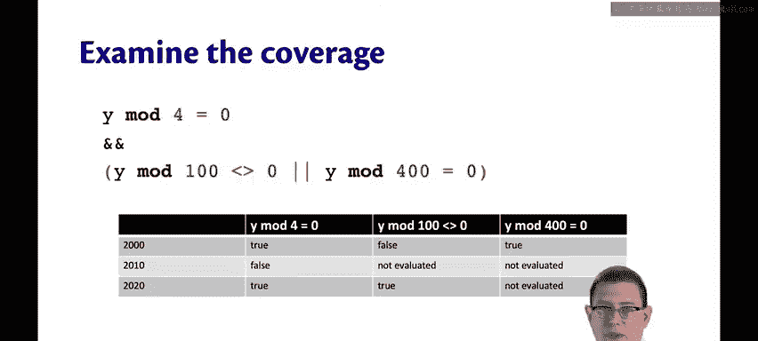
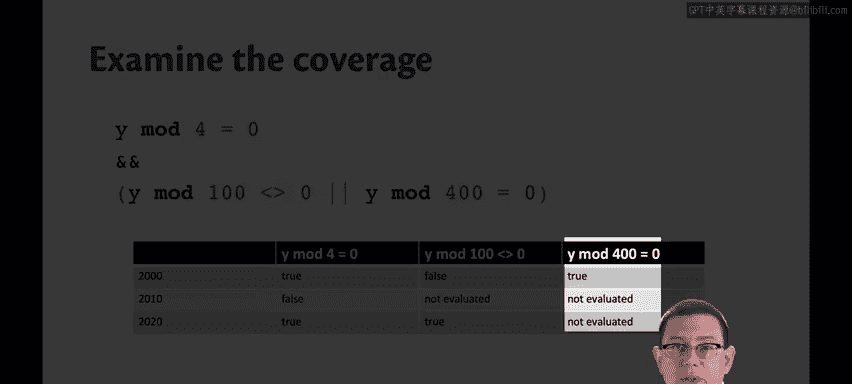
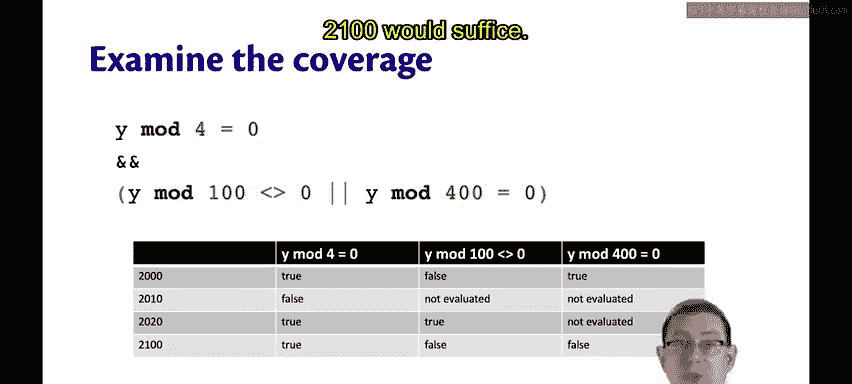
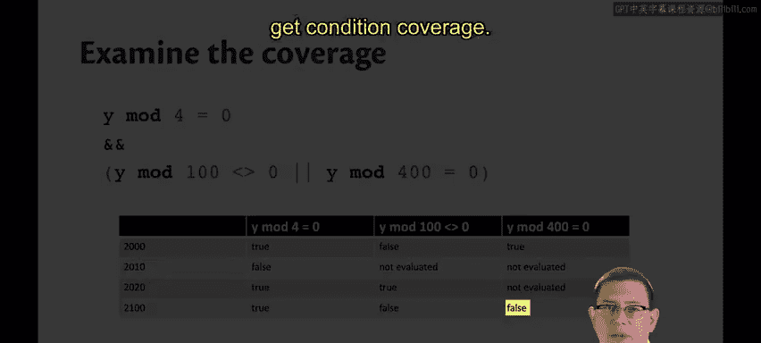

# OCaml编程：6.17：白盒测试 🧪

在本节课中，我们将要学习白盒测试。这是一种测试方法，测试者可以看到被测试功能的内部实现。我们将探讨其优势、核心的覆盖率概念，并通过具体例子来理解如何应用。

## 概述

白盒测试允许测试者查看被测试功能的内部实现。与黑盒测试相比，这具有一些优势。测试者可以判断一个新的测试用例是否真的能提供关于实现正确性的额外信息，或者它是否只是与已设计的其他测试用例冗余。当查看源代码时，白盒测试还能处理那些从规格说明中不明显但可能出现的错误。例如，你可能意识到实现者正在使用一个他们可能误用的函数，因此可以据此设计一些测试。

然而，白盒测试是对黑盒测试的补充，并不能替代对规格说明的检查。如果可能，两种方法都应该使用。

## 白盒测试的目标与挑战

在白盒测试中，我们的目标是用测试用例覆盖整个程序。即确保测试能够执行到源代码的所有部分。

使这一目标具有挑战性的是**分支**。分支是任何允许你条件性地执行一段代码而非另一段代码的语言结构。`if`表达式、`match`表达式、布尔运算符、抛出异常、循环或递归函数，所有这些都涉及分支，使得实现良好的覆盖率变得困难。

## 覆盖率的类型

覆盖率的精确定义是灵活的。以下是三种主要类型：

*   **语句覆盖**：这个名称是在命令式语言的背景下发明的。我们的目标是确保程序中的**每一条语句**至少被执行一次。在函数式语言的语境中，这意味着拥有足够的测试，以确保程序中的**每一个表达式**至少被求值一次。我们继续称之为语句覆盖。
*   **条件覆盖**：我们试图通过使程序中的**每一个布尔表达式**（或在函数式语言中，每一个模式匹配）**求值为每一种可能的值**，来获得更细粒度的程序覆盖。仅仅确保`if`语句的条件至少被求值一次是不够的。你至少需要两个测试：一个使条件求值为`true`，另一个使其求值为`false`。对于模式匹配，你需要确保有足够的测试来最终执行该模式匹配的每一个可能分支。
*   **路径覆盖**：这是粒度更细的覆盖。在路径覆盖中，你希望让程序中**每一条可能的执行路径**都出现。仅仅让每个可能的分支至少被求值一次是不够的。对于其中的每一个子分支，你也希望探索通过它的所有路径。因此，路径覆盖相当难以实现。

## 具体示例分析

让我们通过一个求三个数最大值的具体例子来使其更具体。

函数 `max_of_three x y z` 返回这三个数中的最大值。你可以使用我们已经探讨过的方法为此编写各种黑盒测试，这也是一个好做法。

但如果你查看这里的特定实现，你会发现这个函数实际上只有四种可能的返回路径。

以下是实现示意图：

```
if x > y then
    if x > z then x else z
else
    if y > z then y else z
```

因此，为了实现良好的白盒覆盖，我们实际上只需要编写四个测试用例。每一个测试用例用于探索通过`if`表达式的每一条路径。

这里的优势是我们得以编写一个小得多的测试套件。劣势是我们没有真正针对规格说明进行测试，并且如果有人来更改了实现，我们的测试就会过时。所以我们同时也应该进行黑盒测试。

## 实现良好覆盖的要点





为了实现良好的覆盖，我们应该为每个嵌套`if`表达式的每个分支以及每个嵌套模式匹配的每个分支都包含测试用例。

需要特别注意以下几点：
*   递归函数的**基本情况**。
*   确保触发每个递归函数的**递归调用**。
*   确保为每个可能**抛出异常**的地方编写测试。

## 案例分析：闰年判断函数

假设你正在尝试对这个`leap_year`函数进行白盒覆盖测试，该函数用于判断年份`y`在公历中是否为闰年。

实现基于布尔运算符。假设你已经有一个测试套件，测试了输入 2000、2010 和 2020。

这个测试套件实现了哪种覆盖？是语句覆盖还是条件覆盖？

让我们来分析一下。我创建了一个表格。行是测试用例，列是每个布尔表达式。我将填写这个表格。如果布尔表达式在特定输入下求值为`true`或`false`，我将填入`true`或`false`；如果某些输入不会导致所有表达式都被求值，则标记为“未求值”。

以下是测试覆盖分析表：

| 测试输入 | `y mod 4 == 0` | `y mod 100 != 0` | `y mod 400 == 0` |
| :--- | :--- | :--- | :--- |
| 2000 | true | false | true |
| 2010 | false | 未求值 | 未求值 |
| 2020 | true | true | 未求值 |

输入 2000 导致所有三个表达式都被求值。但 2010 和 2020 使其中一些未被求值。

因此，这个测试套件确实实现了**语句覆盖**，因为程序中的每个表达式在整个测试套件中的某个地方都被求值了。事实上，仅 2000 这一个输入就足以实现语句覆盖。





但是，**条件覆盖**并未实现。如果你查看 `y mod 400 == 0` 这一列，没有任何地方该表达式求值为`false`。你设法得到了`true`，但没有`false`。

为了实现条件覆盖，我们需要添加另一个测试用例。输入 2100 就足够了，它可以使最后一个布尔表达式求值为`false`，从而获得条件覆盖。



更新后的覆盖分析表如下：



| 测试输入 | `y mod 4 == 0` | `y mod 100 != 0` | `y mod 400 == 0` |
| :--- | :--- | :--- | :--- |
| 2000 | true | false | true |
| 2010 | false | 未求值 | 未求值 |
| 2020 | true | true | 未求值 |
| 2100 | true | false | **false** |

## 总结





本节课中我们一起学习了白盒测试。我们了解到白盒测试通过查看代码内部实现来设计测试，可以有效补充黑盒测试。我们探讨了三种主要的覆盖率类型：**语句覆盖**、**条件覆盖**和**路径覆盖**，并通过具体函数示例分析了如何评估和达到这些覆盖标准。记住，结合使用白盒和黑盒测试，并针对代码中的分支、递归和异常点进行重点测试，是构建健壮测试套件的关键。